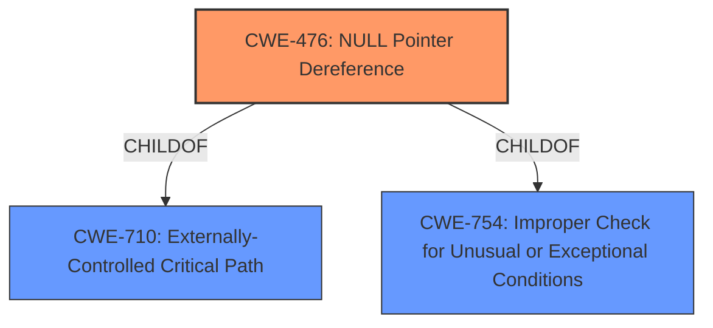

# Analysis for CVE-2021-32282

# Summary
| CWE ID | CWE Name | Confidence | CWE Abstraction Level | CWE Vulnerability Mapping Label | CWE-Vulnerability Mapping Notes |
|---|---|---|---|---|---|
| CWE-476 | NULL Pointer Dereference | 1 | Base | Allowed | Primary CWE |

## Evidence and Confidence

*   **Confidence Score:** 1
*   **Evidence Strength:** HIGH

## Relationship Analysis
The primary relationship is that CWE-476 (NULL Pointer Dereference) is a Base level CWE. It is a child of CWE-710 and CWE-754. This confirms it is the appropriate level of abstraction. The Retriever Results also confirm this with a high score. There are no other relationships that impact the decision.

## Vulnerability Chain
The vulnerability chain is straightforward:
1.  **Root Cause:** **NULL pointer dereference** in `ircode_add_check()`
2.  **Impact:** Denial of Service (crash of the Gravity compiler)

## Summary of Analysis
The initial analysis strongly suggests CWE-476 (NULL Pointer Dereference) as the primary CWE. The **root cause** explicitly mentions "**NULL pointer dereference**." The "CVE Reference Links Content Summary" confirms this, stating a segmentation fault due to a READ memory access on address 0x000000000000, which is a null pointer dereference. The Retriever Results also list CWE-476 as the top candidate.

The evidence directly supports this classification.

The graph relationships confirm that CWE-476 is a Base level CWE, which is the preferred level of abstraction. The MITRE mapping guidance for CWE-476 allows its usage and confirms it's at the preferred level of abstraction.

CWE-476 is the most specific and appropriate CWE based on the provided evidence.

Relevant CWE Information:
- CWE-476: NULL Pointer Dereference
- CWE-822: Untrusted Pointer Dereference
- CWE-252: Unchecked Return Value
- CWE-665: Improper Initialization
- CWE-908: Use of Uninitialized Resource
- CWE-824: Access of Uninitialized Pointer
- CWE-1325: Improperly Controlled Sequential Memory Allocation
- CWE-456: Missing Initialization of a Variable
- CWE-825: Expired Pointer Dereference
- CWE-787: Out-of-bounds Write

I considered the other CWEs but did not use them:

*   CWE-822 (Untrusted Pointer Dereference): While related to pointer issues, this CWE involves obtaining a value from an untrusted source and using it as a pointer. The provided information doesn't indicate any untrusted source for the pointer value itself, only that a NULL pointer is being dereferenced.
*   CWE-252 (Unchecked Return Value): This CWE applies when a function's return value isn't checked, leading to unexpected states. While an unchecked return value could *lead* to a NULL pointer, the vulnerability description directly identifies the **NULL pointer dereference** as the **root cause**.
*   CWE-665 (Improper Initialization): This CWE describes a general failure to initialize resources correctly. While it could be a contributing factor, the specific issue is a **NULL pointer dereference**, making CWE-476 more appropriate.
*   CWE-908 (Use of Uninitialized Resource): Similar to CWE-665, this is a more general weakness. CWE-476 is more specific.
*   CWE-824 (Access of Uninitialized Pointer): Close to CWE-476, but the description explicitly states a *NULL* pointer, making CWE-476 the more accurate choice. An uninitialized pointer might have a random value, not necessarily NULL.
*   CWE-1325 (Improperly Controlled Sequential Memory Allocation): This relates to memory allocation limits, which are not mentioned in the vulnerability description.
*   CWE-456 (Missing Initialization of a Variable): This is similar to CWE-665 and CWE-908, and less specific than a **NULL pointer dereference**.
*   CWE-825 (Expired Pointer Dereference): This involves dereferencing a pointer to memory that has been released. The provided information doesn't suggest memory being released and then re-accessed, but rather a **NULL pointer dereference**.
*   CWE-787 (Out-of-bounds Write): This involves writing past the end of a buffer. This is not indicated by the vulnerability description.