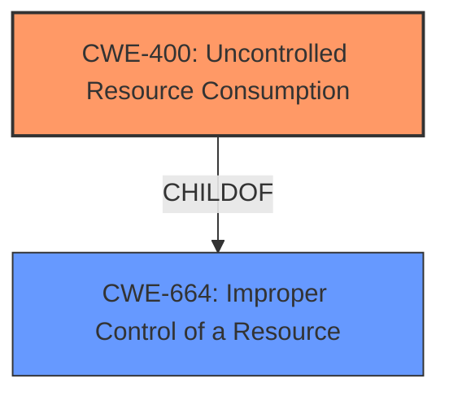

# Raw Analyzer Response for CVE-2021-32455

# Summary
| CWE ID | CWE Name | Confidence | CWE Abstraction Level | CWE Vulnerability Mapping Label | CWE-Vulnerability Mapping Notes |
|---|---|---|---|---|---|
| CWE-400 | Uncontrolled Resource Consumption | 0.9 | Class | Primary | Discouraged, but most appropriate given the available information. |

## Evidence and Confidence

*   **Confidence Score:** 0.9
*   **Evidence Strength:** MEDIUM

## Relationship Analysis
The primary relationship that influenced the decision was the parent-child relationship between CWE-664 (Improper Control of a Resource) and CWE-400 (Uncontrolled Resource Consumption). While CWE-400 is a Class-level CWE, it directly addresses the **uncontrolled consumption of resources** described in the vulnerability, making it the most suitable option despite the discouraged usage.

## Vulnerability Chain
The vulnerability chain starts with an attacker sending a massive number of HTTP requests. This leads to **uncontrolled resource consumption** on the device, ultimately resulting in a denial of service. The root cause is the **lack of proper resource management** within the device's firmware.

## Summary of Analysis
The initial analysis focused on identifying the core weakness that leads to the denial-of-service condition. The vulnerability description clearly states that an attacker can cause a denial of service by sending HTTP requests massively. This indicates that the device is not properly handling the volume of requests, leading to resource exhaustion.

The Retriever Results highlighted several potential CWEs, including CWE-400 (Uncontrolled Resource Consumption), CWE-259 (Use of Hard-coded Password), and CWE-20 (Improper Input Validation). However, CWE-400 aligns most directly with the described scenario.

While CWE-400 is discouraged due to potential misuse and the availability of more specific children, the provided information lacks the details necessary to pinpoint the exact type of resource being exhausted or the specific mechanism causing the **uncontrolled consumption**. Therefore, CWE-400 serves as the most appropriate high-level classification, capturing the essence of the vulnerability.

The decision to use CWE-400 is primarily based on the following evidence from the vulnerability description:

*   "allows an attacker with access to the devices network to cause a denial of service condition on the device"
*   "An attacker could exploit this vulnerability by sending HTTP requests massively."

This evidence directly supports the conclusion that the device is vulnerable to **uncontrolled resource consumption** due to the massive influx of HTTP requests.

The selected CWE is at the optimal level of specificity given the available information. While more detailed analysis could potentially reveal a more specific root cause, the current evidence strongly suggests that the **lack of resource control** is the primary weakness.

Relevant CWE Information:

# Enhanced Context (25 CWEs)
The following CWEs were identified as potentially relevant to this vulnerability:

## CWE-131: Incorrect Calculation of Buffer Size
**Abstraction Level**: Base
**Similarity Score**: 0.76
**Source**: dense

**Description**:
The product does not correctly calculate the size to be used when allocating a buffer, which could lead to a buffer overflow.

**Mapping Guidance**:
- Usage: Allowed
- Rationale: This CWE entry is at the Base level of abstraction, which is a preferred level of abstraction for mapping to the root causes of vulnerabilities.

*This was not selected because there is no evidence of a buffer size calculation error.*

## CWE-119: Improper Restriction of Operations within the Bounds of a Memory Buffer
**Abstraction Level**: Class
**Similarity Score**: 0.76
**Source**: dense

**Description**:
The product performs operations on a memory buffer, but it reads from or writes to a memory location outside the buffer's intended boundary. This may result in read or write operations on unexpected memory locations that could be linked to other variables, data structures, or internal program data.

**Mapping Guidance**:
- Usage: Discouraged
- Rationale: CWE-119 is commonly misused in low-information vulnerability reports when lower-level CWEs could be used instead, or when more details about the vulnerability are available.

*This was not selected because there is no evidence of memory buffer operations in the description.*

## CWE-404: Improper Resource Shutdown or Release
**Abstraction Level**: Class
**Similarity Score**: 0.75
**Source**: dense

**Description**:
The product does not release or incorrectly releases a resource before it is made available for re-use.

**Mapping Guidance**:
- Usage: Allowed-with-Review
- Rationale: This CWE entry is a Class and might have Base-level children that would be more appropriate

*This was not selected because the description doesn't specify any issue of release of resources.*

## CWE-667: Improper Locking
**Abstraction Level**: Class
**Similarity Score**: 0.75
**Source**: dense

**Description**:
The product does not properly acquire or release a lock on a resource, leading to unexpected resource state changes and behaviors.

**Mapping Guidance**:
- Usage: Allowed-with-Review
- Rationale: This CWE entry is a Class and might have Base-level children that would be more appropriate

*This was not selected because there is no evidence of locking issues.*

## CWE-653: Improper Isolation or Compartmentalization
**Abstraction Level**: Class
**Similarity Score**: 0.75
**Source**: dense

**Description**:
The product does not properly compartmentalize or isolate functionality, processes, or resources that require different privilege levels, rights, or permissions.

**Mapping Guidance**:
- Usage: Allowed
- Rationale: This CWE entry is at the Base level of abstraction, which is a preferred level of abstraction for mapping to the root causes of vulnerabilities.

*This was not selected because there is no evidence of isolation or compartmentalization issues.*

## CWE-1289: Improper Validation of Unsafe Equivalence in Input
**Abstraction Level**: Base
**Similarity Score**: 0.75
**Source**: dense

**Description**:
The product receives an input value that is used as a resource identifier or other type of reference, but it does not validate or incorrectly validates that the input is equivalent to a potentially-unsafe value.

**Mapping Guidance**:
- Usage: Allowed
- Rationale: This CWE entry is at the Base level of abstraction, which is a preferred level of abstraction for mapping to the root causes of vulnerabilities.

*This was not selected because there is no evidence of input validation issues related to resource identifiers.*

## CWE-191: Integer Underflow (Wrap or Wraparound)
**Abstraction Level**: Base
**Similarity Score**: 0.75
**Source**: dense

**Description**:
The product subtracts one value from another, such that the result is less than the minimum allowable integer value, which produces a value that is not equal to the correct result.

**Mapping Guidance**:
- Usage: Allowed
- Rationale: This CWE entry is at the Base level of abstraction, which is a preferred level of abstraction for mapping to the root causes of vulnerabilities.

*This was not selected because there is no evidence of integer underflow issues.*

## CWE-41: Improper Resolution of Path Equivalence
**Abstraction Level**: Base
**Similarity Score**: 0.75
**Source**: dense

**Description**:
The product is vulnerable to file system contents disclosure through path equivalence. Path equivalence involves the use of special characters in file and directory names. The associated manipulations are intended to generate multiple names for the same object.

**Mapping Guidance**:
- Usage: Allowed
- Rationale: This CWE entry is at the Base level of abstraction, which is a preferred level of abstraction for mapping to the root causes of vulnerabilities.

*This was not selected because there is no evidence of path equivalence issues.*

## CWE-125: Out-of-bounds Read
**Abstraction Level**: Base
**Similarity Score**: 0.75
**Source**: dense

**Description**:
The product reads data past the end, or before the beginning, of the intended buffer.

**Mapping Guidance**:
- Usage: Allowed
- Rationale: This CWE entry is at the Base level of abstraction, which is a preferred level of abstraction for mapping to the root causes of vulnerabilities.

*This was not selected because there is no evidence of out-of-bounds read issues.*

## CWE-754: Improper Check for Unusual or Exceptional Conditions
**Abstraction Level**: Class
**Similarity Score**: 0.75
**Source**: dense

**Description**:
The product does not check or incorrectly checks for unusual or exceptional conditions that are not expected to occur frequently during day to day operation of the product.

**Mapping Guidance**:
- Usage: Allowed-with-Review
- Rationale: This CWE entry is a Class and might have Base-level children that would be more appropriate

*This was not selected because there is no evidence of a check for unusual conditions.*

## CWE-