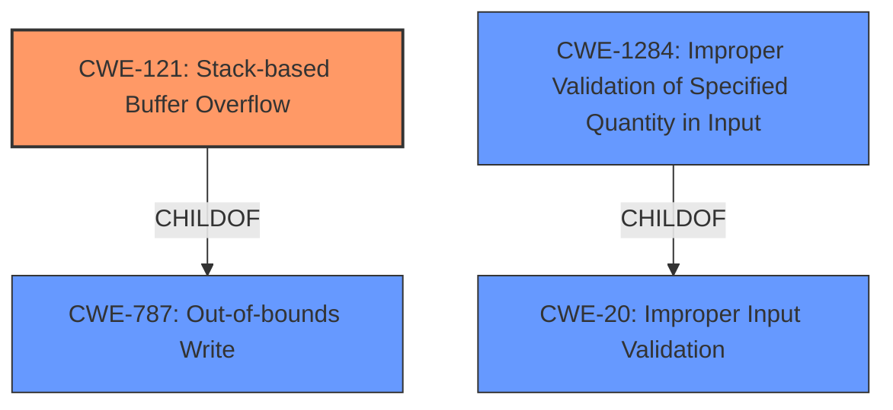

# Enhanced Analysis for CVE-2021-32457

# Summary
| CWE ID    | CWE Name                                                                        | Confidence | CWE Abstraction Level | CWE Vulnerability Mapping Label | CWE-Vulnerability Mapping Notes |
| :--------- | :------------------------------------------------------------------------------ | :--------- | :---------------------- | :------------------------------ | :------------------------------ |
| CWE-121 | Stack-based Buffer Overflow | 0.95       | Variant                 | Allowed                       | Primary CWE                     |
| CWE-1284 | Improper Validation of Specified Quantity in Input                                   | 0.85       | Base                      | Allowed                       | Secondary Candidate             |

## Evidence and Confidence

*   **Confidence Score:** 0.90
*   **Evidence Strength:** HIGH

## Relationship Analysis
The primary relationship influencing the selection was the hierarchical relationship between CWE-787 (Out-of-bounds Write) and its child CWE-121 (Stack-based Buffer Overflow). The vulnerability description explicitly mentions a "stack-based buffer overflow," making CWE-121 a more specific and accurate choice than its parent. CWE-1284 is present because the root cause is the size being read from the ioctl request without any validation, leading to the overflow when passed to __memzero.



## Vulnerability Chain
The vulnerability chain starts with the **improper validation** of the size argument from the ioctl request (CWE-1284). This leads to a **stack-based buffer overflow** (CWE-121) when the unchecked size is used in the `__memzero` function. The overflow allows an attacker to escalate privileges.

## Summary of Analysis
The initial analysis, supported by the vulnerability description and CVE reference content, strongly suggests a **stack-based buffer overflow** (CWE-121). The description explicitly states "stack-based buffer overflow vulnerability." The CVE reference summary confirms that the **lack of input validation** on the ioctl request size leads to writing beyond the bounds of a stack-based buffer. The Talos report confirms the vulnerability is a **stack-based buffer overflow** due to a lack of input validation on the `ioctl` request from userland. Specifically, the upper 14 bits of the `ioctl` request are used as the size argument to `__memzero` without proper checks. This size is used to clear a stack buffer and can be larger than the actual stack buffer.

The relationships in the graph support selecting CWE-121 as the primary cause, with CWE-1284 representing the **improper input validation** that enables it.

The selected CWEs are at the optimal level of specificity, with CWE-121 being a Variant that precisely describes the type of buffer overflow, and CWE-1284 explaining the root cause of **improper input validation**.

**CWEs Considered but Not Used:**

*   **CWE-119: Improper Restriction of Operations within the Bounds of a Memory Buffer:** While this Class-level CWE broadly covers memory buffer issues, CWE-121 is a more specific Variant that accurately describes the stack-based nature of the overflow. The MITRE mapping guidance discourages the use of CWE-119 when more specific CWEs are available.
*   **CWE-190: Integer Overflow or Wraparound:** This CWE was considered because the unchecked size from the ioctl request could potentially lead to an integer overflow before causing the buffer overflow. However, the primary issue is the **lack of validation** and the resulting buffer overflow, not the integer overflow itself.
*   **CWE-250: Execution with Unnecessary Privileges:** While the exploit allows privilege escalation, the root cause is the buffer overflow, not the unnecessary privileges. This is a consequence of the overflow, not the primary weakness.
*   **CWE-732: Incorrect Permission Assignment for Critical Resource:** Similar to CWE-250, this CWE describes a potential impact (incorrect permissions) rather than the underlying cause (buffer overflow).
*   **CWE-78: Improper Neutralization of Special Elements used in an OS Command ('OS Command Injection'):** This CWE is not applicable as the vulnerability does not involve OS command injection.
*   **CWE-20: Improper Input Validation:** While the vulnerability stems from a lack of input validation, CWE-1284 is a more specific base level CWE to describe the lack of validation of the quantity in the input, so it is preferred over the class level CWE-20.


## CWE Relationship Analysis

Current CWEs represent these abstraction levels: .


### Vulnerability Chain Analysis

**Chain starting from CWE-732:**
- 732 (Incorrect Permission Assignment for Critical Resource) - ROOT


**Chain starting from CWE-121:**
- 121 (Stack-based Buffer Overflow) - ROOT


### CWE Relationship Diagram

```mermaid
graph TD
    classDef primary fill:#f96,stroke:#333,stroke-width:2px
    classDef secondary fill:#69f,stroke:#333
    classDef tertiary fill:#9e9,stroke:#333
```