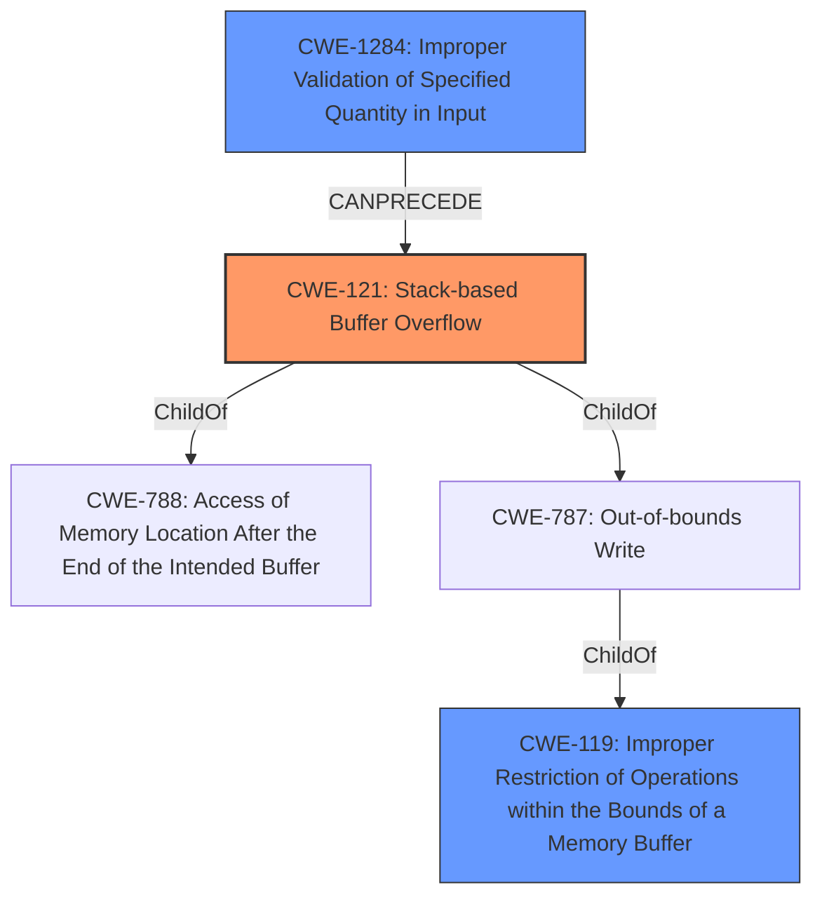

# Analysis Report for CVE-2021-32458

# Vulnerability Analysis Report: CVE-2021-32458

## Description


## Analysis (with Relationship Data)

# Summary
| CWE ID    | CWE Name                                                                     | Confidence | CWE Abstraction Level | CWE Vulnerability Mapping Label | CWE-Vulnerability Mapping Notes |
| --------- | ---------------------------------------------------------------------------- | ---------- | --------------------- | ------------------------------- | ------------------------------- |
| CWE-121   | Stack-based Buffer Overflow                                                   | 1.0        | Variant               | Primary                         | Allowed                        |
| CWE-119   | Improper Restriction of Operations within the Bounds of a Memory Buffer       | 0.8        | Class                 | Secondary                       | Discouraged                     |
| CWE-1284  | Improper Validation of Specified Quantity in Input                            | 0.7        | Base                  | Secondary                       | Allowed                         |

## Evidence and Confidence

*   **Confidence Score:** 0.9
*   **Evidence Strength:** HIGH

## Relationship Analysis
The primary weakness is CWE-121 Stack-based Buffer Overflow, a Variant of CWE-788 and CWE-787. CWE-119, a Class, is a parent of CWE-121, but is too general. CWE-1284 is a base CWE that CANPRECEDE a buffer overflow by not validating the size of the input.



## Vulnerability Chain
The vulnerability chain starts with **improper input validation** (CWE-1284) of the `ioctl` request's size parameter, leading to a **stack-based buffer overflow** (CWE-121) due to the use of an unchecked size in a `__copy_from_user` call. This overflow allows an attacker to overwrite the return address on the stack, ultimately resulting in **code execution**.

## Summary of Analysis
The initial assessment correctly identifies the core issue as a stack-based buffer overflow. The analysis and conclusion are based on the provided evidence, specifically:

*   The **Vulnerability Description Key Phrases** identifies the "**stack-based buffer overflow**".
*   The **CVE Reference Links Content Summary** states:
    *   "The vulnerability stems from a **lack of input validation** on user-provided `ioctl` requests."
    *   "**Stack-based Buffer Overflow:** The kernel-space stack buffer is smaller than the maximum size allowed for the ioctl request, resulting in a buffer overflow if a crafted `ioctl` with a larger size is sent. This overflow can overwrite the stack, including the return address."
    *   "By carefully crafting the input and controlling the overflow, an attacker can overwrite the return address on the stack to gain control of the program counter (PC), leading to arbitrary code execution in the kernel."

The graph relationships support the selection of CWE-121 as the primary CWE due to its specific nature. CWE-119 is a parent, but too general, and CWE-1284 highlights the input validation issue. The selected CWEs are at the optimal level of specificity, with CWE-121 being a Variant that directly describes the vulnerability.

Relevant CWE Information:

# Enhanced Context (25 CWEs)

## CWE-191: Integer Underflow (Wrap or Wraparound)
**Abstraction Level**: Base
**Similarity Score**: 0.75
**Source**: dense

**Description**:
The product subtracts one value from another, such that the result is less than the minimum allowable integer value, which produces a value that is not equal to the correct result.

**Mapping Guidance**:
- Usage: Allowed
- Rationale: This CWE entry is at the Base level of abstraction, which is a preferred level of abstraction for mapping to the root causes of vulnerabilities.

*Not Selected*: Not applicable as it involves subtraction leading to a value less than the minimum, which is not the case here.

## CWE-124: Buffer Underwrite ('Buffer Underflow')
**Abstraction Level**: Base
**Similarity Score**: 0.75
**Source**: dense

**Description**:
The product writes to a buffer using an index or pointer that references a memory location prior to the beginning of the buffer.

**Mapping Guidance**:
- Usage: Allowed
- Rationale: This CWE entry is at the Base level of abstraction, which is a preferred level of abstraction for mapping to the root causes of vulnerabilities.

*Not Selected*: Not applicable as the vulnerability is about writing beyond the end of the buffer, not before the beginning.

## CWE-131: Incorrect Calculation of Buffer Size
**Abstraction Level**: Base
**Similarity Score**: 0.75
**Source**: dense

**Description**:
The product does not correctly calculate the size to be used when allocating a buffer, which could lead to a buffer overflow.

**Mapping Guidance**:
- Usage: Allowed
- Rationale: This CWE entry is at the Base level of abstraction, which is a preferred level of abstraction for mapping to the root causes of vulnerabilities.

*Not Selected*: The buffer size is allocated correctly but the size of data being copied into the buffer is not validated, so this is not applicable.

## CWE-680: Integer Overflow to Buffer Overflow
**Abstraction Level**: Compound
**Similarity Score**: 0.74
**Source**: dense

**Description**:
The product performs a calculation to determine how much memory to allocate, but an integer overflow can occur that causes less memory to be allocated than expected, leading to a buffer overflow.

**Mapping Guidance**:
- Usage: Discouraged
- Rationale: This CWE entry is a named chain, which combines multiple weaknesses.

*Not Selected*: While integer overflow could theoretically play a role by influencing the size calculation, there is no evidence of this in the provided description.

## CWE-805: Buffer Access with Incorrect Length Value
**Abstraction Level**: Base
**Similarity Score**: 0.74
**Source**: dense

**Description**:
The product uses a sequential operation to read or write a buffer, but it uses an incorrect length value that causes it to access memory that is outside of the bounds of the buffer.

**Mapping Guidance**:
- Usage: Allowed
- Rationale: This CWE entry is at the Base level of abstraction, which is a preferred level of abstraction for mapping to the root causes of vulnerabilities.

*Not Selected*: This is similar to CWE-121/CWE-119 but focuses on sequential operations, which isn't explicitly mentioned in the description.

## CWE-126: Buffer Over-read
**Abstraction Level**: Variant
**Similarity Score**: 0.73
**Source**: dense

**Description**:
The product reads from a buffer using buffer access mechanisms such as indexes or pointers that reference memory locations after the targeted buffer.

**Mapping Guidance**:
- Usage: Allowed
- Rationale: This CWE entry is at the Variant level of abstraction, which is a preferred level of abstraction for mapping to the root causes of vulnerabilities.

*Not Selected*: The vulnerability is about writing beyond the buffer, not reading.

## CWE-190: Integer Overflow or Wraparound
**Abstraction Level**: Base
**Similarity Score**: 0.73
**Source**: dense

**Description**:
The product performs a calculation that can
         produce an integer overflow or wraparound when the logic
         assumes that the resulting value will always be larger than
         the original value. This occurs when an integer value is
         incremented to a value that is too large to store in the
         associated representation. When this occurs, the value may
         become a very small or negative number.

**Mapping Guidance**:
- Usage: Allowed
- Rationale: This CWE entry is at the Base level of abstraction, which is a preferred level of abstraction for mapping to the root causes of vulnerabilities.

*Not Selected*: While an integer overflow might be involved in determining the size, this is not the primary issue. The core problem is the lack of validation, which directly leads to the buffer overflow.

## CWE-193: Off-by-one Error
**Abstraction Level**: Base
**Similarity Score**: 0.73
**Source**: dense

**Description**:
A product calculates or uses an incorrect maximum or minimum value that is 1 more, or 1 less, than the correct value.

**Mapping Guidance**:
- Usage: Allowed


## CWE Relationship Analysis

Current CWEs represent these abstraction levels: .


### Vulnerability Chain Analysis

**Chain starting from CWE-121:**
- 121 (Stack-based Buffer Overflow) - ROOT


**Chain starting from CWE-787:**
- 787 (Out-of-bounds Write) - ROOT


### CWE Relationship Diagram

```mermaid
graph TD
    classDef primary fill:#f96,stroke:#333,stroke-width:2px
    classDef secondary fill:#69f,stroke:#333
    classDef tertiary fill:#9e9,stroke:#333
```


*Report generated on 2025-04-02 05:44:45*
