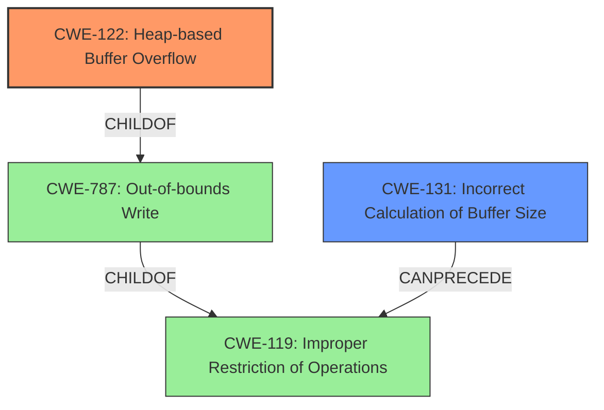

# Enhanced Analysis for CVE-2021-3246

# Summary
| CWE ID    | CWE Name                                                                    | Confidence | CWE Abstraction Level | CWE Vulnerability Mapping Label | CWE-Vulnerability Mapping Notes |
| :---------- | :-------------------------------------------------------------------------- | :--------- | :---------------------- | :------------------------------ | :------------------------------ |
| CWE-122     | Heap-based Buffer Overflow                                                   | 1.0        | Variant               | Primary                       | Allowed                       |
| CWE-131     | Incorrect Calculation of Buffer Size                                        | 0.8        | Base                  | Secondary                       | Allowed                       |

## Evidence and Confidence

*   **Confidence Score:** 0.9
*   **Evidence Strength:** HIGH

## Relationship Analysis
The primary CWE is CWE-122, which is a variant of CWE-787 (Out-of-bounds Write) and CWE-119 (Improper Restriction of Operations within the Bounds of a Memory Buffer). CWE-131 (Incorrect Calculation of Buffer Size) can precede CWE-119. The vulnerability involves a heap buffer overflow due to an incorrect calculation of the buffer size, so the relationship between CWE-131 and CWE-119/CWE-122 is relevant. The abstraction levels influenced the selection, prioritizing the more specific Variant level (CWE-122) and the Base level (CWE-131) over the more general Class level (CWE-119).



## Vulnerability Chain
The vulnerability chain starts with an **incorrect calculation of the buffer size** (CWE-131), leading to an **improper restriction of operations within the bounds of the memory buffer** (CWE-119), and finally resulting in a **heap-based buffer overflow** (CWE-122), which allows for arbitrary code execution.

## Summary of Analysis
The analysis is based on the vulnerability description and the CVE Reference Links Content Summary. The key evidence is the "**heap buffer overflow**" vulnerability in `msadpcm_decode_block` due to a "**crafted WAV file**". The CVE Reference Links Content Summary confirms that the root cause is a **heap buffer overflow** triggered by a crafted WAV file, which leads to arbitrary code execution. The weakness is due to **insufficient validation of the size of decoded data against the buffer** and **incorrect calculation of block sizes**.

CWE-122 (Heap-based Buffer Overflow) is the most specific and appropriate CWE, as it directly describes the vulnerability. CWE-131 (Incorrect Calculation of Buffer Size) is included as a secondary CWE because the root cause analysis mentions the incorrect calculation of block sizes as contributing to the vulnerability.

Other CWEs considered but not used:
*   CWE-119 (Improper Restriction of Operations within the Bounds of a Memory Buffer): While this is a parent of CWE-122, it's too general. CWE-122 provides a more specific description of the heap-based buffer overflow. The MITRE mapping guidance discourages using CWE-119 when more specific CWEs are available.
*   CWE-190 (Integer Overflow or Wraparound): While integer overflows can sometimes lead to buffer overflows, the primary cause here is the incorrect calculation of buffer size, not necessarily an integer overflow. Thus, CWE-131 is more directly relevant.
*   CWE-193 (Off-by-one Error): This is not applicable as the vulnerability is due to an incorrect calculation of block sizes and insufficient validation, rather than an off-by-one error.
*   CWE-121 (Stack-based Buffer Overflow): This is not applicable as the buffer overflow occurs on the heap, not the stack.
*   CWE-126 (Buffer Over-read): This is not a read, but a write, thus CWE-126 is not applicable.
*   CWE-128 (Wrap-around Error): This is not applicable as the vulnerability is due to an incorrect calculation of block sizes and insufficient validation, rather than a wrap-around error.
*   CWE-130 (Improper Handling of Length Parameter Inconsistency): While there is an inconsistency in block size, the weakness is due to the incorrect calculation, making CWE-131 more relevant.
*   CWE-125 (Out-of-bounds Read): This is not a read, but a write, thus CWE-125 is not applicable.

Relevant CWE Information:

# Enhanced Context (25 CWEs)

## CWE-131: Incorrect Calculation of Buffer Size
**Abstraction Level**: Base
**Similarity Score**: 0.79
**Source**: dense

**Description**:
The product does not correctly calculate the size to be used when allocating a buffer, which could lead to a buffer overflow.

**Mapping Guidance**:
- Usage: Allowed
- Rationale: This CWE entry is at the Base level of abstraction, which is a preferred level of abstraction for mapping to the root causes of vulnerabilities.

## CWE-191: Integer Underflow (Wrap or Wraparound)
**Abstraction Level**: Base
**Similarity Score**: 0.78
**Source**: dense

**Description**:
The product subtracts one value from another, such that the result is less than the minimum allowable integer value, which produces a value that is not equal to the correct result.

**Mapping Guidance**:
- Usage: Allowed
- Rationale: This CWE entry is at the Base level of abstraction, which is a preferred level of abstraction for mapping to the root causes of vulnerabilities.

## CWE-805: Buffer Access with Incorrect Length Value
**Abstraction Level**: Base
**Similarity Score**: 0.78
**Source**: dense

**Description**:
The product uses a sequential operation to read or write a buffer, but it uses an incorrect length value that causes it to access memory that is outside of the bounds of the buffer.

**Mapping Guidance**:
- Usage: Allowed
- Rationale: This CWE entry is at the Base level of abstraction, which is a preferred level of abstraction for mapping to the root causes of vulnerabilities.

## CWE-124: Buffer Underwrite ('Buffer Underflow')
**Abstraction Level**: Base
**Similarity Score**: 0.76
**Source**: dense

**Description**:
The product writes to a buffer using an index or pointer that references a memory location prior to the beginning of the buffer.

**Mapping Guidance**:
- Usage: Allowed
- Rationale: This CWE entry is at the Base level of abstraction, which is a preferred level of abstraction for mapping to the root causes of vulnerabilities.

## CWE-680: Integer Overflow to Buffer Overflow
**Abstraction Level**: Compound
**Similarity Score**: 0.76
**Source**: dense

**Description**:
The product performs a calculation to determine how much memory to allocate, but an integer overflow can occur that causes less memory to be allocated than expected, leading to a buffer overflow.

**Mapping Guidance**:
- Usage: Discouraged
- Rationale: This CWE entry is a named chain, which combines multiple weaknesses.

## CWE-681: Incorrect Conversion between Numeric Types
**Abstraction Level**: Base
**Similarity Score**: 0.76
**Source**: dense

**Description**:
When converting from one data type to another, such as long to integer, data can be omitted or translated in a way that produces unexpected values. If the resulting values are used in a sensitive context, then dangerous behaviors may occur.

**Mapping Guidance**:
- Usage: Allowed
- Rationale: This CWE entry is at the Base level of abstraction, which is a preferred level of abstraction for mapping to the root causes of vulnerabilities.

## CWE-126: Buffer Over-read
**Abstraction Level**: Variant
**Similarity Score**: 0.76
**Source**: dense

**Description**:
The product reads from a buffer using buffer access mechanisms such as indexes or pointers that reference memory locations after the targeted buffer.

**Mapping Guidance**:
- Usage: Allowed
- Rationale: This CWE entry is at the Variant level of abstraction, which is a preferred level of abstraction for mapping to the root causes of vulnerabilities.

## CWE-197: Numeric Truncation Error
**Abstraction Level**: Base
**Similarity Score**: 0.75
**Source**: dense

**Description**:
Truncation errors occur when a primitive is cast to a primitive of a smaller size and data is lost


## CWE Relationship Analysis

Current CWEs represent these abstraction levels: .


### Vulnerability Chain Analysis

**Chain starting from CWE-787:**
- 787 (Out-of-bounds Write) - ROOT


**Chain starting from CWE-121:**
- 121 (Stack-based Buffer Overflow) - ROOT


### CWE Relationship Diagram

```mermaid
graph TD
    classDef primary fill:#f96,stroke:#333,stroke-width:2px
    classDef secondary fill:#69f,stroke:#333
    classDef tertiary fill:#9e9,stroke:#333
```