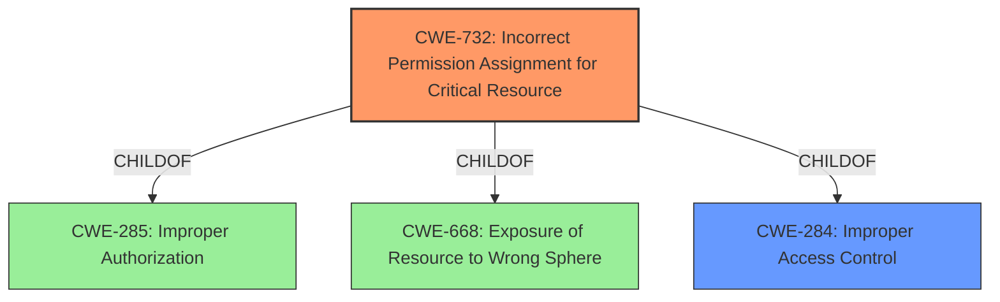

# Analysis Report for CVE-2021-32460

# Vulnerability Analysis Report: CVE-2021-32460

## Description


## Analysis (with Relationship Data)

# Summary
| CWE ID | CWE Name | Confidence | CWE Abstraction Level | CWE Vulnerability Mapping Label | CWE-Vulnerability Mapping Notes |
|---|---|---|---|---|---|
| CWE-732 | Incorrect Permission Assignment for Critical Resource | 0.9 | Class | Primary | Allowed-with-Review |
| CWE-284 | Improper Access Control | 0.6 | Pillar | Secondary | Discouraged |

## Evidence and Confidence

*   **Confidence Score:** 0.75
*   **Evidence Strength:** HIGH

## Relationship Analysis
The primary CWE is CWE-732 which is a child of CWE-285 and CWE-668. CWE-284 is a discouraged Pillar CWE. The weakness is that the product sets incorrect permissions on a sensitive file.


## Vulnerability Chain
The vulnerability chain starts with the **improper access control** (**incorrect permission assignment** on a sensitive file). The impact is a local attacker can then escalate privileges to SYSTEM level.

## Summary of Analysis
The initial assessment identified **improper access control** as the root cause, which aligns with CWE-284 (Improper Access Control). However, CWE-284 is a Pillar-level CWE and is discouraged. Based on the CVE Reference Links Content Summary, the root cause is that "the product sets incorrect permissions on a sensitive file, which is exploited for privilege escalation." This indicates a more specific weakness: CWE-732 (Incorrect Permission Assignment for Critical Resource), which is a Class-level CWE and allowed with review.

The vulnerability description states an "**improper access control** vulnerability in the installer which could allow a local attacker to escalate privileges on a target machine."

The **rootcause** is that the product sets incorrect permissions on a sensitive file, which is exploited for privilege escalation.

The final decision is to assign CWE-732 as the primary CWE because it directly addresses the **incorrect permission assignment** aspect. The confidence is high (0.9) because the provided evidence explicitly mentions **incorrect permissions** as the root cause. CWE-284 is assigned as a secondary CWE, with lower confidence (0.6) due to its high-level abstraction.

The selected CWEs are at the optimal level of specificity because CWE-732 directly reflects the **incorrect permission assignment** on a sensitive file, while avoiding the overly broad scope of CWE-284. Other CWEs were considered but are not as well-suited:

*   CWE-250 (Execution with Unnecessary Privileges): While privilege escalation is the impact, the root cause is not the execution with unnecessary privileges, but the incorrect permission assignment.
*   CWE-59 (Improper Link Resolution Before File Access ('Link Following')): There is no mention of symbolic links.
*   CWE-269 (Improper Privilege Management): This is too general and discouraged.
*   CWE-1386 (Insecure Operation on Windows Junction / Mount Point): There is no mention of junction or mount points.
*   CWE-363 (Race Condition Enabling Link Following): No mention of race condition or symlinks.
*   CWE-20 (Improper Input Validation): There's no input validation issue.
*   CWE-367 (Time-of-check Time-of-use (TOCTOU) Race Condition): There is no time-of-check time-of-use issue.
*   CWE-61 (UNIX Symbolic Link (Symlink) Following): There is no symlink issue.


## CWE Relationship Analysis

Current CWEs represent these abstraction levels: .


### Vulnerability Chain Analysis

**Chain starting from CWE-732:**
- 732 (Incorrect Permission Assignment for Critical Resource) - ROOT


**Chain starting from CWE-284:**
- 284 (Improper Access Control) - ROOT


### CWE Relationship Diagram

```mermaid
graph TD
    classDef primary fill:#f96,stroke:#333,stroke-width:2px
    classDef secondary fill:#69f,stroke:#333
    classDef tertiary fill:#9e9,stroke:#333
```


*Report generated on 2025-04-02 07:47:09*
