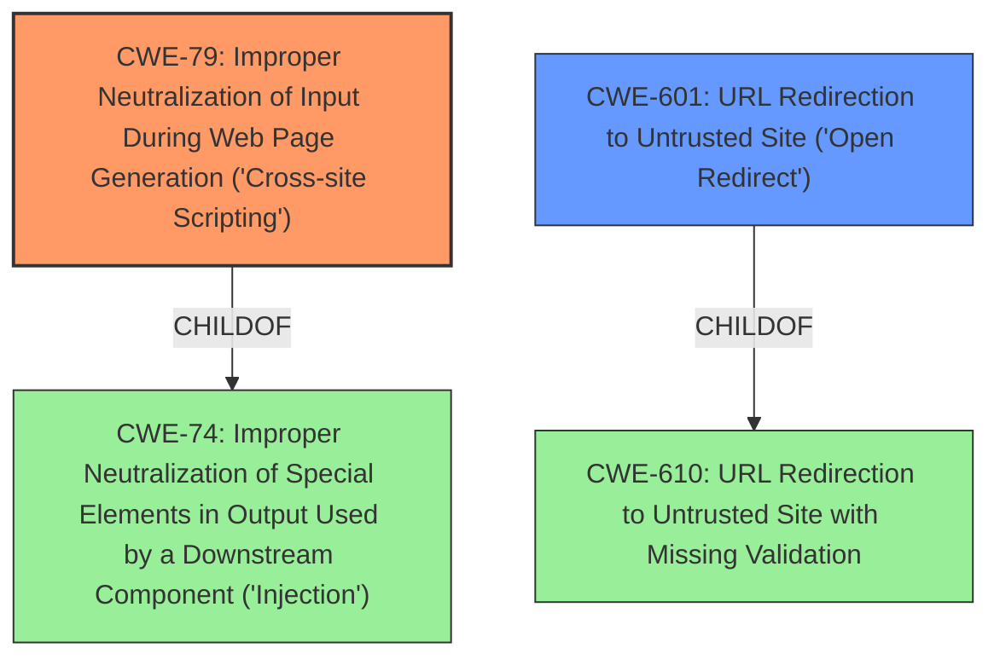

# Analysis for CVE-2021-32478

# Summary
| CWE ID  | CWE Name                                                                     | Confidence | CWE Abstraction Level | CWE Vulnerability Mapping Label | CWE-Vulnerability Mapping Notes |
| :-------- | :--------------------------------------------------------------------------- | :--------- | :-------------------- | :------------------------------ | :------------------------------ |
| CWE-79  | Improper Neutralization of Input During Web Page Generation ('Cross-site Scripting') | 1.0        | Base                  | Primary CWE                   | Allowed                       |
| CWE-601 | URL Redirection to Untrusted Site ('Open Redirect')                          | 0.9        | Base                  | Secondary Candidate             | Allowed                       |

## Evidence and Confidence

*   **Confidence Score:** 0.95
*   **Evidence Strength:** HIGH

## Relationship Analysis
The primary weakness is **CWE-79 (Improper Neutralization of Input During Web Page Generation ('Cross-site Scripting'))**, which is a base-level CWE. It is related to **CWE-74 (Improper Neutralization of Special Elements in Output Used by a Downstream Component ('Injection'))** as a child. **CWE-601 (URL Redirection to Untrusted Site ('Open Redirect'))** is also a base-level CWE and is related to **CWE-610 (URL Redirection to Untrusted Site with Missing Validation)**. The vulnerability description mentions both reflected XSS and open redirect risks, justifying the selection of both CWEs.

## Vulnerability Chain
The vulnerability chain starts with **lack of proper input sanitization** in the redirect URI, leading to reflected XSS (**CWE-79**) and open redirect vulnerabilities (**CWE-601**). The attacker can inject malicious scripts into the redirect URI, leading to XSS attacks, or redirect users to malicious websites.

## Summary of Analysis
The initial analysis strongly points towards **CWE-79** due to the **lack of proper input sanitization** leading to reflected XSS. The description explicitly mentions "reflected XSS and open redirect risks," further reinforcing the selection of **CWE-601** as a secondary weakness. The retriever results also list **CWE-79** as the top match.

The evidence from the vulnerability description includes:
- "**rootcause:** **lack of proper input sanitization**"
- "**weakness:** **cross-site scripting**"
- "**impact:** open redirect and reflected XSS"
- "**Root cause of vulnerability**: The redirect URI in the LTI authorization endpoint lacked sufficient sanitization."
- "**Weaknesses/vulnerabilities present**: Reflected Cross-Site Scripting (XSS) and Open Redirect."

**CWE-79** is at the base level of abstraction and accurately represents the **improper neutralization of input** leading to cross-site scripting. **CWE-601** is also at the base level and represents the open redirect vulnerability. Both CWEs are specific enough to describe the weaknesses present in the vulnerability.

Other CWEs Considered but Not Used:

*   **CWE-174 (Double Decoding of the Same Data)**: While double decoding could potentially exacerbate XSS, the primary issue here is the **lack of initial sanitization**, not double decoding.
*   **CWE-863 (Incorrect Authorization)**: While authorization might be related, the core problem is the **lack of input sanitization** on the redirect URI.
*   **CWE-116 (Improper Encoding or Escaping of Output)**: This is similar to **CWE-79**, but **CWE-79** is more specific to XSS.
*   **CWE-138 (Improper Neutralization of Special Elements)**: This is a class-level CWE and less specific than **CWE-79**.
*   **CWE-494 (Download of Code Without Integrity Check)**: This is not relevant as the vulnerability doesn't involve downloading code.
*   **CWE-20 (Improper Input Validation)**: This is a class-level CWE and too generic. The vulnerability is specifically about **improper neutralization** for XSS, which is more accurately described by **CWE-79**.
*   **CWE-285 (Improper Authorization)**: Not directly related to the **lack of input sanitization**.
*   **CWE-212 (Improper Removal of Sensitive Information Before Storage or Transfer)**: Not relevant to this vulnerability.

I am confident in the selection of **CWE-79** and **CWE-601** based on the provided evidence and the relationships between CWEs.