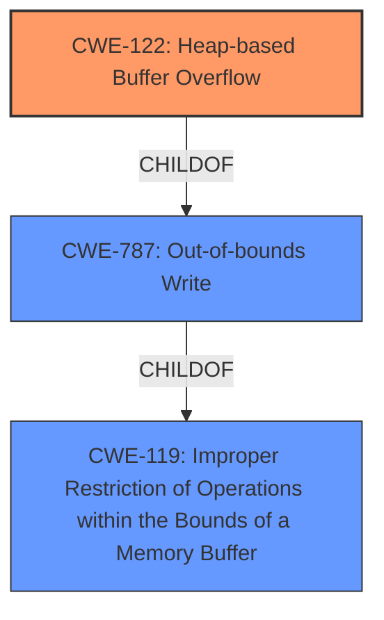

# Analysis Report for CVE-2021-32486

# Vulnerability Analysis Report: CVE-2021-32486

## Description


## Analysis (with Relationship Data)

# Summary
| CWE ID  | CWE Name                                                                            | Confidence | CWE Abstraction Level | CWE Vulnerability Mapping Label | CWE-Vulnerability Mapping Notes |
| :-------- | :---------------------------------------------------------------------------------- | :--------- | :---------------------- | :------------------------------ | :------------------------------ |
| CWE-122   | Heap-based Buffer Overflow                                                          | 1          | Variant                 | Allowed                         | Primary CWE                     |
| CWE-787   | Out-of-bounds Write                                                                 | 0.8        | Base                    | Allowed                         | Secondary Candidate             |
| CWE-119   | Improper Restriction of Operations within the Bounds of a Memory Buffer            | 0.6        | Class                   | Discouraged                     | Secondary Candidate             |

## Evidence and Confidence

*   **Confidence Score:** 0.9
*   **Evidence Strength:** HIGH

## Relationship Analysis
The primary relationship that impacted my decision was the child-parent relationship between CWE-122 (Heap-based Buffer Overflow) and CWE-787 (Out-of-bounds Write), and between CWE-787 and CWE-119 (Improper Restriction of Operations within the Bounds of a Memory Buffer). CWE-122 is a variant of CWE-787, which in turn is a child of CWE-119. Given the specific nature of the **heap buffer overflow** mentioned in the vulnerability description, CWE-122 is the most specific and appropriate choice.



## Vulnerability Chain
The vulnerability chain starts with a **heap buffer overflow** (CWE-122), which leads to an out-of-bounds write (CWE-787), ultimately resulting in a system crash and remote denial of service.

## Summary of Analysis
The initial analysis pointed towards CWE-787 as the primary match, which aligns with the top CWEs for similar CVE descriptions. However, the vulnerability description specifically mentions a "**heap buffer overflow**". Therefore, CWE-122 (Heap-based Buffer Overflow) is a more precise classification.

The evidence supporting this decision comes directly from the "**Vulnerability Description Key Phrases**" which pinpoint the **rootcause** as a "**heap buffer overflow**". The "CVE Reference Links Content Summary" also reinforces this by stating that the **root cause of vulnerability** is a **heap-based buffer overflow**.

CWE-122 is at the Variant level of abstraction, which is a preferred level for mapping root causes. It's a child of CWE-787 (Out-of-bounds Write), which is a more general description of the issue. The selection of CWE-122 provides a more specific and accurate representation of the vulnerability.

CWE-119 was considered as a potential candidate but was rejected as it is too generic. The mapping guidance for CWE-119 discourages its use when more specific CWEs are available.

Relevant CWE Information:

# Enhanced Context (25 CWEs)
The following CWEs were identified as potentially relevant to this vulnerability:

## Vulnerability Description
In modem 2G RRM, there is a possible system crash due to a **heap buffer overflow**. This could lead to remote denial of service with no additional execution privileges needed. User interaction is not needed for exploitation. Patch ID MOLY00500621 Issue ID ALPS04964928.

### Vulnerability Description Key Phrases
- **rootcause:** **heap buffer overflow**
- **impact:** system crash
- **product:** modem 2G RRM

### CWE for similar CVE Descriptions
### Primary CWE Match
CWE-787

#### Top CWEs
- CWE-787 (Count: 60)
- CWE-20 (Count: 22)
- CWE-416 (Count: 10)

## CVE Reference Links Content Summary
- **Root cause of vulnerability**: A heap-based buffer overflow in the Modem 2G RRM.
- **Weaknesses/vulnerabilities present**: Heap-based buffer overflow leading to an out-of-bounds write.
- **Impact of exploitation**: Remote code execution.
- **Attack vectors**: Exploitation occurs when the device is connecting to a 2G cellular network.
- **Required attacker capabilities/position**: No special execution privileges or user interaction are needed for exploitation. The attacker needs to be able to cause a vulnerable device to connect to a 2G cellular network.

## Retriever Results

### Top Combined Results

| Rank | CWE ID | Name | Abstraction | Usage  | Retrievers | Individual Scores |
|------|--------|------|-------------|-------|------------|-------------------|
| 1 | 119 | Improper Restriction of Operations within the Bounds of a Memory Buffer | Class | Discouraged | alternate_terms | 0.800 |
| 2 | 190 | Integer Overflow or Wraparound | Base | Allowed | alternate_terms | 0.800 |
| 3 | 122 | Heap-based Buffer Overflow | Variant | Allowed | sparse | 0.369 |
| 4 | 131 | Incorrect Calculation of Buffer Size | Base | Allowed | sparse | 0.359 |
| 5 | 1284 | Improper Validation of Specified Quantity in Input | Base | Allowed | sparse | 0.328 |
| 6 | 121 | Stack-based Buffer Overflow | Variant | Allowed | dense | 0.581 |
| 7 | 128 | Wrap-around Error | Base | Allowed | graph | 0.003 |
| 8 | 191 | Integer Underflow (Wrap or Wraparound) | Base | Allowed | sparse | 0.323 |
| 9 | 362 | Concurrent Execution using Shared Resource with Improper Synchronization ('Race Condition') | Class | Allowed-with-Review | sparse | 0.316 |
| 10 | 704 | Incorrect Type Conversion or Cast | Class | Allowed-with-Review | sparse | 0.312 |

# Complete CWE Specifications

## CWE-122: Heap-based Buffer Overflow
**Abstraction:** Variant
**Status:** Draft

### Description
A heap overflow condition is a buffer overflow, where the buffer that can be overwritten is allocated in the heap portion of memory, generally meaning that the buffer was allocated using a routine such as malloc().

### Extended Description
Not provided

### Alternative Terms
None

### Relationships
ChildOf -> CWE-788
ChildOf -> CWE-787

### Mapping Guidance
**Usage:** Allowed
**Rationale:** This CWE entry is at the Variant level of abstraction, which is a preferred level of abstraction for mapping to the root causes of vulnerabilities.
**Comments:** Carefully read both the name and description to ensure that this mapping is an appropriate fit. Do not try to 'force' a mapping to a lower-level Base/Variant simply to comply with this preferred level of abstraction.
**Reasons:**
- Acceptable-Use

### Additional Notes
**[Relationship]** Heap-based buffer overflows are usually just as dangerous as stack-based buffer overflows.

### Observed Examples
- **CVE-2021-43537:** Chain: in a web browser, an unsigned 64-bit integer is forcibly cast to a 32-bit integer (CWE-681) and potentially leading to an integer overflow (CWE-190). If an integer overflow occurs, this can cause heap memory corruption (CWE-122)
- **CVE-2007-4268:** Chain: integer signedness error (CWE-195) passes signed comparison, leading to heap overflow (CWE-122)
- **CVE-2009-2523:** Chain: product does not handle when an input string is not NULL terminated (CWE-170), leading to buffer over-read (CWE-125) or heap-based buffer overflow (CWE-122).

## CWE-787: Out-of-bounds Write
**Abstraction:** Base
**Status:** Stable

### Description
The product writes data past the end, or before the beginning, of the intended buffer.

### Extended Description
This typically occurs when the software copies data of a fixed length into a buffer that is too small to hold it, resulting in a write past the end of the buffer.

While the terms "buffer overflow


## CWE Relationship Analysis

Current CWEs represent these abstraction levels: .


### Vulnerability Chain Analysis

**Chain starting from CWE-787:**
- 787 (Out-of-bounds Write) - ROOT


**Chain starting from CWE-416:**
- 416 (Use After Free) - ROOT


### CWE Relationship Diagram

```mermaid
graph TD
    classDef primary fill:#f96,stroke:#333,stroke-width:2px
    classDef secondary fill:#69f,stroke:#333
    classDef tertiary fill:#9e9,stroke:#333
```


*Report generated on 2025-04-01 19:45:20*
