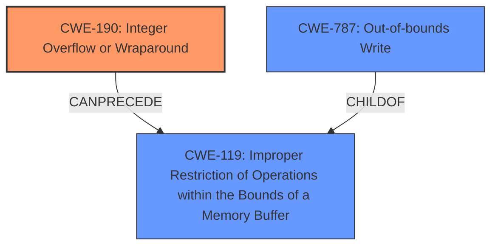

# Enhanced Analysis for CVE-2021-32493

# Summary
| CWE ID | CWE Name | Confidence | CWE Abstraction Level | CWE Vulnerability Mapping Label | CWE-Vulnerability Mapping Notes |
|---|---|---|---|---|---|
| CWE-190 | Integer Overflow or Wraparound | 1.00 | Base | Primary | Allowed |
| CWE-787 | Out-of-bounds Write | 1.00 | Base | Secondary | Allowed |

## Evidence and Confidence

*   **Confidence Score:** 1.00
*   **Evidence Strength:** HIGH

## Relationship Analysis
The primary weakness is **CWE-190 [Integer Overflow or Wraparound]**, which can **CanPrecede** **CWE-119 [Improper Restriction of Operations within the Bounds of a Memory Buffer]**. **CWE-787 [Out-of-bounds Write]** is a child of **CWE-119 [Improper Restriction of Operations within the Bounds of a Memory Buffer]**. This indicates that the integer overflow leads to an out-of-bounds write, fitting the description of the vulnerability. The base level of abstraction for both CWE-190 and CWE-787 are appropriate.



## Vulnerability Chain
The vulnerability chain starts with an integer overflow (**CWE-190 [Integer Overflow or Wraparound]**) during buffer size calculation. This leads to an undersized buffer allocation, and subsequently, an out-of-bounds write (**CWE-787 [Out-of-bounds Write]**) occurs when data is written into the buffer.

## Summary of Analysis
The vulnerability involves a **heap buffer overflow** due to an integer overflow when calculating buffer sizes.

The **Vulnerability Description** states "A **heap buffer overflow** in function DJVUGBitmapdecode() via crafted djvu file may lead to application crash and other consequences."

The **CVE Reference Links Content Summary** indicates "The vulnerability stems from a heap buffer overflow within the `DJVU::GBitmap::decode()` function in Djvulibre. This occurs due to an integer overflow when calculating buffer sizes during bitmap decoding, leading to a heap buffer overflow when writing to the undersized allocated memory." It also mentions "An unsigned short integer overflow in `GBitmap::decode()` is the root cause of the heap overflow. The sum of two unsigned short values is stored in another unsigned short variable, and if the sum exceeds the maximum value, the result will wrap around to a small value, leading to an undersized allocation."

Based on the **heap buffer overflow** and integer overflow in the **CVE Reference Links Content Summary**, the primary cause is **CWE-190 [Integer Overflow or Wraparound]**. The resulting **heap buffer overflow** is best represented by **CWE-787 [Out-of-bounds Write]**.

Other CWEs were considered but deemed less appropriate:
*   CWE-119 [Improper Restriction of Operations within the Bounds of a Memory Buffer] is too high-level and discouraged by MITRE.
*   CWE-122 [Heap-based Buffer Overflow] is a variant of CWE-787 [Out-of-bounds Write] and doesn't capture the root cause.
*   CWE-125 [Out-of-bounds Read] is not applicable as the issue is a write, not a read.

The chosen CWEs are at the appropriate level of specificity and accurately represent the vulnerability based on the provided evidence.

Relevant CWE Information:

# Enhanced Context (25 CWEs)
The following CWEs were identified as potentially relevant to this vulnerability:

## CWE-131: Incorrect Calculation of Buffer Size
**Abstraction Level**: Base
**Similarity Score**: 0.77
**Source**: dense

**Description**:
The product does not correctly calculate the size to be used when allocating a buffer, which could lead to a buffer overflow.

**Mapping Guidance**:
- Usage: Allowed
- Rationale: This CWE entry is at the Base level of abstraction, which is a preferred level of abstraction for mapping to the root causes of vulnerabilities.

**Why Not Used:** While this CWE is related, CWE-190 [Integer Overflow or Wraparound] is more specific about the root cause.

## CWE-415: Double Free
**Abstraction Level**: Variant
**Similarity Score**: 0.76
**Source**: dense

**Description**:
The product calls free() twice on the same memory address, potentially leading to modification of unexpected memory locations.

**Mapping Guidance**:
- Usage: Allowed
- Rationale: This CWE entry is at the Variant level of abstraction, which is a preferred level of abstraction for mapping to the root causes of vulnerabilities.

**Why Not Used:** This CWE is not relevant to the vulnerability description.

## CWE-191: Integer Underflow (Wrap or Wraparound)
**Abstraction Level**: Base
**Similarity Score**: 0.76
**Source**: dense

**Description**:
The product subtracts one value from another, such that the result is less than the minimum allowable integer value, which produces a value that is not equal to the correct result.

**Mapping Guidance**:
- Usage: Allowed
- Rationale: This CWE entry is at the Base level of abstraction, which is a preferred level of abstraction for mapping to the root causes of vulnerabilities.

**Why Not Used:** The description explicitly mentions an integer overflow, not underflow.

## CWE-125: Out-of-bounds Read
**Abstraction Level**: Base
**Similarity Score**: 0.76
**Source**: dense

**Description**:
The product reads data past the end, or before the beginning, of the intended buffer.

**Mapping Guidance**:
- Usage: Allowed
- Rationale: This CWE entry is at the Base level of abstraction, which is a preferred level of abstraction for mapping to the root causes of vulnerabilities.

**Why Not Used:** The vulnerability is due to writing out of bounds, not reading.

## CWE-126: Buffer Over-read
**Abstraction Level**: Variant
**Similarity Score**: 0.76
**Source**: dense

**Description**:
The product reads from a buffer using buffer access mechanisms such as indexes or pointers that reference memory locations after the targeted buffer.

**Mapping Guidance**:
- Usage: Allowed
- Rationale: This CWE entry is at the Variant level of abstraction, which is a preferred level of abstraction for mapping to the root causes of vulnerabilities.

**Why Not Used:** The vulnerability is due to writing out of bounds, not reading.

## CWE-193: Off-by-one Error
**Abstraction Level**: Base
**Similarity Score**: 0.75
**Source**: dense

**Description**:
A product calculates or uses an incorrect maximum or minimum value that is 1 more, or 1 less, than the correct value.

**Mapping Guidance**:
- Usage: Allowed
- Rationale: This CWE entry is at the Base level of abstraction, which is a preferred level of abstraction for mapping to the root causes of vulnerabilities.

**Why Not Used:** While potentially related, the more specific cause is an integer overflow.

## CWE-789: Memory Allocation with Excessive Size Value
**Abstraction Level**: Variant
**Similarity Score**: 0.75
**Source**: dense

**Description**:
The product allocates memory based on an untrusted, large size value, but it does not ensure that the size is within expected limits, allowing arbitrary amounts of memory to be allocated.

**Mapping Guidance**:
- Usage: Allowed
- Rationale: This CWE entry is at the Variant level of abstraction, which is a preferred level of abstraction for mapping to the root causes of vulnerabilities.

**Why Not Used:** The problem is not an excessively large allocation but an undersized allocation due to integer overflow.

## CWE-667: Improper Locking
**Abstraction Level**: Class
**Similarity Score**: 0.75
**Source**: dense

**Description**:
The product does not properly acquire or release a lock on a resource, leading to unexpected resource state changes and behaviors.

**Mapping Guidance**:
- Usage: Allowed-with-Review
- Rationale: This CWE entry is a Class and might have Base-level children that would be more appropriate

**Why Not Used:** This is not related to concurrency or locking issues.

## CWE-226: Sensitive Information in Resource Not Removed Before Reuse
**Abstraction Level**: Base
**Similarity Score**: 0.75
**Source**: dense

**Description**:
The product releases a resource such as memory or a file so that it can be made available for reuse, but it does not clear or "zeroize" the information contained in the resource before the product performs a critical state


## CWE Relationship Analysis

Current CWEs represent these abstraction levels: .


### Vulnerability Chain Analysis

**Chain starting from CWE-667:**
- 667 (Improper Locking) - ROOT


**Chain starting from CWE-787:**
- 787 (Out-of-bounds Write) - ROOT


### CWE Relationship Diagram

```mermaid
graph TD
    classDef primary fill:#f96,stroke:#333,stroke-width:2px
    classDef secondary fill:#69f,stroke:#333
    classDef tertiary fill:#9e9,stroke:#333
```