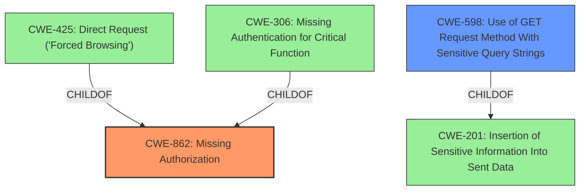

# Analysis Report for CVE-2021-32503

# Vulnerability Analysis Report: CVE-2021-32503

## Description


## Analysis (with Relationship Data)

# Summary
| CWE ID | CWE Name | Confidence | CWE Abstraction Level | CWE Vulnerability Mapping Label | CWE-Vulnerability Mapping Notes |
|---|---|---|---|---|---|
| CWE-862 | Missing Authorization | 1.0 | Base | Primary | Allowed |
| CWE-598 | Use of GET Request Method With Sensitive Query Strings | 0.7 | Variant | Secondary | Allowed |

## Evidence and Confidence

*   **Confidence Score:** 0.9
*   **Evidence Strength:** MEDIUM

## Relationship Analysis
The primary CWE is CWE-862, which indicates a **missing authorization** issue. CWE-425 and CWE-306 are children of CWE-862 and each other, but the vulnerability description does not seem to be related to "forced browsing" (CWE-425) or lack of authentication (CWE-306).

CWE-598 is a child of CWE-201, which is related to the transmission of sensitive information.



## Vulnerability Chain
The vulnerability involves an unauthenticated user gaining access to sensitive web URLs via GET requests.

1.  **Root Cause:** **Missing Authorization** (CWE-862): The application **fails to properly verify** if the user has the necessary privileges to access the requested resource.
2.  **Mechanism:** Use of GET requests (CWE-598): Sensitive information might be included in the URL, potentially exposing it in logs or browser history.
3.  **Impact:** Access to sensitive web URLs, potentially leading to further attacks.

## Summary of Analysis
The initial analysis identified CWE-862 as the primary weakness, and CWE-598 as a potential secondary weakness.

The vulnerability description clearly states that unauthenticated users can access sensitive web URLs, indicating **a failure in authorization**. This aligns directly with the description of CWE-862 ("Missing Authorization"), where the product **does not ensure that the user is authorized** for the requested resource. The "CWE for similar CVE Descriptions" section also lists CWE-862 as the primary CWE match, reinforcing this selection.

The use of GET requests to access these sensitive URLs is a contributing factor that could potentially expose sensitive information within the URL itself, such as session tokens or other parameters. This makes CWE-598 ("Use of GET Request Method With Sensitive Query Strings") a relevant, though secondary, consideration, as the method of transport is relevant for the vulnerability.

CWE-862 is a Base level CWE, which is the preferred level of abstraction, and the description of the vulnerability aligns well with the characteristics of the CWE.

CWE-598 is a Variant level CWE, which is also a preferred level of abstraction. It highlights how the use of GET requests contributes to the potential exposure of sensitive information.

Several other CWEs were considered but not selected because they didn't fully capture the core issue or were too abstract. For example, CWE-200 ("Exposure of Sensitive Information to an Unauthorized Actor") is a Class-level CWE that is discouraged as it describes the impact rather than the root cause. CWE-425 ("Direct Request ('Forced Browsing')") was also considered, but the description doesn't focus on the "forced browsing" aspect but rather on the **lack of authorization**.

The decision to map CWE-862 as the primary CWE is based on the evidence from the vulnerability description that clearly points to **a missing authorization check**. The selection is further supported by the retriever results and the CWE specifications. The abstraction level of CWE-862 is at the base level and is therefore more desirable.


## CWE Relationship Analysis

Current CWEs represent these abstraction levels: .


### Vulnerability Chain Analysis

**Chain starting from CWE-306:**
- 306 (Missing Authentication for Critical Function) - ROOT


**Chain starting from CWE-862:**
- 862 (Missing Authorization) - ROOT


### CWE Relationship Diagram

```mermaid
graph TD
    classDef primary fill:#f96,stroke:#333,stroke-width:2px
    classDef secondary fill:#69f,stroke:#333
    classDef tertiary fill:#9e9,stroke:#333
```


*Report generated on 2025-04-01 16:28:25*
