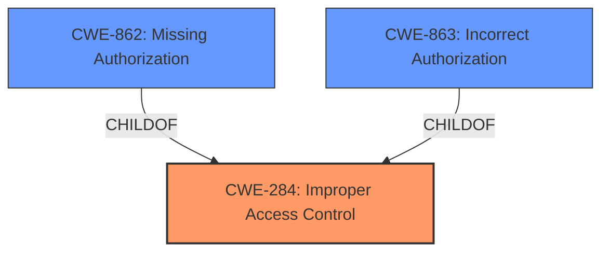

# Enhanced Analysis for CVE-2021-32514

# Summary
| CWE ID | CWE Name | Confidence | CWE Abstraction Level | CWE Vulnerability Mapping Label | CWE-Vulnerability Mapping Notes |
|---|---|---|---|---|---|
| CWE-284 | Improper Access Control | 0.7 | Pillar | Primary | Discouraged |
| CWE-862 | Missing Authorization | 0.6 | Base | Secondary | Allowed |
| CWE-863 | Incorrect Authorization | 0.6 | Class | Secondary | Allowed-with-Review |

## Evidence and Confidence

*   **Confidence Score:** 0.7
*   **Evidence Strength:** MEDIUM

## Relationship Analysis
The primary CWE identified is CWE-284 (Improper Access Control), which is a high-level Pillar. Due to its high-level nature, it's generally discouraged. The analysis also considered its child CWEs, CWE-862 (Missing Authorization) and CWE-863 (Incorrect Authorization), for more specific classifications.



## Vulnerability Chain
The chain of events starts with an **improper access control** vulnerability. This leads to remote attackers being able to reboot and discontinue the device.

## Summary of Analysis
The initial analysis points to **CWE-284 (Improper Access Control)** due to the vulnerability description explicitly stating "**Improper access control** vulnerability". However, CWE-284 is a high-level Pillar and is discouraged. Therefore, the analysis also considered more specific child CWEs such as CWE-862 (Missing Authorization) and CWE-863 (Incorrect Authorization). Without more information, it is difficult to determine if authorization is completely missing or if it is incorrectly implemented. Both are plausible given the description.

The evidence is directly from the "Vulnerability Description Key Phrases" which states "**rootcause: Improper access control**".

The final decision is to include CWE-284 as the primary because that is what is explicitly stated in the description of the vulnerability. It will be noted that this is discouraged for mapping. The other two CWEs will be included as secondary candidates because there is not enough information to differentiate between the two.

# Relevant CWE Information:

## CWE-312: Cleartext Storage of Sensitive Information
**Abstraction Level**: Base
**Similarity Score**: 0.76
**Source**: dense
This CWE is not relevant because the description does not describe storage of any kind.

## CWE-807: Reliance on Untrusted Inputs in a Security Decision
**Abstraction Level**: Base
**Similarity Score**: 0.75
**Source**: dense
This CWE is not relevant because the description does not describe untrusted inputs.

## CWE-345: Insufficient Verification of Data Authenticity
**Abstraction Level**: Class
**Similarity Score**: 0.75
**Source**: dense
This CWE is not relevant because the description does not describe data authenticity.

## CWE-668: Exposure of Resource to Wrong Sphere
**Abstraction Level**: Class
**Similarity Score**: 0.75
**Source**: dense
This CWE is not relevant because the description does not describe exposure of resources.

## CWE-212: Improper Removal of Sensitive Information Before Storage or Transfer
**Abstraction Level**: Base
**Similarity Score**: 0.74
**Source**: dense
This CWE is not relevant because the description does not describe removal of sensitive information.

## CWE-1391: Use of Weak Credentials
**Abstraction Level**: Class
**Similarity Score**: 0.74
**Source**: dense
This CWE is not relevant because the description does not describe credentials.

## CWE-798: Use of Hard-coded Credentials
**Abstraction Level**: Base
**Similarity Score**: 0.74
**Source**: dense
This CWE is not relevant because the description does not describe hardcoded credentials.

## CWE-41: Improper Resolution of Path Equivalence
**Abstraction Level**: Base
**Similarity Score**: 0.74
**Source**: dense
This CWE is not relevant because the description does not describe path equivalence.

## CWE-274: Improper Handling of Insufficient Privileges
**Abstraction Level**: Base
**Similarity Score**: 0.74
**Source**: dense
This CWE is not relevant because the description does not describe insufficient privileges.

## CWE-538: Insertion of Sensitive Information into Externally-Accessible File or Directory
**Abstraction Level**: Base
**Similarity Score**: 0.74
**Source**: dense
This CWE is not relevant because the description does not describe sensitive information in files or directories.

## CWE-916: Use of Password Hash With Insufficient Computational Effort
**Abstraction Level**: Base
**Similarity Score**: 5669.31
**Source**: sparse
This CWE is not relevant because the description does not describe password hashing.

## CWE-59: Improper Link Resolution Before File Access ('Link Following')
**Abstraction Level**: Base
**Similarity Score**: 5269.22
**Source**: sparse
This CWE is not relevant because the description does not describe link resolution.

## CWE-184: Incomplete List of Disallowed Inputs
**Abstraction Level**: Base
**Similarity Score**: 5189.07
**Source**: sparse
This CWE is not relevant because the description does not describe disallowed inputs.

## CWE-22: Improper Limitation of a Pathname to a Restricted Directory ('Path Traversal')
**Abstraction Level**: Base
**Similarity Score**: 5175.37
**Source**: sparse
This CWE is not relevant because the description does not describe path traversal.

## CWE-863: Incorrect Authorization
**Abstraction Level**: Class
**Similarity Score**: 5143.92
**Source**: sparse

**Description**:
The product performs an authorization check when an actor attempts to access a resource or perform an action, but it does not correctly perform the check.

**Mapping Guidance**:
- Usage: Allowed-with-Review
- Rationale: This CWE entry is a Class and might have Base-level children that would be more appropriate

This is a secondary candidate because the description implies an access control problem but could be due to an incorrectly implemented authorization check.

## CWE-434: Unrestricted Upload of File with Dangerous Type
**Abstraction Level**: base
**Similarity Score**: 4.33
**Source**: graph
This CWE is not relevant because the description does not describe file uploads.

## CWE-205: Observable Behavioral Discrepancy
**Abstraction Level**: base
**Similarity Score**: 4.33
**Source**: graph
This CWE is not relevant because the description does not describe behavioral discrepancies.

## CWE-79: Improper Neutralization of Input During Web Page Generation ('Cross-site Scripting')
**Abstraction Level**: base
**Similarity Score**: 4.33
**Source**: graph
This CWE is not relevant because the description does not describe cross-site scripting.

## CWE-78: Improper Neutralization of Special Elements used in an OS Command ('OS Command Injection')
**Abstraction Level**: base
**Similarity Score**: 4.33
**Source**: graph
This CWE is not relevant because the description does not describe command injection.

## CWE-98: Improper Control of Filename for Include/Require Statement in PHP Program ('PHP Remote File Inclusion')
**Abstraction Level**: variant
**Similarity Score**: 3.88
**Source**: graph
This CWE is not relevant because the description does not describe PHP remote file inclusion.

## CWE-266: Incorrect Privilege Assignment
**Abstraction Level**: base
**Similarity Score**: 3.64
**Source**: graph
This CWE is not relevant because the description does not describe privilege assignment.

## CWE-425: Direct Request ('Forced Browsing')
**Abstraction Level**: base
**Similarity Score**: 2.87
**Source**: graph
This CWE is not relevant because the description does not describe forced browsing.

## CWE-284: Improper Access Control
**Abstraction:** Pillar
**Status:** Incomplete

### Description
The product does not restrict or incorrectly restricts access to a resource from an unauthorized actor.

This is the primary candidate CWE because the description explicitly states "**Improper access control**". This is discouraged.

## CWE-285: Improper Authorization
**Abstraction:** Class
**Status:** Draft

### Description
The product does not perform or incorrectly performs an authorization check when an actor attempts to access a resource or perform an action.

This is a secondary candidate because the description implies an access control problem but could be due to an authorization issue.

## CWE-269: Improper Privilege Management
**Abstraction


## CWE Relationship Analysis

Current CWEs represent these abstraction levels: .


### Vulnerability Chain Analysis

**Chain starting from CWE-862:**
- 862 (Missing Authorization) - ROOT


**Chain starting from CWE-434:**
- 434 (Unrestricted Upload of File with Dangerous Type) - ROOT


### CWE Relationship Diagram

```mermaid
graph TD
    classDef primary fill:#f96,stroke:#333,stroke-width:2px
    classDef secondary fill:#69f,stroke:#333
    classDef tertiary fill:#9e9,stroke:#333
```