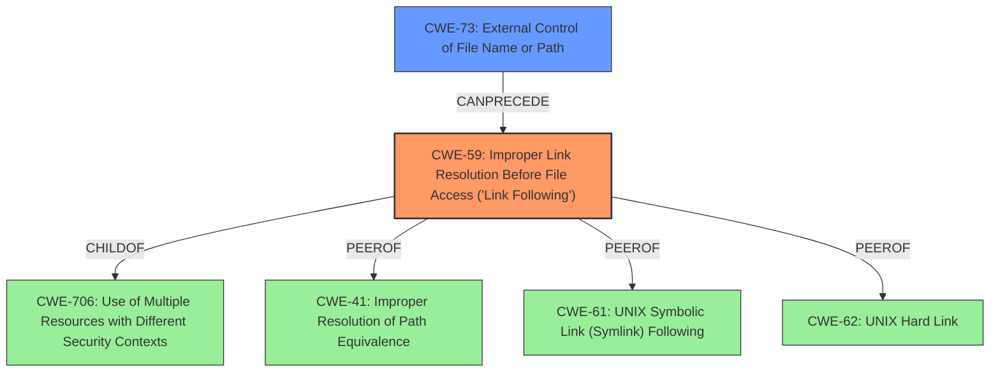

# Analysis for CVE-2021-32518

# Summary
| CWE ID | CWE Name | Confidence | CWE Abstraction Level | CWE Vulnerability Mapping Label | CWE-Vulnerability Mapping Notes |
|---|---|---|---|---|---|
| CWE-59 | Improper Link Resolution Before File Access ('Link Following') | 1.0 | Base | Allowed | Primary CWE |
| CWE-73 | External Control of File Name or Path | 0.7 | Base | Allowed | Secondary CWE |

## Evidence and Confidence

*   **Confidence Score:** 0.9
*   **Evidence Strength:** HIGH

## Relationship Analysis
The primary CWE is CWE-59, which describes the **improper link resolution** that allows an attacker to access arbitrary files. A related CWE is CWE-73, because the attacker is using an externally controlled file name or path to create the symbolic link. CWE-59 is a child of CWE-706 (Use of Multiple Resources with Different Security Contexts) and has peer relationships with CWE-41, CWE-61, and CWE-62 which are all related to file access and path manipulation. The relationship between CWE-59 and CWE-73 is that CWE-73 can precede CWE-59, meaning that external control of the file name or path can lead to improper link resolution.

## Vulnerability Chain
The vulnerability chain starts with the **improper handling of file paths** (CWE-73), which allows a remote attacker to **create a symbolic link** and then **access arbitrary files** (CWE-59).

## Summary of Analysis
The initial analysis pointed to CWE-59 as the primary weakness, which aligns with the vulnerability description of a symbolic link attack. The retriever results also indicated CWE-59 as the top candidate.

The vulnerability description states that a remote attacker can **create a symbolic link** then **access arbitrary files**. This aligns with the description of CWE-59 which states: "The product attempts to access a file based on the filename, but it does not properly prevent that filename from identifying a link or shortcut that resolves to an unintended resource."

The relationship graph shows that CWE-59 can be preceded by CWE-73 (External Control of File Name or Path), indicating that the attacker's ability to control the file name or path is a contributing factor to the vulnerability.

CWE-59 is at the Base level of abstraction, which is the preferred level for mapping vulnerabilities. CWE-73 is also at the Base level of abstraction. Both CWEs accurately represent the weakness described in the vulnerability.

Based on the vulnerability description and the retriever results, the selected CWEs are at the optimal level of specificity and accurately represent the vulnerability.