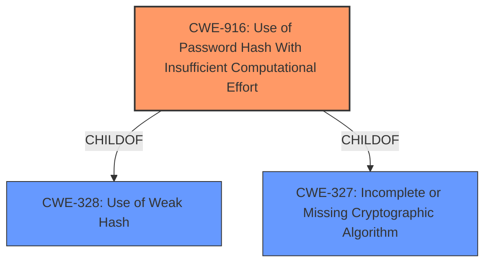

# Analysis Report for CVE-2021-32519

# Vulnerability Analysis Report: CVE-2021-32519

## Description


## Analysis (with Relationship Data)

# Summary
| CWE ID | CWE Name | Confidence | CWE Abstraction Level | CWE Vulnerability Mapping Label | CWE-Vulnerability Mapping Notes |
|---|---|---|---|---|---|
| CWE-916 | Use of Password Hash With Insufficient Computational Effort | 1.0 | Base | Allowed | Primary CWE |

## Evidence and Confidence

*   **Confidence Score:** 1.0
*   **Evidence Strength:** HIGH

## Relationship Analysis
The primary CWE identified is CWE-916 (**Use of Password Hash With Insufficient Computational Effort**). This CWE is a base level weakness. It is related to CWE-328 (**Use of Weak Hash**) and CWE-327 (**Incomplete or Missing Cryptographic Algorithm**). The vulnerability description explicitly mentions the **use of password hash with insufficient computational effort**, making CWE-916 the most appropriate choice.



## Vulnerability Chain
The vulnerability chain is as follows:
1.  **Root Cause:** **Use of password hash with insufficient computational effort** (CWE-916).
2.  **Impact:** Remote attackers can recover the plain-text password by brute-forcing the MD5 hash.

## Summary of Analysis
The initial analysis focused on identifying the root cause of the vulnerability. The vulnerability description clearly states the **rootcause** as "**Use of password hash with insufficient computational effort**".

The retriever results also listed CWE-916 as the top candidate, which aligns with the vulnerability description.

The relationship analysis confirms that CWE-916 is the most specific and appropriate CWE.

The selection of CWE-916 is based on the provided evidence, relationship analysis, and retriever results. The evidence from the vulnerability description is that "**Use of password hash with insufficient computational effort** vulnerability in QSAN Storage Manager, XEVO, SANOS allows remote attackers to recover the plain-text password by brute-forcing the MD5 hash."

The selected CWE is at the optimal level of specificity (Base) because it directly represents the weakness described in the vulnerability.

Relevant CWE Information:
## CWE-916: Use of Password Hash With Insufficient Computational Effort
**Abstraction:** Base
**Status:** Incomplete

### Description
The product generates a hash for a password, but it uses a scheme that does not provide a sufficient level of computational effort that would make password cracking attacks infeasible or expensive.


## CWE Relationship Analysis

Current CWEs represent these abstraction levels: .


### Vulnerability Chain Analysis

**Chain starting from CWE-327:**
- 327 (Use of a Broken or Risky Cryptographic Algorithm) - ROOT


**Chain starting from CWE-916:**
- 916 (Use of Password Hash With Insufficient Computational Effort) - ROOT


### CWE Relationship Diagram

```mermaid
graph TD
    classDef primary fill:#f96,stroke:#333,stroke-width:2px
    classDef secondary fill:#69f,stroke:#333
    classDef tertiary fill:#9e9,stroke:#333
```


*Report generated on 2025-04-02 02:14:27*
