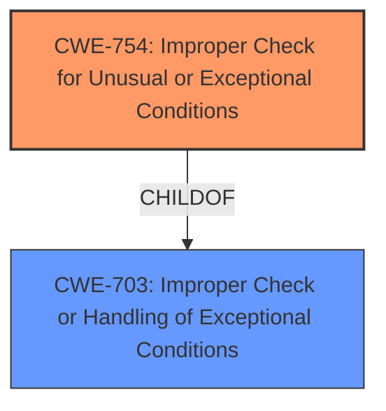

# Analysis Report for CVE-2021-32537

# Vulnerability Analysis Report: CVE-2021-32537

## Description


## Analysis (with Relationship Data)

# Summary
| CWE ID | CWE Name | Confidence | CWE Abstraction Level | CWE Vulnerability Mapping Label | CWE-Vulnerability Mapping Notes |
|---|---|---|---|---|---|
| CWE-754 | Improper Check for Unusual or Exceptional Conditions | 0.8 | Class | Primary | Allowed-with-Review |
| CWE-703 | Improper Check or Handling of Exceptional Conditions | 0.6 | Pillar | Secondary | Discouraged |

## Evidence and Confidence

*   **Confidence Score:** 0.8
*   **Evidence Strength:** MEDIUM

## Relationship Analysis
The primary CWE is CWE-754, a class-level weakness, which is a child of the Pillar CWE-703. The vulnerability is related to the **unexpected commands**, suggesting that the system did not anticipate or handle the unusual commands properly. Because CWE-754 is a class, there may be a better base-level CWE.



## Vulnerability Chain
The vulnerability chain starts with **unexpected commands** being sent to the kernel driver, which then leads to the system crashing. The **improper check** is the root cause that allows the **unexpected commands** to crash the system.
  - **Root Cause:** **Unexpected Commands**
  - **Weakness:** **Improper Check for Unusual or Exceptional Conditions** (CWE-754)
  - **Impact:** System Crash

## Summary of Analysis
The initial analysis focused on identifying the root cause of the system crash, which was attributed to **unexpected commands**. The provided information points towards the system's inability to handle these **unexpected commands**, leading to a crash. The vulnerability description states: "Due to **unexpected commands**, the kernel driver will cause the system crashed."

CWE-754 (Improper Check for Unusual or Exceptional Conditions) aligns well with this scenario because it describes a situation where a product does not check or incorrectly checks for unusual conditions that are not expected to occur frequently. The **unexpected commands** can be considered unusual conditions that the system failed to handle correctly, leading to the crash.
CWE-754 is a Class-level CWE, so the Mapping Guidance suggests that we examine the children of this entry to see if there is a better fit, but there are no children. The best fit is therefore CWE-754.

CWE-703 (Improper Check or Handling of Exceptional Conditions) was also considered. However, it is a Pillar-level CWE, which is too high-level and less specific than CWE-754.

The decision to classify the vulnerability as CWE-754 is based on the available evidence and the CWE's description. The confidence level is 0.8 because although the root cause is clear, there might be other contributing factors that are not explicitly mentioned in the description.

Relevant CWE Information:

# Enhanced Context (25 CWEs)

## CWE-667: Improper Locking
**Abstraction Level**: Class
**Similarity Score**: 0.82
**Source**: dense

**Description**:
The product does not properly acquire or release a lock on a resource, leading to unexpected resource state changes and behaviors.

**Mapping Guidance**:
- Usage: Allowed-with-Review
- Rationale: This CWE entry is a Class and might have Base-level children that would be more appropriate

*Reason for Exclusion:* Locking does not appear to be an issue with this description, so this CWE is not a good fit.

## CWE-404: Improper Resource Shutdown or Release
**Abstraction Level**: Class
**Similarity Score**: 0.79
**Source**: dense

**Description**:
The product does not release or incorrectly releases a resource before it is made available for re-use.

**Mapping Guidance**:
- Usage: Allowed-with-Review
- Rationale: This CWE entry is a Class and might have Base-level children that would be more appropriate

*Reason for Exclusion:* Resource shutdown or release does not appear to be an issue with this description, so this CWE is not a good fit.

## CWE-662: Improper Synchronization
**Abstraction Level**: Class
**Similarity Score**: 0.78
**Source**: dense

**Description**:
The product utilizes multiple threads or processes to allow temporary access to a shared resource that can only be exclusive to one process at a time, but it does not properly synchronize these actions, which might cause simultaneous accesses of this resource by multiple threads or processes.

**Mapping Guidance**:
- Usage: Discouraged
- Rationale: This CWE entry is a level-1 Class (i.e., a child of a Pillar). It might have lower-level children that would be more appropriate

*Reason for Exclusion:* Synchronization does not appear to be an issue with this description, so this CWE is not a good fit.

## CWE-362: Concurrent Execution using Shared Resource with Improper Synchronization ('Race Condition')
**Abstraction Level**: Class
**Similarity Score**: 0.78
**Source**: dense

**Description**:
The product contains a concurrent code sequence that requires temporary, exclusive access to a shared resource, but a timing window exists in which the shared resource can be modified by another code sequence operating concurrently.

**Mapping Guidance**:
- Usage: Allowed-with-Review
- Rationale: This CWE entry is a Class and might have Base-level children that would be more appropriate

*Reason for Exclusion:* Race conditions do not appear to be an issue with this description, so this CWE is not a good fit.

## CWE-280: Improper Handling of Insufficient Permissions or Privileges 
**Abstraction Level**: Base
**Similarity Score**: 0.77
**Source**: dense

**Description**:
The product does not handle or incorrectly handles when it has insufficient privileges to access resources or functionality as specified by their permissions. This may cause it to follow unexpected code paths that may leave the product in an invalid state.

**Mapping Guidance**:
- Usage: Allowed
- Rationale: This CWE entry is at the Base level of abstraction, which is a preferred level of abstraction for mapping to the root causes of vulnerabilities.

*Reason for Exclusion:* Permissions do not appear to be an issue with this description, so this CWE is not a good fit.

## CWE-367: Time-of-check Time-of-use (TOCTOU) Race Condition
**Abstraction Level**: Base
**Similarity Score**: 0.77
**Source**: dense

**Description**:
The product checks the state of a resource before using that resource, but the resource's state can change between the check and the use in a way that invalidates the results of the check. This can cause the product to perform invalid actions when the resource is in an unexpected state.

**Mapping Guidance**:
- Usage: Allowed
- Rationale: This CWE entry is at the Base level of abstraction, which is a preferred level of abstraction for mapping to the root causes of vulnerabilities.

*Reason for Exclusion:* TOCTOU race conditions do not appear to be an issue with this description, so this CWE is not a good fit.

## CWE-274: Improper Handling of Insufficient Privileges
**Abstraction Level**: Base
**Similarity Score**: 0.77
**Source**: dense

**Description**:
The product does not handle or incorrectly handles when it has insufficient privileges to perform an operation, leading to resultant weaknesses.

**Mapping Guidance**:
- Usage: Discouraged
- Rationale: This CWE entry could be deprecated in a future version of CWE.

*Reason for Exclusion:* Permissions do not appear to be an issue with this description, so this CWE is not a good fit.

## CWE-755: Improper Handling of Exceptional Conditions
**Abstraction Level**: Class
**Similarity Score**: 0.77
**Source**: dense

**Description**:
The product does not handle or incorrectly handles an exceptional condition.

**Mapping Guidance**:
- Usage: Discouraged
- Rationale: This CWE entry is a level-1 Class (i.e., a child of a Pillar). It might have lower-level children that would be more appropriate

*Reason for Exclusion:* This is very similar to CWE-754, but it is more generic.

## CWE-908: Use of Uninitialized Resource
**Abstraction Level**: base
**Similarity Score**: 4.33
**Source**: graph

**Description**:
CWE-908: Use of Uninitialized Resource

**Mapping Guidance**:
- Usage: Allowed
- Rationale: This CWE entry is at the Base level of abstraction, which is a preferred level of abstraction for mapping to the root causes of vulnerabilities.

*Reason for Exclusion:* This CWE is focused on uninitialized resources, but that does not appear to be an issue here.

## CWE-476: NULL Pointer Dereference
**Abstraction Level**: base
**Similarity Score**: 4.33
**


## CWE Relationship Analysis

Current CWEs represent these abstraction levels: .


### Vulnerability Chain Analysis

**Chain starting from CWE-754:**
- 754 (Improper Check for Unusual or Exceptional Conditions) - ROOT


**Chain starting from CWE-667:**
- 667 (Improper Locking) - ROOT


### CWE Relationship Diagram

```mermaid
graph TD
    classDef primary fill:#f96,stroke:#333,stroke-width:2px
    classDef secondary fill:#69f,stroke:#333
    classDef tertiary fill:#9e9,stroke:#333
```


*Report generated on 2025-04-01 17:10:47*
