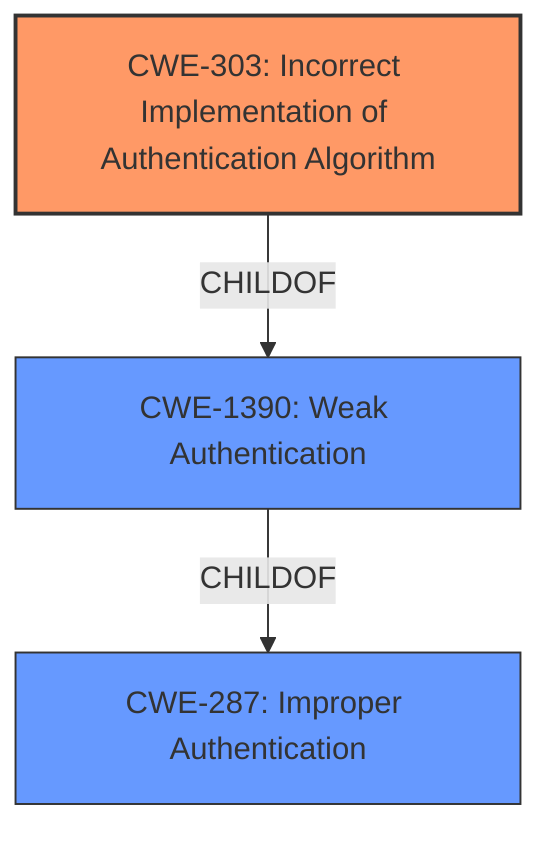

# Analysis for CVE-2021-32541

# Summary
| CWE ID | CWE Name | Confidence | CWE Abstraction Level | CWE Vulnerability Mapping Label | CWE-Vulnerability Mapping Notes |
|---|---|---|---|---|---|
| CWE-303 | Incorrect Implementation of Authentication Algorithm | 0.9 | Base | Primary | Allowed |
| CWE-1390 | Weak Authentication | 0.7 | Class | Secondary | Allowed-with-Review |
| CWE-287 | Improper Authentication | 0.5 | Class | Secondary | Discouraged |

## Evidence and Confidence

*   **Confidence Score:** 0.8
*   **Evidence Strength:** HIGH

## Relationship Analysis
The primary CWE, CWE-303 (Incorrect Implementation of Authentication Algorithm), is a child of CWE-1390 (Weak Authentication), indicating a hierarchical relationship. CWE-287 (Improper Authentication) is a parent of CWE-1390, making it a grandparent of CWE-303. The selection of CWE-303 is favored due to its Base abstraction level, providing more specific details than the Class-level CWE-1390 and CWE-287.

## Vulnerability Chain
The chain starts with an **incorrect implementation** of the authentication and session management, leading to a broken access control. This allows remote unauthenticated attackers to force logged-in accounts to log out, resulting in a denial-of-service where users are unable to access the system's services.

## Summary of Analysis
The initial analysis identified the **incorrect implementation** as a key factor. The evidence provided from the "Vulnerability Description Key Phrases" and "CVE Reference Links Content Summary" supports this: "**Root cause of vulnerability:** The authentication and session management of the CTS Web transaction system is implemented incorrectly." The retriever results also suggested CWE-303 (Incorrect Implementation of Authentication Algorithm) as a potential match, along with its parent CWEs.

CWE-303 is chosen as the primary CWE because the vulnerability is caused by the **incorrect implementation** of the authentication algorithm, as stated in the vulnerability description. The retriever results listed CWE-303 with a high similarity score and a Base abstraction level, which is preferred.

CWE-1390 and CWE-287 were considered but not chosen as the primary CWE because they are at a higher level of abstraction (Class) and do not provide as much specific information about the cause of the vulnerability. The mapping guidance for CWE-287 explicitly discourages its use when lower-level CWE entries are applicable, suggesting CWE-1390 or CWE-306 instead. In this case, CWE-303 is a more accurate and specific representation of the **root cause**.

CWE-306 (Missing Authentication for Critical Function) was considered but not selected because the description involves an **incorrect implementation** rather than a missing authentication mechanism.

CWE-425 (Direct Request ('Forced Browsing')) was considered but not selected because it focuses on inadequate enforcement of authorization on restricted URLs, while the described vulnerability is specifically related to the **incorrect implementation** of authentication and session management.

CWE-384 (Session Fixation) was considered but not selected because the vulnerability involves forcing logouts by sending usernames, rather than session identifier manipulation.

CWE-613 (Insufficient Session Expiration) was considered but not selected as the primary weakness since the core issue is the **incorrect implementation** allowing unauthenticated users to force logouts, rather than the session's lifetime.

The selection of CWE-303 as the primary CWE is justified because it accurately reflects the **root cause** of the vulnerability, which is the **incorrect implementation** of the authentication algorithm. This decision is further supported by the evidence in the vulnerability description and the retriever results, and it adheres to the MITRE mapping guidance by selecting the most specific and appropriate CWE at the Base abstraction level.