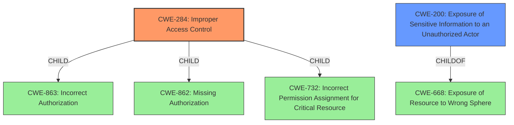

# Enhanced Analysis for CVE-2021-32587

# Summary
| CWE ID  | CWE Name                                                                                           | Confidence | CWE Abstraction Level | CWE Vulnerability Mapping Label | CWE-Vulnerability Mapping Notes |
| :-------- | :--------------------------------------------------------------------------------------------------- | :---------- | :---------------------- | :------------------------------ | :------------------------------ |
| CWE-284 | Improper Access Control                                                                          | 0.9         | Pillar                  | Primary CWE                     | Discouraged                   |
| CWE-200 | Exposure of Sensitive Information to an Unauthorized Actor                                     | 0.7         | Class                   | Secondary Candidate              | Discouraged                   |

## Evidence and Confidence

*   **Confidence Score:** 0.8
*   **Evidence Strength:** HIGH

## Relationship Analysis
The primary CWE, CWE-284 **Improper Access Control**, is a Pillar-level CWE, which means it's a high-level categorization. While it aligns with the **improper access control** root cause, its discouraged usage suggests considering more specific descendants. CWE-200 **Exposure of Sensitive Information to an Unauthorized Actor**, is a Class-level CWE and a potential impact of the vulnerability. The relationship between these CWEs helped refine the classification, prioritizing the root cause while acknowledging the potential information exposure.



## Vulnerability Chain
The vulnerability chain starts with **improper access control** (CWE-284). This leads to an authenticated attacker with a restricted user profile being able to retrieve the list of administrative users of other ADOMs and their related configurations, which results in **Exposure of Sensitive Information to an Unauthorized Actor** (CWE-200).

## Summary of Analysis
The initial analysis identified **improper access control** as the root cause, aligning with the vulnerability description and key phrases. The CVE reference links content summary reinforced this by stating that the root cause of the vulnerability is **improper access control** in the FortiManager and FortiAnalyzer GUI interface.

The Retriever Results highlighted CWE-284 **Improper Access Control** as the top candidate. However, the mapping guidance for CWE-284 discourages its use due to its high-level nature. It suggests considering more specific descendants such as CWE-862 **Missing Authorization**, CWE-863 **Incorrect Authorization**, or CWE-732 **Incorrect Permission Assignment for Critical Resource**. While these are more specific, the description indicates a general **improper access control** issue rather than a specific authorization or permission problem. Therefore, while acknowledging its limitations, CWE-284 is chosen due to the lack of sufficient evidence to pinpoint a more specific cause.

CWE-200 **Exposure of Sensitive Information to an Unauthorized Actor** is considered as a secondary weakness, as the **improper access control** leads to the retrieval of sensitive information. However, as the mapping guidance discourages the use of CWE-200 as a primary cause, due to it being a technical impact, it is only added as a secondary candidate.

Relevant CWE Information:

# Enhanced Context (25 CWEs)
The following CWEs were identified as potentially relevant to this vulnerability:

## CWE-444: Inconsistent Interpretation of HTTP Requests ('HTTP Request/Response Smuggling')
**Abstraction Level**: Base
**Similarity Score**: 0.79
**Source**: dense
This CWE is not applicable as the vulnerability is not related to HTTP request/response smuggling.

## CWE-668: Exposure of Resource to Wrong Sphere
**Abstraction Level**: Class
**Similarity Score**: 0.75
**Source**: dense
This CWE is not applicable because the issue isn't about exposing a resource to the wrong sphere, but rather an access control issue allowing unauthorized retrieval of information.

## CWE-113: Improper Neutralization of CRLF Sequences in HTTP Headers ('HTTP Request/Response Splitting')
**Abstraction Level**: Variant
**Similarity Score**: 0.75
**Source**: dense
This CWE is not applicable since it deals with improper neutralization of CRLF sequences, which is not related to the described vulnerability.

## CWE-74: Improper Neutralization of Special Elements in Output Used by a Downstream Component ('Injection')
**Abstraction Level**: Class
**Similarity Score**: 0.74
**Source**: dense
This CWE is not applicable as the vulnerability does not involve injection of special elements.

## CWE-212: Improper Removal of Sensitive Information Before Storage or Transfer
**Abstraction Level**: Base
**Similarity Score**: 0.74
**Source**: dense
This CWE is not applicable because the vulnerability isn't about failing to remove sensitive information before storage or transfer, but about unauthorized access to begin with.

## CWE-807: Reliance on Untrusted Inputs in a Security Decision
**Abstraction Level**: Base
**Similarity Score**: 0.74
**Source**: dense
This CWE is not applicable, as the vulnerability is not about relying on untrusted inputs for security decisions.

## CWE-41: Improper Resolution of Path Equivalence
**Abstraction Level**: Base
**Similarity Score**: 0.74
**Source**: dense
This CWE is not relevant because the vulnerability doesn't involve path equivalence issues.

## CWE-799: Improper Control of Interaction Frequency
**Abstraction Level**: Class
**Similarity Score**: 0.73
**Source**: dense
This CWE is not applicable, as the vulnerability doesn't involve limiting interaction frequency.

## CWE-653: Improper Isolation or Compartmentalization
**Abstraction Level**: Class
**Similarity Score**: 0.73
**Source**: dense
This CWE is not applicable because the vulnerability doesn't stem from improper isolation or compartmentalization.

## CWE-280: Improper Handling of Insufficient Permissions or Privileges
**Abstraction Level**: Base
**Similarity Score**: 0.73
**Source**: dense
This CWE is not applicable since the vulnerability doesn't involve handling insufficient permissions or privileges.

## CWE-200: Exposure of Sensitive Information to an Unauthorized Actor
**Abstraction Level**: Class
**Similarity Score**: 6240.35
**Source**: sparse
This CWE is a potential impact of the vulnerability, as the **improper access control** leads to the retrieval of sensitive information. However, as the mapping guidance discourages the use of CWE-200 as a primary cause, due to it being a technical impact, it is not selected.

## CWE-863: Incorrect Authorization
**Abstraction Level**: Class
**Similarity Score**: 6180.73
**Source**: sparse
This is a more specific child of CWE-284 and could be applicable. However, there is no specific evidence about an incorrect authorization check, only about a general access control issue.

## CWE-639: Authorization Bypass Through User-Controlled Key
**Abstraction Level**: Base
**Similarity Score**: 6072.18
**Source**: sparse
This CWE is not applicable, as the vulnerability doesn't involve bypassing authorization through user-controlled keys.

## CWE-285: Improper Authorization
**Abstraction Level**: Class
**Similarity Score**: 6062.76
**Source**: sparse
This CWE is similar to CWE-863, but still requires more specific evidence about authorization checks.

## CWE-444: Inconsistent Interpretation of HTTP Requests ('HTTP Request/Response Smuggling')
**Abstraction Level**: Base
**Similarity Score**: 5976.21
**Source**: sparse
This CWE is not applicable as the vulnerability is not related to HTTP request/response smuggling.

## CWE-201: Insertion of Sensitive Information Into Sent Data
**Abstraction Level**: base
**Similarity Score**: 4.33
**Source**: graph
This CWE is not applicable, as the vulnerability isn't about inserting sensitive information into sent data.

## CWE-1272: Sensitive Information Uncleared Before Debug/Power State Transition
**Abstraction Level**: base
**Similarity Score**: 4.33
**Source**: graph
This CWE is not applicable because the issue isn't related to debug or power state transitions.

## CWE-266: Incorrect Privilege Assignment
**Abstraction Level**: base


## CWE Relationship Analysis

Current CWEs represent these abstraction levels: .


### Vulnerability Chain Analysis

**Chain starting from CWE-862:**
- 862 (Missing Authorization) - ROOT


**Chain starting from CWE-444:**
- 444 (Inconsistent Interpretation of HTTP Requests ('HTTP Request/Response Smuggling')) - ROOT


### CWE Relationship Diagram

```mermaid
graph TD
    classDef primary fill:#f96,stroke:#333,stroke-width:2px
    classDef secondary fill:#69f,stroke:#333
    classDef tertiary fill:#9e9,stroke:#333
```