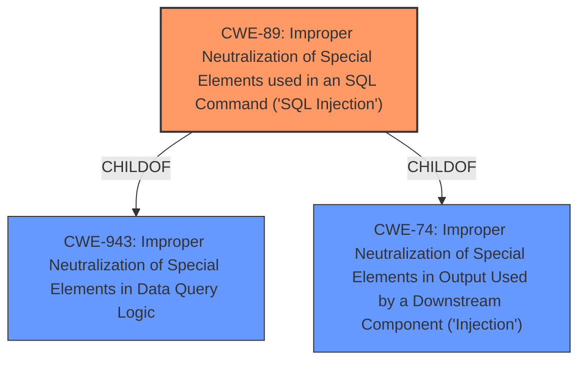

# Raw Analyzer Response for CVE-2021-32590

# Summary
| CWE ID | CWE Name | Confidence | CWE Abstraction Level | CWE Vulnerability Mapping Label | CWE-Vulnerability Mapping Notes |
|---|---|---|---|---|---|
| CWE-89 | Improper Neutralization of Special Elements used in an SQL Command ('SQL Injection') | 1.0 | Base | Allowed | Primary CWE |

## Evidence and Confidence

*   **Confidence Score:** 1.0
*   **Evidence Strength:** HIGH

## Relationship Analysis
The primary relationship influencing the CWE selection is the hierarchical relationship where CWE-89 (SQL Injection) is a child of CWE-943 (Improper Neutralization of Special Elements in Data Query Logic) and CWE-74 (Improper Neutralization of Special Elements in Output Used by a Downstream Component ('Injection')). This indicates that SQL injection is a specific type of injection that occurs within data query logic.

## Vulnerability Chain
The vulnerability chain starts with the **improper neutralization of special elements used in an SQL command** (CWE-89). This leads to the attacker being able to execute arbitrary commands on the underlying SQL database.

## Summary of Analysis
The primary focus is on the **improper neutralization of special elements used in an SQL command** that allows an attacker to execute arbitrary commands on the underlying SQL database.

The selection of CWE-89 is based on the following evidence:
- The **Vulnerability Description Key Phrases** section explicitly mentions "**rootcause:** **Multiple improper neutralization of special elements used in an SQL command**".
- The **CVE Reference Links Content Summary** section states "**Root cause of vulnerability**: Improper neutralization of special elements used in an SQL command (CWE-89)."

The retriever results also lists CWE-89 as the top candidate with a score of 0.507.

The analysis relies heavily on the explicit statements in the vulnerability description and CVE summary, leading to a high confidence score. CWE-89 is the most specific and accurate representation of the vulnerability's root cause, as it directly addresses the **improper neutralization** leading to **SQL injection**.

Other CWEs were considered but not selected:
- CWE-78 (Improper Neutralization of Special Elements used in an OS Command ('OS Command Injection')): While also related to **improper neutralization**, it focuses on OS commands, which is not the case here, as the commands are executed on the SQL database.
- CWE-943 (Improper Neutralization of Special Elements in Data Query Logic): This is a broader category that includes SQL injection, but CWE-89 is more specific and thus more appropriate.
- CWE-74 (Improper Neutralization of Special Elements in Output Used by a Downstream Component ('Injection')): This is a higher level class with SQL injection as a child, but is not as specific as CWE-89.