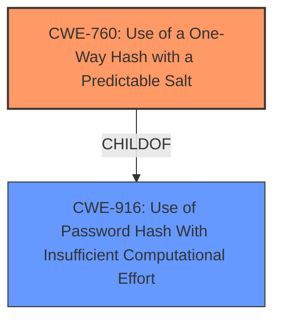

# Enhanced Analysis for CVE-2021-32596

# Summary
| CWE ID | CWE Name | Confidence | CWE Abstraction Level | CWE Vulnerability Mapping Label | CWE-Vulnerability Mapping Notes |
|---|---|---|---|---|---|
| CWE-760 | Use of a One-Way Hash with a Predictable Salt | 1.0 | Variant | Primary | Allowed |
| CWE-916 | Use of Password Hash With Insufficient Computational Effort | 0.7 | Base | Secondary | Allowed |

## Evidence and Confidence

*   **Confidence Score:** 0.9
*   **Evidence Strength:** HIGH

## Relationship Analysis
The primary CWE is CWE-760, which is a variant of CWE-916 (Use of Password Hash With Insufficient Computational Effort). This parent-child relationship guided the selection, ensuring that the most specific CWE was chosen. CWE-760 directly addresses the use of a predictable salt, a detail present in the vulnerability description, whereas CWE-916 is a broader category.



## Vulnerability Chain
The vulnerability chain starts with the **use of a one-way hash with a predictable salt** (CWE-760), which leads to the ability to decrypt passwords. The root cause is the predictable salt. The impact is that an attacker already in possession of the password store can decrypt the passwords by means of precomputed tables.

## Summary of Analysis
The initial analysis focused on identifying the most specific CWE that matches the vulnerability description. The description clearly indicates a **"use of one-way hash with a predictable salt"**. The retriever results also list CWE-760 as the top match.

The relationship analysis confirms that CWE-760 is a variant of CWE-916, providing a more granular classification.

The final decision is based on the strong evidence in the vulnerability description and the retriever results. CWE-760 is at the optimal level of specificity as it directly reflects the **root cause** of the vulnerability, i.e., the **use of a predictable salt**.

Relevant CWE Information:

# Enhanced Context (25 CWEs)
The following CWEs were identified as potentially relevant to this vulnerability:

## CWE-916: Use of Password Hash With Insufficient Computational Effort
**Abstraction Level**: Base
**Similarity Score**: 0.81
**Source**: dense

**Description**:
The product generates a hash for a password, but it uses a scheme that does not provide a sufficient level of computational effort that would make password cracking attacks infeasible or expensive.

**Mapping Guidance**:
- Usage: Allowed
- Rationale: This CWE entry is at the Base level of abstraction, which is a preferred level of abstraction for mapping to the root causes of vulnerabilities.

## CWE-760: Use of a One-Way Hash with a Predictable Salt
**Abstraction Level**: Variant
**Status**: Incomplete

### Description
The product uses a one-way cryptographic hash against an input that should not be reversible, such as a password, but the product uses a predictable salt as part of the input.

### Extended Description

This makes it easier for attackers to pre-compute the hash value using dictionary attack techniques such as rainbow tables, effectively disabling the protection that an unpredictable salt would provide.

### Mapping Guidance
**Usage:** Allowed
**Rationale:** This CWE entry is at the Variant level of abstraction, which is a preferred level of abstraction for mapping to the root causes of vulnerabilities.

## CWE-328: Use of Weak Hash
**Abstraction:** Base
**Status:** Draft

### Description
The product uses an algorithm that produces a digest (output value) that does not meet security expectations for a hash function that allows an adversary to reasonably determine the original input (preimage attack), find another input that can produce the same hash (2nd preimage attack), or find multiple inputs that evaluate to the same digest (birthday attack).

### Extended Description

A hash function is defined as an algorithm that maps arbitrarily sized data into a fixed-sized digest (output) such that the following properties hold:

 1. The algorithm is not invertible (also called "one-way" or "not reversible")
 2. The algorithm is deterministic; the same input produces the same digest every time

 Building on this definition, a cryptographic hash function must also ensure that a malicious actor cannot leverage the hash function to have a reasonable chance of success at determining any of the following:

 1. the original input (preimage attack), given only the digest
 2. another input that can produce the same digest (2nd preimage attack), given the original input
 3. a set of two or more inputs that evaluate to the same digest (birthday attack), given the actor can arbitrarily choose the inputs to be hashed and can do so a reasonable amount of times

What is regarded as "reasonable" varies by context and threat model, but in general, "reasonable" could cover any attack that is more efficient than brute force (i.e., on average, attempting half of all possible combinations). Note that some attacks might be more efficient than brute force but are still not regarded as achievable in the real world.

Any algorithm that does not meet the above conditions will generally be considered weak for general use in hashing.

### Mapping Guidance
**Usage:** Allowed
**Rationale:** This CWE entry is at the Base level of abstraction, which is a preferred level of abstraction for mapping to the root causes of vulnerabilities.

## CWE-759: Use of a One-Way Hash without a Salt
**Abstraction:** Variant
**Status:** Incomplete

### Description
The product uses a one-way cryptographic hash against an input that should not be reversible, such as a password, but the product does not also use a salt as part of the input.

### Extended Description

This makes it easier for attackers to pre-compute the hash value using dictionary attack techniques such as rainbow tables.

### Mapping Guidance
**Usage:** Allowed
**Rationale:** This CWE entry is at the Variant level of abstraction, which is a preferred level of abstraction for mapping to the root causes of vulnerabilities.

I am confident in this assessment, and the selected CWEs accurately reflect the nature of the vulnerability based on the provided evidence.


## CWE Relationship Analysis

Current CWEs represent these abstraction levels: .


### Vulnerability Chain Analysis

**Chain starting from CWE-759:**
- 759 (Use of a One-Way Hash without a Salt) - ROOT


**Chain starting from CWE-916:**
- 916 (Use of Password Hash With Insufficient Computational Effort) - ROOT


### CWE Relationship Diagram

```mermaid
graph TD
    classDef primary fill:#f96,stroke:#333,stroke-width:2px
    classDef secondary fill:#69f,stroke:#333
    classDef tertiary fill:#9e9,stroke:#333
```