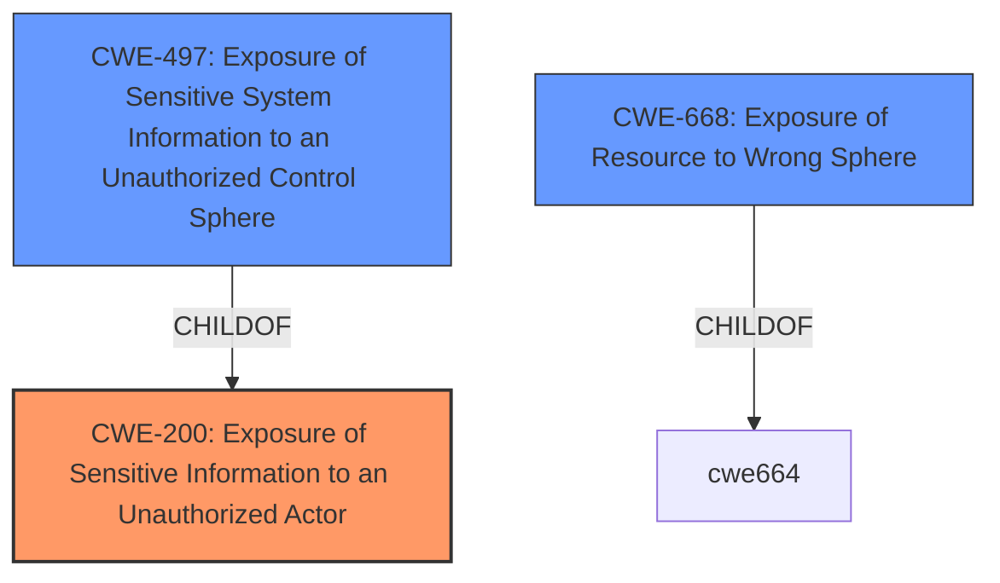

# Analysis for CVE-2021-32600

# Summary
| CWE ID | CWE Name | Confidence | CWE Abstraction Level | CWE Vulnerability Mapping Label | CWE-Vulnerability Mapping Notes |
|---|---|---|---|---|---|
| CWE-200 | Exposure of Sensitive Information to an Unauthorized Actor | 0.9 | Class | Allowed | Primary CWE |
| CWE-497 | Exposure of Sensitive System Information to an Unauthorized Control Sphere | 0.7 | Base | Allowed | Secondary Candidate |
| CWE-668 | Exposure of Resource to Wrong Sphere | 0.5 | Class | Discouraged | Secondary Candidate |

## Evidence and Confidence

*   **Confidence Score:** 0.9
*   **Evidence Strength:** HIGH

## Relationship Analysis
The primary relationship influencing the selection was the parent-child relationship between CWE-497 and CWE-200. While CWE-497 is more specific, the vulnerability description lacks the system-level detail needed to confidently assign it as the primary CWE. Therefore, CWE-200, a broader class, was selected as the primary, with CWE-497 as a secondary candidate. CWE-668 was also considered due to its relationship with exposing resources to wrong control spheres, but it was deemed less specific than CWE-200.

## Vulnerability Chain
The vulnerability chain starts with the **incorrect** handling of VDOM access controls in the FortiOS CLI. This **leads** to the **exposure** of sensitive information from other VDOMs to an unauthorized user.

## Summary of Analysis
The initial assessment strongly pointed towards **CWE-200 (Exposure of Sensitive Information to an Unauthorized Actor)** as the primary weakness, because an authenticated user is able to **retrieve other VDOMs information such as the admin account list and the network interface list.** The retriever results also listed this as a top candidate.

The evidence supporting **CWE-200** is:
*   Vulnerability Description: "An exposure of sensitive information to an unauthorized actor vulnerability in FortiOS CLI...may allow a local and authenticated user assigned to a specific VDOM to retrieve other VDOMs information such as the admin account list and the network interface list."
*   CVE Reference Links Content Summary: "An authenticated user within a specific VDOM can use CLI commands to retrieve sensitive information from other VDOMs, including admin account lists and network interface lists."

**CWE-497 (Exposure of Sensitive System Information to an Unauthorized Control Sphere)** was considered because the exposed information (admin account list, network interface list) can be considered sensitive system information. However, the description doesn't explicitly state that the information is "system-level." Thus, it was classified as a secondary candidate.

**CWE-668 (Exposure of Resource to Wrong Sphere)** was also considered because the vulnerability involves exposing resources (VDOM information) to the wrong control sphere (a user in a different VDOM). However, this is a high-level class, and CWE-200 is a more direct representation of the vulnerability.

The final decision prioritizes **CWE-200** due to the explicit mention of "exposure of sensitive information" in the vulnerability description and the ability to retrieve "other VDOMs information." This aligns directly with **CWE-200's** description: "The product exposes sensitive information to an actor that is not explicitly authorized to have access to that information." While **CWE-497** and **CWE-668** are relevant, they are either less specific or require more assumptions about the nature of the exposed information.