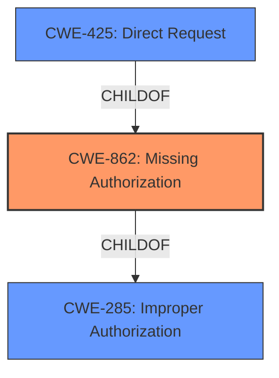

# Raw Analyzer Response for CVE-2021-32619

# Summary
| CWE ID | CWE Name | Confidence | CWE Abstraction Level | CWE Vulnerability Mapping Label | CWE-Vulnerability Mapping Notes |
|---|---|---|---|---|---|
| CWE-862 | Missing Authorization | 0.9 | Class | Primary | Allowed-with-Review |
| CWE-425 | Direct Request ('Forced Browsing') | 0.6 | Base | Secondary | Allowed |

## Evidence and Confidence

*   **Confidence Score:** 0.8
*   **Evidence Strength:** HIGH

## Relationship Analysis
The primary CWE is CWE-862, a class-level weakness indicating a failure to perform authorization checks. CWE-862 is a child of CWE-285 (Improper Authorization), but CWE-862 is more specific. CWE-425 (Direct Request) is also related, as the vulnerability allows direct access to resources without proper authorization. CWE-425 is a base-level weakness, making it more specific than its parent, CWE-285.

## Vulnerability Chain
The vulnerability chain starts with the **missing authorization** checks in dynamically imported modules. This leads to a **bypass** of network and file system permissions, allowing attackers to make **direct requests** to restricted resources.
  - The **root cause** is the **missing authorization** checks.
  - The **weakness** is the resulting ability to **bypass permissions**.
  - The **impact** is the ability to make **direct requests** to restricted resources.

## Summary of Analysis
The primary weakness is the **bypass of network and file system permission checks**, which is a direct result of **missing authorization** checks.
The evidence from the vulnerability description includes: "modules that are dynamically imported through `import()` or `new Worker` might have been able to **bypass network and file system permission checks** when statically importing other modules." The CVE Reference Links Content Summary states: "Static imports within dynamically imported modules did not adhere to permission checks."
This confirms that the **root cause** is related to how Deno handles permissions for dynamically imported modules, and the **weakness** is that it fails to properly enforce these permissions, leading to a **bypass**.

CWE-862 (Missing Authorization) is the most appropriate primary CWE because the vulnerability involves a failure to perform authorization checks on statically imported modules within dynamically imported modules. This aligns with the description of CWE-862: "The product does not perform an authorization check when an actor attempts to access a resource or perform an action."

CWE-425 (Direct Request) is a secondary CWE because the missing authorization allows attackers to directly request resources without proper validation, as described in the CWE's description: "The web application does not adequately enforce appropriate authorization on all restricted URLs, scripts, or files."

CWE-863 (Incorrect Authorization) was considered but not selected as the primary CWE because the core issue is that authorization checks are **missing**, not that they are incorrectly performed.

CWE-285 (Improper Authorization) was also considered but not selected as the primary CWE because it is a high-level class and more specific CWEs are available (CWE-862).

CWE-918 (Server-Side Request Forgery (SSRF)) was considered because the vulnerability allows initiating GET requests to arbitrary URLs. However, the **root cause** is not directly related to SSRF, but rather the **missing authorization** checks that enable the unauthorized requests.

CWE-668 (Exposure of Resource to Wrong Sphere) was considered but ultimately rejected as it is too high-level and other more specific CWEs are more suitable.

My assessment is primarily based on the provided evidence, specifically the vulnerability description and the CVE Reference Links Content Summary. The graph relationships helped to confirm that CWE-862 is more specific than its parent, CWE-285, and is therefore a more appropriate choice.
The selected CWEs are at the optimal level of specificity because they directly address the **root cause** (CWE-862) and the resulting weakness (CWE-425) described in the vulnerability report.

Relevant CWE Information:

# Enhanced Context (25 CWEs)

## CWE-668: Exposure of Resource to Wrong Sphere
**Abstraction Level**: Class
**Similarity Score**: 0.78
**Source**: dense

**Description**:
The product exposes a resource to the wrong control sphere, providing unintended actors with inappropriate access to the resource.

**Mapping Guidance**:
- Usage: Discouraged
- Rationale: CWE-668 is high-level and is often misused as a catch-all when lower-level CWE IDs might be applicable. It is sometimes used for low-information vulnerability reports [REF-1287]. It is a level-1 Class (i.e., a child of a Pillar). It is not useful for trend analysis.

## CWE-280: Improper Handling of Insufficient Permissions or Privileges 
**Abstraction Level**: Base
**Similarity Score**: 0.78
**Source**: dense

**Description**:
The product does not handle or incorrectly handles when it has insufficient privileges to access resources or functionality as specified by their permissions. This may cause it to follow unexpected code paths that may leave the product in an invalid state.

**Mapping Guidance**:
- Usage: Allowed
- Rationale: This CWE entry is at the Base level of abstraction, which is a preferred level of abstraction for mapping to the root causes of vulnerabilities.

## CWE-274: Improper Handling of Insufficient Privileges
**Abstraction Level**: Base
**Similarity Score**: 0.77
**Source**: dense

**Description**:
The product does not handle or incorrectly handles when it has insufficient privileges to perform an operation, leading to resultant weaknesses.

**Mapping Guidance**:
- Usage: Discouraged
- Rationale: This CWE entry could be deprecated in a future version of CWE.

## CWE-266: Incorrect Privilege Assignment
**Abstraction Level**: Base
**Similarity Score**: 0.76
**Source**: dense

**Description**:
A product incorrectly assigns a privilege to a particular actor, creating an unintended sphere of control for that actor.

**Mapping Guidance**:
- Usage: Allowed
- Rationale: This CWE entry is at the Base level of abstraction, which is a preferred level of abstraction for mapping to the root causes of vulnerabilities.

## CWE-552: Files or Directories Accessible to External Parties
**Abstraction Level**: Base
**Similarity Score**: 0.76
**Source**: dense

**Description**:
The product makes files or directories accessible to unauthorized actors, even though they should not be.

**Mapping Guidance**:
- Usage: Allowed
- Rationale: This CWE entry is at the Base level of abstraction, which is a preferred level of abstraction for mapping to the root causes of vulnerabilities.

## CWE-404: Improper Resource Shutdown or Release
**Abstraction Level**: Class
**Similarity Score**: 0.76
**Source**: dense

**Description**:
The product does not release or incorrectly releases a resource before it is made available for re-use.

**Mapping Guidance**:
- Usage: Allowed-with-Review
- Rationale: This CWE entry is a Class and might have Base-level children that would be more appropriate

## CWE-1220: Insufficient Granularity of Access Control
**Abstraction Level**: Base
**Similarity Score**: 0.76
**Source**: dense

**Description**:
The product implements access controls via a policy or other feature with the intention to disable or restrict accesses (reads and/or writes) to assets in a system from untrusted agents. However, implemented access controls lack required granularity, which renders the control policy too broad because it allows accesses from unauthorized agents to the security-sensitive assets.

**Mapping Guidance**:
- Usage: Allowed
- Rationale: This CWE entry is at the Base level of abstraction, which is a preferred level of abstraction for mapping to the root causes of vulnerabilities.

## CWE-653: Improper Isolation or Compartmentalization
**Abstraction Level**: Class
**Similarity Score**: 0.76
**Source**: dense

**Description**:
The product does not properly compartmentalize or isolate functionality, processes, or resources that require different privilege levels, rights, or permissions.

**Mapping Guidance**:
- Usage: Allowed
- Rationale: This CWE entry is at the Base level of abstraction, which is a preferred level of abstraction for mapping to the root causes of vulnerabilities.

## CWE-267: Privilege Defined With Unsafe Actions
**Abstraction Level**: Base
**Similarity Score**: 0.76
**Source**: dense

**Description**:
A particular privilege, role, capability, or right can be used to perform unsafe actions that were not