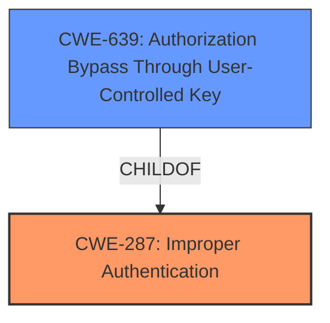

# Analysis Report for CVE-2021-32620

# Vulnerability Analysis Report: CVE-2021-32620

## Description


## Analysis (with Relationship Data)

# Summary
| CWE ID  | CWE Name                                                                              | Confidence | CWE Abstraction Level | CWE Vulnerability Mapping Label | CWE-Vulnerability Mapping Notes |
| :-------- | :------------------------------------------------------------------------------------ | :--------- | :---------------------- | :------------------------------ | :------------------------------ |
| CWE-287 | Improper Authentication                                                             | 0.9        | Class                     | Primary                         | Allowed-with-Review           |
| CWE-639 | Authorization Bypass Through User-Controlled Key                                  | 0.7        | Base                      | Secondary                       | Allowed                       |

## Evidence and Confidence

*   **Confidence Score:** 0.8
*   **Evidence Strength:** HIGH

## Relationship Analysis
The primary CWE is CWE-287, which represents a broad class of authentication failures. Given the specifics of the vulnerability, CWE-639, a base-level CWE, captures the re-use of a validation key which allows a user to bypass the intended authentication process after being disabled. CWE-287 serves as a more general category while CWE-639 is the specific mechanism.



## Vulnerability Chain
The vulnerability chain starts with **improper authentication** (CWE-287), specifically due to the **re-use of an authentication key** (CWE-639). This leads to **unauthorized access** as disabled users can re-activate their accounts, which then leads to the **impact of potential data breaches or malicious activity.**

## Summary of Analysis
The initial assessment focused on the re-activation of disabled users through the re-use of an activation link. This led to the selection of CWE-287 (Improper Authentication) as the primary weakness, as it highlights the failure to properly verify the user's identity before granting access. Further analysis revealed that **the root cause** was more specifically related to the **validation key not being reset**, enabling an **authorization bypass** via the user-controlled key, leading to the addition of CWE-639 as a secondary, more granular CWE.

The selection of CWE-287 is based on the evidence: "a user disabled on a wiki using email verification for registration can re-activate themself by using the activation link provided for his registration." This demonstrates a failure in the authentication process, as disabled users should not be able to re-activate their accounts using the original activation link.

The addition of CWE-639 is based on the evidence from the CVE Reference Links Content Summary: "The vulnerability stems from the fact that the email validation key for user registration in XWiki was not being properly reset after the user's email was validated. This allowed a disabled user who registered with email verification to re-activate their account by using the original activation link or the validation key." This highlights that the user's control over the validation key allowed them to bypass the intended authorization mechanism.

The graph relationships influenced the final selection by illustrating the hierarchical relationship between CWE-287 and CWE-639, with CWE-639 providing a more specific explanation of the **authentication failure**.

The selected CWEs are at the optimal level of specificity because CWE-287 captures the broad category of authentication failures, while CWE-639 provides a more granular description of the specific **mechanism** by which the **authentication** is bypassed.

Relevant CWE Information:

# Enhanced Context (25 CWEs)
The following CWEs were identified as potentially relevant to this vulnerability:

## CWE-807: Reliance on Untrusted Inputs in a Security Decision
**Abstraction Level**: Base
**Similarity Score**: 0.79
**Source**: dense

**Description**:
The product uses a protection mechanism that relies on the existence or values of an input, but the input can be modified by an untrusted actor in a way that bypasses the protection mechanism.
**Reason Not Used:** While the activation link involves an input, the core issue isn't about the reliance on an untrusted input for a security decision, but rather **the improper management and re-use of the validation key**.

## CWE-74: Improper Neutralization of Special Elements in Output Used by a Downstream Component ('Injection')
**Abstraction Level**: Class
**Similarity Score**: 0.78
**Source**: dense

**Description**:
The product constructs all or part of a command, data structure, or record using externally-influenced input from an upstream component, but it does not neutralize or incorrectly neutralizes special elements that could modify how it is parsed or interpreted when it is sent to a downstream component.
**Reason Not Used:** This CWE relates to injection vulnerabilities. The described vulnerability is not related to injection.

## CWE-319: Cleartext Transmission of Sensitive Information
**Abstraction Level**: Base
**Similarity Score**: 0.78
**Source**: dense

**Description**:
The product transmits sensitive or security-critical data in cleartext in a communication channel that can be sniffed by unauthorized actors.
**Reason Not Used:** This CWE is not relevant as the vulnerability does not concern the transmission of sensitive information in cleartext.

## CWE-639: Authorization Bypass Through User-Controlled Key
**Abstraction Level**: Base
**Similarity Score**: 0.78
**Source**: dense

**Description**:
The system's authorization functionality does not prevent one user from gaining access to another user's data or record by modifying the key value identifying the data.
**Reason Used:** The description aligns with the scenario where a user can re-activate their disabled account by re-using the original validation key, bypassing the intended authorization controls.

## CWE-303: Incorrect Implementation of Authentication Algorithm
**Abstraction Level**: Base
**Similarity Score**: 0.78
**Source**: dense

**Description**:
The requirements for the product dictate the use of an established authentication algorithm, but the implementation of the algorithm is incorrect.
**Reason Not Used:** This CWE is not applicable because the issue is not with the implementation of an authentication algorithm itself, but rather with the **improper management of validation keys** that enables authorization bypass.

## CWE-472: External Control of Assumed-Immutable Web Parameter
**Abstraction Level**: Base
**Similarity Score**: 0.77
**Source**: dense

**Description**:
The web application does not sufficiently verify inputs that are assumed to be immutable but are actually externally controllable, such as hidden form fields.
**Reason Not Used:** While related to external control, the vulnerability is not directly about the lack of verification of assumed-immutable parameters. Instead, it focuses on **the re-use of a validation key that should have been invalidated**.

## CWE-1391: Use of Weak Credentials
**Abstraction Level**: Class
**Similarity Score**: 0.77
**Source**: dense

**Description**:
The product uses weak credentials (such as a default key or hard-coded password) that can be calculated, derived, reused, or guessed by an attacker.
**Reason Not Used:** The validation key itself isn't necessarily "weak," but its **improper handling** allows it to be re-used.

## CWE-538: Insertion of Sensitive Information into Externally-Accessible File or Directory
**Abstraction Level**: Base
**Similarity Score**: 0.77
**Source**: dense

**Description**:
The product places sensitive information into files or directories that are accessible to actors who are allowed to have access to the files, but not to the sensitive information.
**Reason Not Used:** This CWE is not relevant as the vulnerability is not about the placement of sensitive information in accessible files or directories.

## CWE-1390: Weak Authentication
**Abstraction Level**: Class
**Similarity Score**: 0.77
**Source**: dense

**Description**:
The product uses an authentication mechanism to restrict access to specific users or identities, but the mechanism does not sufficiently prove that the claimed identity is correct.
**Reason Not Used:** While related to authentication, CWE-287 and CWE-639 capture the specific issue of **re-activation via re-use of a validation key** more accurately.

## CWE-116: Improper Encoding or Escaping of Output
**Abstraction Level**: Class
**Similarity Score**: 0.77
**Source**: dense

**Description**:
The product prepares a structured message for communication with another component, but encoding or escaping of the data is either missing or done incorrectly. As a result, the intended structure of the message is not preserved.
**Reason Not Used:** This CWE is not relevant as the vulnerability is not related to encoding or escaping of output.

## CWE-1336: Improper Neutralization of Special Elements Used in a Template Engine
**Abstraction Level**: Base
**Similarity Score**: 7739.85
**Source**: sparse

**Description**:
The product uses a template engine to insert or process externally-influenced input, but it does not neutralize or incorrectly neutralizes special elements or syntax that can be interpreted as template expressions or other code directives when processed


## CWE Relationship Analysis

Current CWEs represent these abstraction levels: .


### Vulnerability Chain Analysis

**Chain starting from CWE-303:**
- 303 (Incorrect Implementation of Authentication Algorithm) - ROOT


**Chain starting from CWE-1336:**
- 1336 (Improper Neutralization of Special Elements Used in a Template Engine) - ROOT


### CWE Relationship Diagram

```mermaid
graph TD
    classDef primary fill:#f96,stroke:#333,stroke-width:2px
    classDef secondary fill:#69f,stroke:#333
    classDef tertiary fill:#9e9,stroke:#333
```


*Report generated on 2025-04-02 15:28:29*
