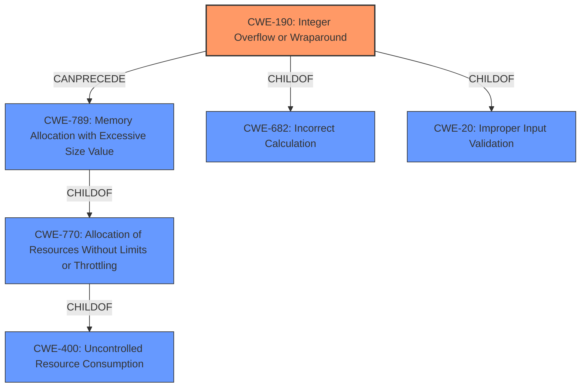

# Analysis for CVE-2021-32628

# Summary
| CWE ID | CWE Name | Confidence | CWE Abstraction Level | CWE Vulnerability Mapping Label | CWE-Vulnerability Mapping Notes |
|---|---|---|---|---|---|
| CWE-190 | Integer Overflow or Wraparound | 1.0 | Base | Allowed | Primary CWE |
| CWE-789 | Memory Allocation with Excessive Size Value | 0.7 | Variant | Allowed | Secondary Candidate |

## Evidence and Confidence

*   **Confidence Score:** 0.85
*   **Evidence Strength:** HIGH

## Relationship Analysis
The primary CWE is CWE-190, **Integer Overflow or Wraparound**, which can lead to other weaknesses. CWE-789, **Memory Allocation with Excessive Size Value** is a child of CWE-770 **Allocation of Resources Without Limits or Throttling**, which could be triggered by an integer overflow when calculating the size of the memory allocation. The Mermaid diagram illustrates these relationships.

## Vulnerability Chain
The vulnerability chain starts with an **integer overflow** (CWE-190) when calculating the size of the ziplist. This can lead to allocating an excessive amount of memory (CWE-789), potentially causing a denial of service or heap corruption, eventually leading to remote code execution.

## Summary of Analysis
The initial analysis identified CWE-190 as the primary weakness due to the explicit mention of "**integer overflow**" in the vulnerability description and the CVE summary. The "Retriever Results" also listed CWE-190 as the top candidate. The description clearly states: "An **integer overflow** bug in the ziplist data structure used by all versions of Redis can be exploited to corrupt the heap and potentially result with remote code execution." This aligns perfectly with the CWE-190 description. The "CVE Reference Links Content Summary" further reinforces this by stating: "Integer overflow in ziplist data structure."

CWE-789 was considered as a secondary weakness because the integer overflow can directly result in allocating memory with an excessive size value. The description mentions that the vulnerability involves modifying configuration parameters to a very large value and crafting commands to create very large ziplists. The relationships between these CWEs, particularly the CANPRECEDE relationship between CWE-190 and CWE-789, support this assessment.

The selection of CWE-190 and CWE-789 is at the optimal level of specificity. CWE-190 is a base-level CWE that accurately describes the **root cause** of the vulnerability. CWE-789 is a variant that describes the allocation of memory with an excessive size value, which is a direct consequence of the **integer overflow**.

Relevant CWE Information:

# Enhanced Context (25 CWEs)
The following CWEs were identified as potentially relevant to this vulnerability:

## CWE-226: Sensitive Information in Resource Not Removed Before Reuse
**Abstraction Level**: Base
**Similarity Score**: 0.76
**Source**: dense

**Description**:
The product releases a resource such as memory or a file so that it can be made available for reuse, but it does not clear or "zeroize" the information contained in the resource before the product performs a critical state transition or makes the resource available for reuse by other entities.

**Mapping Guidance**:
- Usage: Allowed
- Rationale: This CWE entry is at the Base level of abstraction, which is a preferred level of abstraction for mapping to the root causes of vulnerabilities.

**CWE-226 was not selected** as the vulnerability does not involve sensitive information being left in the resource but rather the memory allocation being excessive.

## CWE-789: Memory Allocation with Excessive Size Value
**Abstraction Level**: Variant
**Similarity Score**: 0.76
**Source**: dense

**Description**:
The product allocates memory based on an untrusted, large size value, but it does not ensure that the size is within expected limits, allowing arbitrary amounts of memory to be allocated.

**Mapping Guidance**:
- Usage: Allowed
- Rationale: This CWE entry is at the Variant level of abstraction, which is a preferred level of abstraction for mapping to the root causes of vulnerabilities.

**CWE-789 was selected** as a secondary weakness because the integer overflow can directly result in allocating memory with an excessive size value.

## CWE-1289: Improper Validation of Unsafe Equivalence in Input
**Abstraction Level**: Base
**Similarity Score**: 0.76
**Source**: dense

**Description**:
The product receives an input value that is used as a resource identifier or other type of reference, but it does not validate or incorrectly validates that the input is equivalent to a potentially-unsafe value.

**Mapping Guidance**:
- Usage: Allowed
- Rationale: This CWE entry is at the Base level of abstraction, which is a preferred level of abstraction for mapping to the root causes of vulnerabilities.

**CWE-1289 was not selected** as the vulnerability description mentions that the configuration parameters can be set to a large value and specially crafted commands can be run. While this is an input, it is not a resource identifier that is validated.

## CWE-404: Improper Resource Shutdown or Release
**Abstraction Level**: Class
**Similarity Score**: 0.76
**Source**: dense

**Description**:
The product does not release or incorrectly releases a resource before it is made available for re-use.

**Mapping Guidance**:
- Usage: Allowed-with-Review
- Rationale: This CWE entry is a Class and might have Base-level children that would be more appropriate

**CWE-404 was not selected** as the vulnerability description does not involve a resource not being released or shutdown.

## CWE-131: Incorrect Calculation of Buffer Size
**Abstraction Level**: Base
**Similarity Score**: 0.76
**Source**: dense

**Description**:
The product does not correctly calculate the size to be used when allocating a buffer, which could lead to a buffer overflow.

**Mapping Guidance**:
- Usage: Allowed
- Rationale: This CWE entry is at the Base level of abstraction, which is a preferred level of abstraction for mapping to the root causes of vulnerabilities.

**CWE-131 was not selected** as the vulnerability description explicitly mentions **integer overflow** which is CWE-190.

## CWE-405: Asymmetric Resource Consumption (Amplification)
**Abstraction Level**: Class
**Similarity Score**: 0.76
**Source**: dense

**Description**:
The product does not properly control situations in which an adversary can cause the product to consume or produce excessive resources without requiring the adversary to invest equivalent work or otherwise prove authorization, i.e., the adversary's influence is "asymmetric."

**Mapping Guidance**:
- Usage: Allowed-with-Review
- Rationale: This CWE entry is a Class and might have Base-level children that would be more appropriate

**CWE-405 was not selected** as the vulnerability description does not specifically deal with asymmetric resource consumption.

## CWE-74: Improper Neutralization of Special Elements in Output Used by a Downstream Component ('Injection')
**Abstraction Level**: Class
**Similarity Score**: 0.76
**Source**: dense

**Description**:
The product constructs all or part of a command, data structure, or record using externally-influenced input from an upstream component, but it does not neutralize or incorrectly neutralizes special elements that could modify how it is parsed or interpreted when it is sent to a downstream component.

**Mapping Guidance**:
- Usage: Discouraged
- Rationale: CWE-74 is high-level and often misused when lower-level weaknesses are more appropriate.

**CWE-74 was not selected** as the vulnerability does not involve injection.

## CWE-667: Improper Locking
**Abstraction Level**: Class
**Similarity Score**: 0.76
**Source**: dense

**Description**:
The product does not properly acquire or release a lock on a resource, leading to unexpected resource state changes and behaviors.

**Mapping Guidance**:
- Usage: Allowed-with-Review
- Rationale: This CWE entry is a