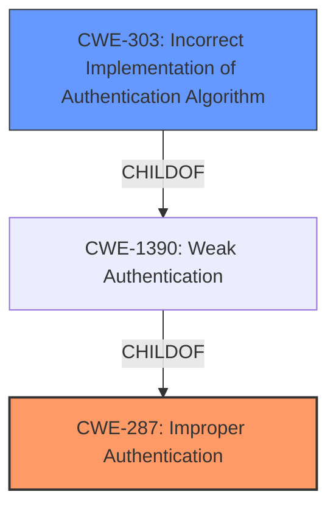

# Analysis Report for CVE-2021-32637

# Vulnerability Analysis Report: CVE-2021-32637

## Description


## Analysis (with Relationship Data)

# Summary
| CWE ID | CWE Name | Confidence | CWE Abstraction Level | CWE Vulnerability Mapping Label | CWE-Vulnerability Mapping Notes |
|---|---|---|---|---|---|
| CWE-287 | Improper Authentication | 0.8 | Class | Primary | Discouraged |
| CWE-303 | Incorrect Implementation of Authentication Algorithm | 0.7 | Base | Secondary | Allowed |

## Evidence and Confidence

*   **Confidence Score:** 0.8
*   **Evidence Strength:** HIGH

## Relationship Analysis
The primary relationship influencing the decision is that CWE-303 is a child of CWE-1390 (Weak Authentication), which is itself a suggested alternative to CWE-287 (Improper Authentication). While CWE-287 is a broader category, the evidence suggests a more specific **incorrect implementation** of an authentication algorithm, guiding the selection towards CWE-303 as a secondary mapping. The overall abstraction level also plays a role, as the goal is to find the most specific, yet accurate representation of the weakness.



## Vulnerability Chain
The vulnerability chain starts with a **malformed HTTP request** that bypasses the authentication mechanism due to **improper error handling** in Authelia's URL parsing logic.

## Summary of Analysis
The initial assessment focused on identifying the root cause of the authentication bypass. The vulnerability description and CVE reference links strongly suggest that the vulnerability arises from Authelia's **failure to properly handle malformed HTTP request URIs** when used with nginx's `ngx_http_auth_request_module`. The application incorrectly returns a success code (200) instead of an authentication failure (401 Unauthorized) when encountering a malformed URL.

CWE-287 (Improper Authentication) was considered as the primary candidate based on the **impact: bypass the authentication mechanism** key phrase. However, the CVE Reference Links Content Summary indicates that the **root cause** is how Authelia handles malformed requests and its **incorrect URL parsing**, making CWE-303 (Incorrect Implementation of Authentication Algorithm) a more suitable secondary candidate since the authentication **algorithm was implemented incorrectly**. This is further supported by the provided patch, which modifies the URL parsing logic to return a 401 status code when an error occurs. While the ultimate impact is an authentication bypass, the root cause is an implementation flaw.

The retriever results also listed CWE-287, giving additional evidence.

The selected CWEs are at the optimal level of specificity as they represent both the overall impact (authentication bypass) and the underlying cause (incorrect URL parsing during authentication).

Relevant CWE Information:

# Enhanced Context (25 CWEs)
The following CWEs were identified as potentially relevant to this vulnerability:

## CWE-303: Incorrect Implementation of Authentication Algorithm
**Abstraction Level**: Base
**Similarity Score**: 0.77
**Source**: dense

**Description**:
The requirements for the product dictate the use of an established authentication algorithm, but the implementation of the algorithm is incorrect.

**Mapping Guidance**:
- Usage: Allowed
- Rationale: This CWE entry is at the Base level of abstraction, which is a preferred level of abstraction for mapping to the root causes of vulnerabilities.

## CWE-287: Improper Authentication
**Abstraction:** Class
**Status:** Draft

### Description
When an actor claims to have a given identity, the product does not prove or insufficiently proves that the claim is correct.

### Extended Description
Not provided

### Alternative Terms
authentification: An alternate term is "authentification", which appears to be most commonly used by people from non-English-speaking countries.
AuthN: "AuthN" is typically used as an abbreviation of "authentication" within the web application security community. It is also distinct from "AuthZ," which is an abbreviation of "authorization." The use of "Auth" as an abbreviation is discouraged, since it could be used for either authentication or authorization.
AuthC: "AuthC" is used as an abbreviation of "authentication," but it appears to used less frequently than "AuthN."

### Relationships
ChildOf -> CWE-284
ChildOf -> CWE-284

### Mapping Guidance
**Usage:** Discouraged
**Rationale:** This CWE entry might be misused when lower-level CWE entries are likely to be applicable. It is a level-1 Class (i.e., a child of a Pillar).
**Comments:** Consider children or descendants, beginning with CWE-1390: Weak Authentication or CWE-306: Missing Authentication for Critical Function.
**Reasons:**
- Frequent Misuse
**Suggested Alternatives:**
- CWE-1390: Weak Authentication
- CWE-306: Missing Authentication for Critical Function


## CWE Relationship Analysis

Current CWEs represent these abstraction levels: .


### Vulnerability Chain Analysis

**Chain starting from CWE-306:**
- 306 (Missing Authentication for Critical Function) - ROOT


**Chain starting from CWE-303:**
- 303 (Incorrect Implementation of Authentication Algorithm) - ROOT


### CWE Relationship Diagram

```mermaid
graph TD
    classDef primary fill:#f96,stroke:#333,stroke-width:2px
    classDef secondary fill:#69f,stroke:#333
    classDef tertiary fill:#9e9,stroke:#333
```


*Report generated on 2025-04-02 12:37:10*
