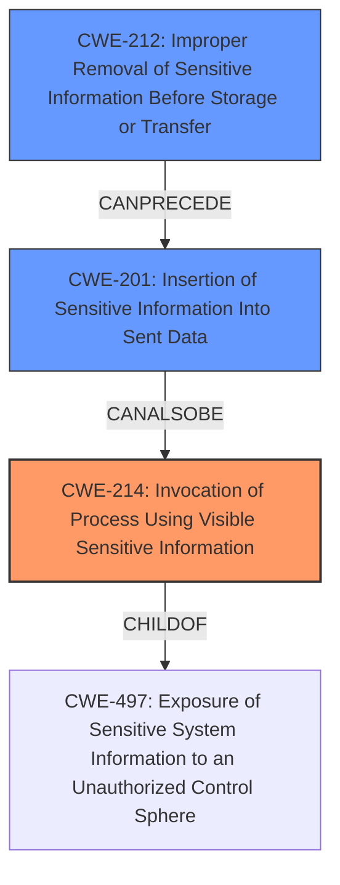

# Enhanced Analysis for CVE-2021-32638

# Summary
| CWE ID | CWE Name | Confidence | CWE Abstraction Level | CWE Vulnerability Mapping Label | CWE-Vulnerability Mapping Notes |
|---|---|---|---|---|---|
| CWE-214 | Invocation of Process Using Visible Sensitive Information | 1 | Base | Allowed | Primary CWE |
| CWE-201 | Insertion of Sensitive Information Into Sent Data | 0.7 | Base | Allowed | Secondary Candidate |
| CWE-212 | Improper Removal of Sensitive Information Before Storage or Transfer | 0.6 | Base | Allowed | Secondary Candidate |

## Evidence and Confidence

*   **Confidence Score:** 0.9
*   **Evidence Strength:** HIGH

## Relationship Analysis
The primary CWE is CWE-214, which describes the **invocation of a process using visible sensitive information**. This CWE is at the Base level and directly matches the vulnerability where the GitHub token was passed as a **command-line parameter**, making it visible to other processes.

CWE-201 (Insertion of Sensitive Information Into Sent Data) and CWE-212 (Improper Removal of Sensitive Information Before Storage or Transfer) are related because the **sensitive information** (the GitHub token) is being sent as part of the command-line invocation, and the application **does not properly remove** that information before making it visible.



## Vulnerability Chain
The vulnerability chain starts with the **root cause**:
1.  The CodeQL runner accepts a GitHub token as a **command-line parameter** (**CWE-214**).
2.  This leads to the **insertion of sensitive information** into the command that is being sent (**CWE-201**).
3.  The **sensitive information** is **not properly removed** before the process is invoked, leading to its exposure (**CWE-212**).
4.  The **impact** is the exposure of the GitHub access token.

## Summary of Analysis
The primary finding is CWE-214 because the vulnerability's **root cause** is the passing of the GitHub token as a visible **command-line parameter**. This aligns directly with the CWE's description: "A process is invoked with **sensitive command-line arguments**, environment variables, or other elements that can be seen by other processes on the operating system." The evidence is strong, as the vulnerability description states: "The runner and its documentation previously suggested passing the GitHub token as a **command-line parameter** to the process instead of reading it from a file, standard input, or an environment variable."

CWE-201 and CWE-212 are considered secondary because they describe the subsequent steps in the chain (insertion and lack of removal), but CWE-214 most accurately captures the initial coding error.

The CWE selection is at the optimal level of specificity because CWE-214 is a Base-level CWE that directly describes the **root cause** of the vulnerability. More general CWEs like CWE-497 (Exposure of Sensitive System Information to an Unauthorized Control Sphere), which is a parent of CWE-214, would be less specific and less informative.

CWE-863 (Incorrect Authorization), CWE-287 (Improper Authentication), and CWE-639 (Authorization Bypass Through User-Controlled Key) were considered but not selected because the vulnerability does not directly involve issues with authorization or authentication mechanisms. The problem is the exposure of a valid token, not the failure to authenticate or authorize correctly.


## CWE Relationship Analysis

Current CWEs represent these abstraction levels: .


### Vulnerability Chain Analysis

**Chain starting from CWE-497:**
- 497 (Exposure of Sensitive System Information to an Unauthorized Control Sphere) - ROOT


**Chain starting from CWE-201:**
- 201 (Insertion of Sensitive Information Into Sent Data) - ROOT


### CWE Relationship Diagram

```mermaid
graph TD
    classDef primary fill:#f96,stroke:#333,stroke-width:2px
    classDef secondary fill:#69f,stroke:#333
    classDef tertiary fill:#9e9,stroke:#333
```