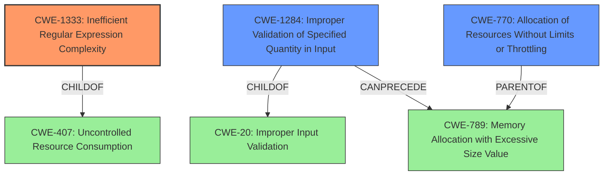

# Analysis Report for CVE-2021-32640

# Vulnerability Analysis Report: CVE-2021-32640

## Description


## Analysis (with Relationship Data)

# Summary
| CWE ID    | CWE Name                                                                     | Confidence | CWE Abstraction Level | CWE Vulnerability Mapping Label | CWE-Vulnerability Mapping Notes |
| :--------- | :--------------------------------------------------------------------------- | :--------- | :---------------------- | :------------------------------ | :------------------------------ |
| **CWE-1333** | **Inefficient Regular Expression Complexity**                                | 1.0        | Base                    | Primary CWE                   | Allowed                       |
| CWE-1284  | Improper Validation of Specified Quantity in Input                          | 0.75       | Base                    | Secondary Candidate          | Allowed                       |
| CWE-770   | Allocation of Resources Without Limits or Throttling                       | 0.5        | Base                    | Secondary Candidate          | Allowed                       |

## Evidence and Confidence

*   **Confidence Score:** 0.9
*   **Evidence Strength:** HIGH

## Relationship Analysis
The primary CWE is CWE-1333, which directly addresses the root cause of the vulnerability: an inefficient regular expression. CWE-1333 is a child of CWE-407 (Uncontrolled Resource Consumption).

CWE-1284 is related because the vulnerability could be seen as a failure to validate the size or complexity of the input string that is fed into the regular expression. CWE-1284 is a child of CWE-20 (Improper Input Validation). CWE-1284 can precede CWE-789 (Memory Allocation with Excessive Size Value), but this is not directly relevant here.

CWE-770 is related because the inefficient regular expression leads to excessive resource consumption. CWE-770 is a parent of CWE-789.



## Vulnerability Chain
The vulnerability chain starts with the use of an **inefficient regular expression** (CWE-1333). This leads to excessive CPU consumption when processing a specially crafted input string. The excessive CPU consumption results in a denial-of-service (DoS) condition on the server.

## Summary of Analysis
The primary weakness is the **inefficient regular expression** (CWE-1333) used to parse the `Sec-Websocket-Protocol` header. The "CVE Reference Links Content Summary" section states: "The vulnerability stems from a regular expression denial-of-service (ReDoS) issue in the `ws` Node.js library. Specifically, the library used an inefficient regular expression to parse the `Sec-Websocket-Protocol` header." This directly supports the selection of CWE-1333. The fix mentioned in the summary, "using `protocol = protocol.split(',').map(trim);` instead of using the vulnerable regex," further confirms that the root cause is related to the regular expression.

CWE-1284 (Improper Validation of Specified Quantity in Input) is a secondary consideration. While not the primary driver, the vulnerability can be viewed as a failure to properly validate the complexity or length of the input string before processing it with the regex. This lack of validation contributes to the vulnerability.

CWE-770 is also a consideration since the inefficient regex leads to uncontrolled resource consumption, but CWE-1333 is more specific to the root cause.

The final decision is based on the evidence provided, the relationships between the CWEs, and the goal of selecting the most specific CWE that accurately represents the root cause of the vulnerability.

Relevant CWE Information:

# Enhanced Context (25 CWEs)

## CWE-113: Improper Neutralization of CRLF Sequences in HTTP Headers ('HTTP Request/Response Splitting')
**Abstraction Level**: Variant
**Similarity Score**: 0.81
**Source**: dense

**Description**:
The product receives data from an HTTP agent/component (e.g., web server, proxy, browser, etc.), but it does not neutralize or incorrectly neutralizes CR and LF characters before the data is included in outgoing HTTP headers.

**Mapping Guidance**:
- Usage: Allowed
- Rationale: This CWE entry is at the Variant level of abstraction, which is a preferred level of abstraction for mapping to the root causes of vulnerabilities.

NOT USED: This CWE is not relevant because the vulnerability is not related to CRLF injection.

## CWE-444: Inconsistent Interpretation of HTTP Requests ('HTTP Request/Response Smuggling')
**Abstraction Level**: Base
**Similarity Score**: 0.79
**Source**: dense

**Description**:
The product acts as an intermediary HTTP agent
         (such as a proxy or firewall) in the data flow between two
         entities such as a client and server, but it does not
         interpret malformed HTTP requests or responses in ways that
         are consistent with how the messages will be processed by
         those entities that are at the ultimate destination.

**Mapping Guidance**:
- Usage: Allowed
- Rationale: This CWE entry is at the Base level of abstraction, which is a preferred level of abstraction for mapping to the root causes of vulnerabilities.

NOT USED: This CWE is not relevant because the vulnerability is not related to HTTP request smuggling.

## CWE-130: Improper Handling of Length Parameter Inconsistency
**Abstraction Level**: Base
**Similarity Score**: 0.76
**Source**: dense

**Description**:
The product parses a formatted message or structure, but it does not handle or incorrectly handles a length field that is inconsistent with the actual length of the associated data.

**Mapping Guidance**:
- Usage: Allowed
- Rationale: This CWE entry is at the Base level of abstraction, which is a preferred level of abstraction for mapping to the root causes of vulnerabilities.

NOT USED: This CWE is not relevant because the vulnerability is not about length inconsistencies.

## CWE-1289: Improper Validation of Unsafe Equivalence in Input
**Abstraction Level**: Base
**Similarity Score**: 0.76
**Source**: dense

**Description**:
The product receives an input value that is used as a resource identifier or other type of reference, but it does not validate or incorrectly validates that the input is equivalent to a potentially-unsafe value.

**Mapping Guidance**:
- Usage: Allowed
- Rationale: This CWE entry is at the Base level of abstraction, which is a preferred level of abstraction for mapping to the root causes of vulnerabilities.

NOT USED: This CWE is not relevant because the vulnerability is not about unsafe equivalence.

## CWE-134: Use of Externally-Controlled Format String
**Abstraction Level**: Base
**Similarity Score**: 0.76
**Source**: dense

**Description**:
The product uses a function that accepts a format string as an argument, but the format string originates from an external source.

**Mapping Guidance**:
- Usage: Allowed
- Rationale: This CWE entry is at the Base level of abstraction, which is a preferred level of abstraction for mapping to the root causes of vulnerabilities.

NOT USED: This CWE is not relevant because the vulnerability is not related to format string injection.

## CWE-184: Incomplete List of Disallowed Inputs
**Abstraction Level**: Base
**Similarity Score**: 0.76
**Source**: dense

**Description**:
The product implements a protection mechanism that relies on a list of inputs (or properties of inputs) that are not allowed by policy or otherwise require other action to neutralize before additional processing takes place, but the list is incomplete.

**Mapping Guidance**:
- Usage: Allowed
- Rationale: This CWE entry is at the Base level of abstraction, which is a preferred level of abstraction for mapping to the root causes of vulnerabilities.

NOT USED: This CWE is not relevant because the vulnerability is not about an incomplete list of disallowed inputs.

## CWE-74: Improper Neutralization of Special Elements in Output Used by a Downstream Component ('Injection')
**Abstraction Level**: Class
**Similarity Score**: 0.76
**Source**: dense

**Description**:
The product constructs all or part of a command, data structure, or record using externally-influenced input from an upstream component, but it does not neutralize or incorrectly neutralizes special elements that could modify how it is parsed or interpreted


## CWE Relationship Analysis

Current CWEs represent these abstraction levels: .


### Vulnerability Chain Analysis

**Chain starting from CWE-113:**
- 113 (Improper Neutralization of CRLF Sequences in HTTP Headers ('HTTP Request/Response Splitting')) - ROOT


**Chain starting from CWE-1333:**
- 1333 (Inefficient Regular Expression Complexity) - ROOT


### CWE Relationship Diagram

```mermaid
graph TD
    classDef primary fill:#f96,stroke:#333,stroke-width:2px
    classDef secondary fill:#69f,stroke:#333
    classDef tertiary fill:#9e9,stroke:#333
```


*Report generated on 2025-04-01 17:24:50*
