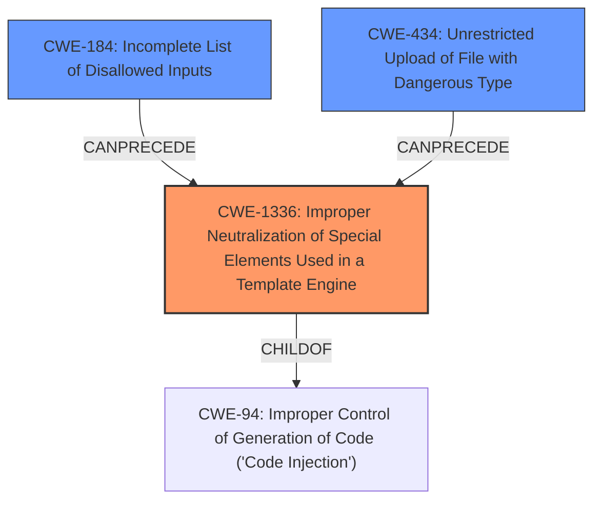

# Analysis for CVE-2021-32650

# Summary
| CWE ID  | CWE Name                                                                      | Confidence | CWE Abstraction Level | CWE Vulnerability Mapping Label | CWE-Vulnerability Mapping Notes |
| ------- | ----------------------------------------------------------------------------- | ---------- | --------------------- | ------------------------------- | ------------------------------- |
| CWE-1336 | Improper Neutralization of Special Elements Used in a Template Engine         | 0.9        | Base                  | Primary                         | Allowed                         |
| CWE-184 | Incomplete List of Disallowed Inputs                                          | 0.7        | Base                  | Secondary                       | Allowed                         |
| CWE-434 | Unrestricted Upload of File with Dangerous Type                               | 0.6        | Base                  | Secondary                       | Allowed                         |

## Evidence and Confidence

*   **Confidence Score:** 0.8
*   **Evidence Strength:** HIGH

## Relationship Analysis
The primary CWE is CWE-1336, representing the core issue of improper template engine neutralization. CWE-94 is a parent, but too general. CWE-184 is related as an incomplete denylist could allow malicious templates. CWE-434 relates to unrestricted file uploads which is the initial vector. The abstraction levels are appropriate, with CWE-1336 being a base level.

## Vulnerability Chain
The vulnerability chain starts with an **unrestricted upload of a file with a dangerous type** (CWE-434). This is followed by a potential **incomplete list of disallowed inputs** (CWE-184), which can allow specially crafted files to be uploaded and processed by the template engine. Finally, the **improper neutralization of special elements used in a template engine** (CWE-1336) allows for the execution of arbitrary code.

## Summary of Analysis
The initial assessment identified the core issue as a **PHP code injection** vulnerability stemming from the theme import feature in October CMS. The analysis focused on identifying the specific weakness that allowed attackers to bypass the safe mode and execute arbitrary code.

The primary CWE selected is CWE-1336 (Improper Neutralization of Special Elements Used in a Template Engine). This selection is based on the following evidence:

*   **Vulnerability Description Key Phrases:** "PHP code injection", "bypass safe mode feature", "theme import feature".
*   **CVE Reference Links Content Summary:** "The vulnerability stems from the ability to bypass the safe mode feature...An attacker with backend access can exploit the theme import feature to execute arbitrary PHP code.", "Insufficient input sanitization...allows the upload of themes containing malicious PHP code.".
*   **Retriever Results:** CWE-1336 has the highest similarity score.
*   **CWE Specifications:** The description of CWE-1336 directly matches the vulnerability: "The product uses a template engine to insert or process externally-influenced input, but it does not neutralize or incorrectly neutralizes special elements or syntax that can be interpreted as template expressions or other code directives when processed by the engine."

Secondary CWEs identified are CWE-184 (Incomplete List of Disallowed Inputs) and CWE-434 (Unrestricted Upload of File with Dangerous Type):

*   CWE-184 is relevant because the theme import feature might rely on a denylist of disallowed inputs, which could be incomplete, allowing malicious files to be uploaded.
*   CWE-434 is relevant as the initial attack vector involves uploading a malicious theme file.

Other CWEs were considered but deemed less appropriate:

*   CWE-94 (Improper Control of Generation of Code ('Code Injection')): While this CWE is related, it is more general than CWE-1336, which specifically addresses template engine injection.
*   CWE-79 (Improper Neutralization of Input During Web Page Generation ('Cross-site Scripting')): This CWE is not the primary issue, as the vulnerability allows for arbitrary code execution on the server, not just script injection in the browser.

The selected CWEs are at the optimal level of specificity because they accurately represent the root cause of the vulnerability (CWE-1336) and the contributing factors (CWE-184 and CWE-434). The selection is supported by the evidence from the vulnerability description, the retriever results, and the CWE specifications.

Relevant CWE Information:

# Enhanced Context (25 CWEs)

## CWE-1336: Improper Neutralization of Special Elements Used in a Template Engine
**Abstraction Level**: Base
**Similarity Score**: 8240.44
**Source**: sparse

**Description**:
The product uses a template engine to insert or process externally-influenced input, but it does not neutralize or incorrectly neutralizes special elements or syntax that can be interpreted as template expressions or other code directives when processed by the engine.

**Mapping Guidance**:
- Usage: Allowed
- Rationale: This CWE entry is at the Base level of abstraction, which is a preferred level of abstraction for mapping to the root causes of vulnerabilities.

## CWE-184: Incomplete List of Disallowed Inputs
**Abstraction Level**: Base
**Similarity Score**: 8050.18
**Source**: sparse

**Description**:
The product implements a protection mechanism that relies on a list of inputs (or properties of inputs) that are not allowed by policy or otherwise require other action to neutralize before additional processing takes place, but the list is incomplete.

**Mapping Guidance**:
- Usage: Allowed
- Rationale: This CWE entry is at the Base level of abstraction, which is a preferred level of abstraction for mapping to the root causes of vulnerabilities.

## CWE-434: Unrestricted Upload of File with Dangerous Type
**Abstraction Level**: base
**Similarity Score**: 5.03
**Source**: graph

**Description**:
CWE-434: Unrestricted Upload of File with Dangerous Type

**Mapping Guidance**:
- Usage: Allowed
- Rationale: This CWE entry is at the Base level of abstraction, which is a preferred level of abstraction for mapping to the root causes of vulnerabilities.