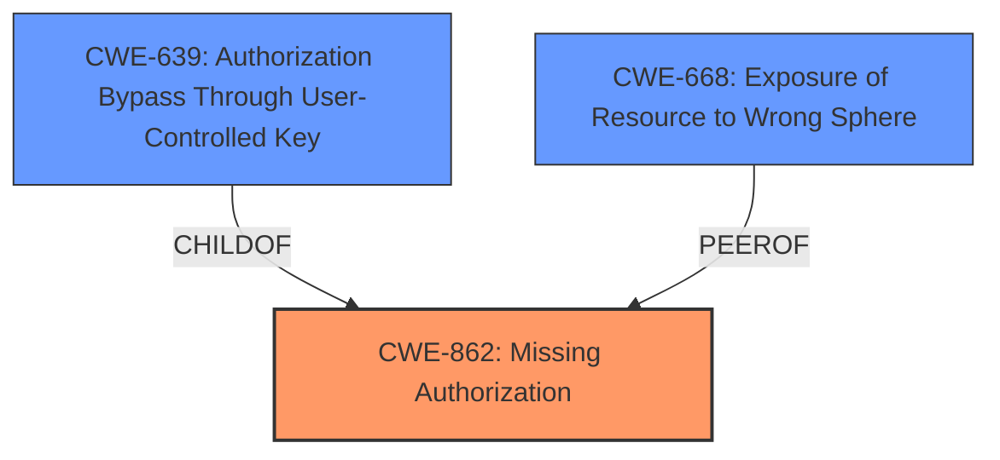

# Raw Analyzer Response for CVE-2021-32652

```markdown
# Summary
| CWE ID    | CWE Name                                          | Confidence | CWE Abstraction Level | CWE Vulnerability Mapping Label | CWE-Vulnerability Mapping Notes |
| --------- | ------------------------------------------------- | ---------- | --------------------- | ------------------------------- | ------------------------------- |
| CWE-862   | Missing Authorization                             | 0.9        | Class                 | Primary                         | Allowed-with-Review           |
| CWE-668   | Exposure of Resource to Wrong Sphere              | 0.7        | Class                 | Secondary                       | Discouraged                     |
| CWE-639   | Authorization Bypass Through User-Controlled Key | 0.6        | Base                  | Secondary                       | Allowed                         |

## Evidence and Confidence

*   **Confidence Score:** 0.9
*   **Evidence Strength:** HIGH

## Relationship Analysis
The primary relationship influencing the selection is the parent-child relationship. CWE-862 (Missing Authorization) is a class-level CWE. While more specific CWEs exist, such as CWE-639 (Authorization Bypass Through User-Controlled Key), the description focuses on a general **missing permission check** rather than a specific bypass mechanism involving user-controlled keys. Therefore, CWE-862 serves as the most appropriate initial classification. CWE-668 (Exposure of Resource to Wrong Sphere) is related, but less specific, as it describes the broader consequence of the **missing permission check**.



## Vulnerability Chain
The chain of events is as follows:
1.  Root Cause: **Missing permission check** (CWE-862)
2.  Impact: Access to mail metadata of other users (Exposure of Resource to Wrong Sphere CWE-668)

## Summary of Analysis
The initial assessment identified a **missing permission check** as the root cause. This aligns with CWE-862 (Missing Authorization). The retriever results also listed CWE-862 as a potential match.

The vulnerability description states: "A **missing permission check** in Nextcloud Mail before 1.4.3 and 1.8.2 allows another authenticated users to access mail metadata of other users." The CVE Reference Links Content Summary reinforces this: "**Root cause of vulnerability**: Missing permission check in Nextcloud Mail."

CWE-862 directly addresses the **lack of an authorization check**. The impact, unauthorized access to mail metadata, is a consequence of this missing check, which can be classified as CWE-668 (Exposure of Resource to Wrong Sphere).

CWE-639 (Authorization Bypass Through User-Controlled Key) was considered because it is a child of CWE-862 and was the top result from the sparse retriever results. However, the description doesn't provide specific evidence for a user-controlled key being the mechanism of bypass. The description only states the **missing permission check**, so the user-controlled key aspect is not explicitly present. Therefore, it is less appropriate than CWE-862.

CWE-862 is selected because it represents the root cause **missing permission check**, which is the most accurate and well-supported classification based on the provided evidence. It is at the class level, which is appropriate given the lack of more specific details about the authorization failure.

Relevant CWE Information:
# Enhanced Context (25 CWEs)
The following CWEs were identified as potentially relevant to this vulnerability:

## CWE-280: Improper Handling of Insufficient Permissions or Privileges
**Abstraction Level**: Base
**Similarity Score**: 0.78
**Source**: dense

**Description**:
The product does not handle or incorrectly handles when it has insufficient privileges to access resources or functionality as specified by their permissions. This may cause it to follow unexpected code paths that may leave the product in an invalid state.

**Mapping Guidance**:
- Usage: Allowed
- Rationale: This CWE entry is at the Base level of abstraction, which is a preferred level of abstraction for mapping to the root causes of vulnerabilities.

## CWE-639: Authorization Bypass Through User-Controlled Key
**Abstraction Level**: Base
**Similarity Score**: 0.78
**Source**: dense

**Description**:
The system's authorization functionality does not prevent one user from gaining access to another user's data or record by modifying the key value identifying the data.

**Mapping Guidance**:
- Usage: Allowed
- Rationale: This CWE entry is at the Base level of abstraction, which is a preferred level of abstraction for mapping to the root causes of vulnerabilities.

## CWE-668: Exposure of Resource to Wrong Sphere
**Abstraction Level**: Class
**Similarity Score**: 0.78
**Source**: dense

**Description**:
The product exposes a resource to the wrong control sphere, providing unintended actors with inappropriate access to the resource.

**Mapping Guidance**:
- Usage: Discouraged
- Rationale: CWE-668 is high-level and is often misused as a catch-all when lower-level CWE IDs might be applicable. It is sometimes used for low-information vulnerability reports [REF-1287]. It is a level-1 Class (i.e., a child of a Pillar). It is not useful for trend analysis.

## CWE-267: Privilege Defined With Unsafe Actions
**Abstraction Level**: Base
**Similarity Score**: 0.77
**Source**: dense

**Description**:
A particular privilege, role, capability, or right can be used to perform unsafe actions that were not intended, even when it is assigned to the correct entity.

**Mapping Guidance**:
- Usage: Allowed
- Rationale: This CWE entry is at the Base level of abstraction, which is a preferred level of abstraction for mapping to the root causes of vulnerabilities.

## CWE-266: Incorrect Privilege Assignment
**Abstraction Level**: Base
**Similarity Score**: 0.77
**Source**: dense

**Description**:
A product incorrectly assigns a privilege to a particular actor, creating an unintended sphere of control for that actor.

**Mapping Guidance**:
- Usage: Allowed
- Rationale: This CWE entry is at the Base level of abstraction, which is a preferred level of abstraction for mapping to the root causes of vulnerabilities.

## CWE-274: Improper Handling of Insufficient Privileges
**Abstraction Level**: Base
**Similarity Score**: 0.77
**Source**: dense

**Description**:
The product does not handle or incorrectly handles when it has insufficient privileges to perform an operation, leading to resultant weaknesses.

**Mapping Guidance**:
- Usage: Discouraged
- Rationale: This CWE entry could be deprecated in a future version of CWE.

## CWE-212: Improper Removal of Sensitive Information Before Storage or Transfer
**Abstraction Level**: Base
**Similarity Score**: 0.77
**Source**: dense

**Description**:
The product stores, transfers, or shares a resource that contains sensitive information, but it does not properly remove that information before the product makes the resource available to unauthorized actors.

**Mapping Guidance**:
- Usage: Allowed
- Rationale: This CWE entry is at the Base level of abstraction, which is a preferred level of abstraction for mapping to the root causes of vulnerabilities.

## CWE-41: Improper Resolution of Path Equivalence
**Abstraction Level**: Base
**Similarity Score**: 0.77
**Source**: dense

**Description**:
The product is vulnerable to file system contents disclosure through path equivalence. Path equivalence involves the use of special characters in file and directory names. The associated manipulations are intended to generate multiple names for the same object.

**Mapping Guidance**:
- Usage: Allowed
- Rationale: This CWE entry is at the Base level of abstraction, which is a preferred level of abstraction for mapping to the root causes of vulnerabilities.

## CWE-807: Reliance on Untrusted Inputs in a Security Decision
**Abstraction Level**: Base
**Similarity Score**: 0.76
**Source**: dense

**Description**:
The product uses a protection mechanism that relies on the existence or values of an input, but the input can be modified by an untrusted actor in a way that bypasses the protection mechanism.

**Mapping Guidance**:
- Usage: Allowed
- Rationale: This CWE entry is at the Base level of abstraction, which is a preferred level of abstraction for mapping to the root causes of vulnerabilities.

## CWE-404: Improper Resource Shutdown or Release
**Abstraction Level**: Class
**Similarity Score**: 0.76
**Source**: dense

**Description**:
The product does not release or incorrectly releases a resource before it is made available for re-use.

**Mapping Guidance**:
- Usage: Allowed-with-Review
- Rationale: