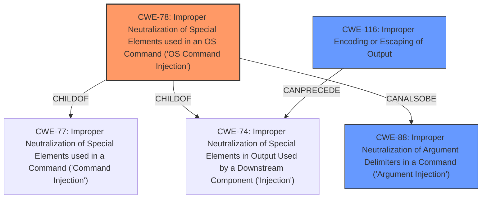

# Enhanced Analysis for CVE-2021-32673

# Summary
| CWE ID | CWE Name | Confidence | CWE Abstraction Level | CWE Vulnerability Mapping Label | CWE-Vulnerability Mapping Notes |
|---|---|---|---|---|---|
| CWE-78 | Improper Neutralization of Special Elements used in an OS Command ('OS Command Injection') | 1.0 | Base | Allowed | Primary CWE. The vulnerability stems from the improper handling of user-controlled input when executing shell commands without proper escaping parameters. |
| CWE-88 | Improper Neutralization of Argument Delimiters in a Command ('Argument Injection') | 0.75 | Base | Allowed | Secondary CWE. The attacker can inject additional arguments or options into the command, modifying its behavior. |
| CWE-116 | Improper Encoding or Escaping of Output | 0.6 | Class | Allowed-with-Review | Secondary CWE. The root cause is the **lack of** proper encoding/escaping of user-provided input before including it in shell commands. |

## Evidence and Confidence

*   **Confidence Score:** 0.9
*   **Evidence Strength:** HIGH

## Relationship Analysis
The primary relationship is that CWE-78 is a child of CWE-77 (Improper Neutralization of Special Elements used in a Command) and CWE-74 (Improper Neutralization of Special Elements in Output Used by a Downstream Component ('Injection')). CWE-88 (Argument Injection) can be a related weakness, potentially preceding CWE-78 if argument delimiters are not properly neutralized, leading to OS command injection. CWE-116 is a Class level CWE, but included because it directly relates to the root cause of **lack of** output encoding, and is also related to CWE-74.



## Vulnerability Chain
The vulnerability chain starts with **improper handling** and **lack of sanitization** of user-controlled input. This leads to the construction of a malicious OS command due to **missing or incorrect neutralization** of special elements, resulting in the execution of arbitrary commands.
  - **Root Cause:** Improper handling of user-controlled input, **lack of** input sanitization.
  - **Weakness:** CWE-78 (Improper Neutralization of Special Elements used in an OS Command).
  - **Impact:** Remote Command Execution.

## Summary of Analysis
The primary CWE is CWE-78 because the **root cause** is the application's failure to neutralize special elements in OS commands. The "CVE Reference Links Content Summary" clearly states, "The vulnerability stems from the improper handling of user-controlled input when executing shell commands within the `GitCmdClient` class. Specifically, the `execSync` function was used to execute git commands without properly escaping parameters." The description explicitly indicates that user-provided input (`hash`, `a`, `b`) was directly interpolated into shell commands passed to `execSync`, allowing an attacker to inject arbitrary shell commands by manipulating these inputs. This aligns directly with the description of CWE-78, which states, "The product constructs all or part of an OS command using externally-influenced input from an upstream component, but it does not neutralize or incorrectly neutralizes special elements that could modify the intended OS command when it is sent to a downstream component."

CWE-88 is included as a secondary weakness because the attacker could potentially inject additional arguments or options into the command, further modifying its behavior. The description of CWE-88 notes that "if an attacker can provide an untrusted input that contains argument-separating delimiters, then the resulting command will have more arguments than intended by the developer." While the primary concern is the injection of entire commands, the possibility of argument injection contributes to the overall vulnerability.

CWE-116 is also included as the **lack of** proper encoding/escaping of user-provided input before including it in shell commands is a direct contributor to the vulnerability. The "CVE Reference Links Content Summary" highlights this by stating, "The code did not sanitize or escape the parameters passed to the git commands, leaving them vulnerable to shell injection."

The selected CWEs are at the optimal level of specificity because they directly address the root cause and contributing factors of the vulnerability. CWE-78 is a Base-level CWE that accurately describes the command injection issue. CWE-88 and CWE-116 further refine the understanding by highlighting the potential for argument injection and the **lack of** output handling, respectively. Higher-level CWEs would be too generic and would not capture the specific details of the vulnerability.


## CWE Relationship Analysis

Current CWEs represent these abstraction levels: .


### Vulnerability Chain Analysis

**Chain starting from CWE-88:**
- 88 (Improper Neutralization of Argument Delimiters in a Command ('Argument Injection')) - ROOT


**Chain starting from CWE-78:**
- 78 (Improper Neutralization of Special Elements used in an OS Command ('OS Command Injection')) - ROOT


### CWE Relationship Diagram

```mermaid
graph TD
    classDef primary fill:#f96,stroke:#333,stroke-width:2px
    classDef secondary fill:#69f,stroke:#333
    classDef tertiary fill:#9e9,stroke:#333
```