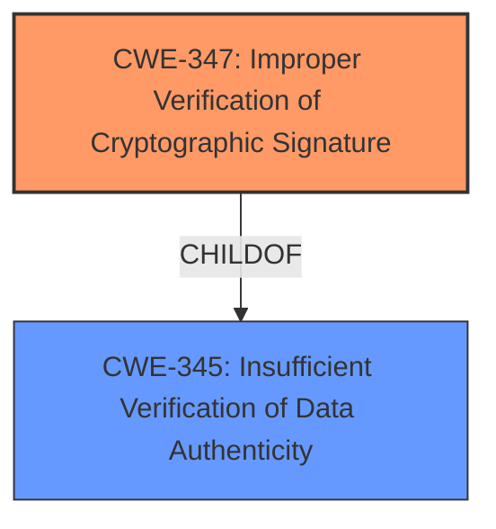

# Analysis Report for CVE-2021-32685

# Vulnerability Analysis Report: CVE-2021-32685

## Description


## Analysis (with Relationship Data)

# Summary
| CWE ID | CWE Name | Confidence | CWE Abstraction Level | CWE Vulnerability Mapping Label | CWE-Vulnerability Mapping Notes |
|---|---|---|---|---|---|
| CWE-347 | Improper Verification of Cryptographic Signature | 1.0 | Base | Primary | Allowed |

## Evidence and Confidence

*   **Confidence Score:** 1.0
*   **Evidence Strength:** HIGH

## Relationship Analysis
The primary CWE identified is CWE-347, which is a Base level CWE. It is a child of CWE-345 (Insufficient Verification of Data Authenticity), a Class level CWE. Choosing CWE-347 provides the most specific description of the vulnerability.



## Vulnerability Chain
The vulnerability involves an **improper signature verification** (**ROOT CAUSE**), leading to the ability to verify any signature with a matching hash (**IMPACT**). The chain is direct and simple:

1.  **Improper Verification of Cryptographic Signature (CWE-347):** The `verifyWithMessage` method does not properly validate the cryptographic signature, only checking the SHA-512 hash.
2.  **Bypass Signature Verification (Impact):** An attacker can forge signatures by creating signatures with matching SHA-512 hashes.

## Summary of Analysis
The analysis is based on the provided evidence, which clearly indicates an **improper signature verification** in the `tEnvoy` library.

The "CVE Reference Links Content Summary" states: "The `verifyWithMessage` method in the `tEnvoyNaClSigningKey` class of the `tenvoy` npm package incorrectly implemented signature verification...It was only checking if the SHA-512 hash of the signature matched the SHA-512 hash of the message. This allowed any signature with a matching SHA-512 hash of the message to pass verification, regardless of whether the signature was actually valid."

The graph relationship confirms that a more general case of data authenticity issues (CWE-345) exists, but the specific case of signature verification is more precise.

CWE-347 is at the optimal level of specificity because it directly addresses the **improper verification** of cryptographic signatures, rather than a more general authentication or data integrity issue.

Other CWEs Considered:

*   CWE-328 (Use of Weak Hash): While the vulnerability involves SHA-512 hashes, the core issue is not the weakness of the hash itself, but rather the **improper use** of the hash in signature verification. Therefore, this CWE is not as relevant.
*   CWE-327 (Use of a Broken or Risky Cryptographic Algorithm): This CWE is too broad. The vulnerability is not due to a broken crypto algorithm, but a flaw in how the signature verification process is implemented.
*   CWE-295 (Improper Certificate Validation): This is not a certificate validation issue.

The vulnerability is a direct result of **improperly verifying** the signature, making CWE-347 the most accurate and specific classification.


## CWE Relationship Analysis

Current CWEs represent these abstraction levels: .


### Vulnerability Chain Analysis

**Chain starting from CWE-345:**
- 345 (Insufficient Verification of Data Authenticity) - ROOT


**Chain starting from CWE-327:**
- 327 (Use of a Broken or Risky Cryptographic Algorithm) - ROOT


### CWE Relationship Diagram

```mermaid
graph TD
    classDef primary fill:#f96,stroke:#333,stroke-width:2px
    classDef secondary fill:#69f,stroke:#333
    classDef tertiary fill:#9e9,stroke:#333
```


*Report generated on 2025-04-01 18:41:33*
