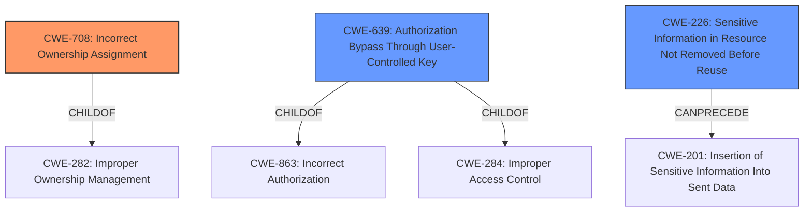

# Raw Analyzer Response for CVE-2021-32689

# Summary
| CWE ID | CWE Name | Confidence | CWE Abstraction Level | CWE Vulnerability Mapping Label | CWE-Vulnerability Mapping Notes |
|---|---|---|---|---|---|
| CWE-708 | Incorrect Ownership Assignment | 0.9 | Base | Primary | Allowed |
| CWE-639 | Authorization Bypass Through User-Controlled Key | 0.7 | Base | Secondary | Allowed |
| CWE-226 | Sensitive Information in Resource Not Removed Before Reuse | 0.6 | Base | Secondary | Allowed |

## Evidence and Confidence

*   **Confidence Score:** 0.8
*   **Evidence Strength:** HIGH

## Relationship Analysis
The primary CWE is CWE-708, which has a child relationship to CWE-282, indicating broader resource management issues. CWE-639 is a child of CWE-863 and CWE-284, suggesting an authorization bypass issue stemming from broader authorization problems. CWE-226 can precede CWE-201, suggesting a potential chain where sensitive information remains in a resource and is then inserted into sent data. The chosen CWEs are at the Base level, providing the most specific classification possible based on the available evidence.

## Vulnerability Chain
The vulnerability chain begins with the **failure to properly disassociate users from chat messages** upon account deletion (CWE-708). This leads to a situation where reusing a username grants a new user access to the previous user's chat history (CWE-639). If the chat messages contain sensitive information, it can be exposed (CWE-226). The impact is unauthorized access to sensitive data.

## Summary of Analysis
Initial analysis pointed towards issues with authorization and data handling. After reviewing the retriever results, CWE-708 stands out as the best primary classification given the **incorrect association of ownership of the chat messages to the new user** when the username is reused. This decision is based on the CVE summary: "The vulnerability stems from Nextcloud Talk not properly disassociating users from chats after account deletion. Specifically, if a user was deleted and then their username was reused by a new user, the new user could gain access to chat messages sent to the previous user."

CWE-639 is a secondary classification because it addresses the authorization bypass aspect that occurs when the new user, via the reused username, is able to access the old user's data.

CWE-226 is a weaker secondary classification due to the potential for sensitive information exposure if the chat messages contain sensitive information.

These CWEs are at the most specific level of abstraction, providing a clear understanding of the vulnerability's root cause and potential impacts.

Relevant CWE Information:

# Enhanced Context (25 CWEs)

## CWE-708: Incorrect Ownership Assignment
**Abstraction:** Base
**Status:** Incomplete

### Description
The product assigns an owner to a resource, but the owner is outside of the intended control sphere.

### Extended Description
This may allow the resource to be manipulated by actors outside of the intended control sphere.

### Alternative Terms
None

### Relationships
ChildOf -> CWE-282
CanAlsoBe -> CWE-345

### Mapping Guidance
**Usage:** Allowed
**Rationale:** This CWE entry is at the Base level of abstraction, which is a preferred level of abstraction for mapping to the root causes of vulnerabilities.
**Comments:** Carefully read both the name and description to ensure that this mapping is an appropriate fit. Do not try to 'force' a mapping to a lower-level Base/Variant simply to comply with this preferred level of abstraction.
**Reasons:**
- Acceptable-Use

### Additional Notes
**[Maintenance]** 

This overlaps verification errors, permissions, and privileges.

A closely related weakness is the incorrect assignment of groups to a resource. It is not clear whether it would fall under this entry or require a different entry.

### Observed Examples
- **CVE-2007-5101:** File system sets wrong ownership and group when creating a new file.
- **CVE-2007-4238:** OS installs program with bin owner/group, allowing modification.
- **CVE-2007-1716:** Manager does not properly restore ownership of a reusable resource when a user logs out, allowing privilege escalation.

**Explanation:** The vulnerability in Nextcloud Talk involves the incorrect assignment of chat messages to a new user when a username is reused, which perfectly aligns with the description of CWE-708. The chat messages, which are the resource, are incorrectly assigned to a user outside the intended control sphere.

## CWE-639: Authorization Bypass Through User-Controlled Key
**Abstraction:** Base
**Status:** Incomplete

### Description
The system's authorization functionality does not prevent one user from gaining access to another user's data or record by modifying the key value identifying the data.

### Extended Description
Retrieval of a user record occurs in the system based on some key value that is under user control. The key would typically identify a user-related record stored in the system and would be used to lookup that record for presentation to the user. It is likely that an attacker would have to be an authenticated user in the system. However, the authorization process would not properly check the data access operation to ensure that the authenticated user performing the operation has sufficient entitlements to perform the requested data access, hence bypassing any other authorization checks present in the system.

### Alternative Terms
Insecure Direct Object Reference / IDOR: The "Insecure Direct Object Reference" term, as described in the OWASP Top Ten, is broader than this CWE because it also covers path traversal (CWE-22). Within the context of vulnerability theory, there is a similarity between the OWASP concept and CWE-706: Use of Incorrectly-Resolved Name or Reference.
Broken Object Level Authorization / BOLA: BOLA is used in the 2019 OWASP API Security Top 10 and is said to be the same as IDOR.
Horizontal Authorization: "Horizontal Authorization" is used to describe situations in which two users have the same privilege level, but must be prevented from accessing each other's resources. This is fairly common when using key-based access to resources in a multi-user context.

### Relationships
ChildOf -> CWE-863
ChildOf -> CWE-863
ChildOf -> CWE-284

### Mapping Guidance
**Usage:** Allowed
**Rationale:** This CWE entry is at the Base level of abstraction, which is a preferred level of abstraction for mapping to the root causes of vulnerabilities.
**Comments:** Carefully read both the name and description to ensure that this mapping is an appropriate fit. Do not try to 'force' a mapping to a lower-level Base/Variant simply to comply with this preferred level of abstraction.
**Reasons:**
- Acceptable-Use

### Observed Examples
- **CVE-2021-36539:** An educational application does not appropriately restrict file IDs to a particular user. The attacker can brute-force guess IDs, indicating IDOR.

**Explanation:** While CWE-708 covers the incorrect assignment, CWE-639 highlights how the reuse of a username (the key) allows a user to bypass authorization and access another user's data. The username acts as a key, and the system fails to prevent the new user from accessing the old user's messages.

## CWE-226: Sensitive Information in Resource Not Removed Before Reuse
**Abstraction:** Base
**Status:** Draft

### Description
The product releases a resource such as memory or a file so that it can be made available for reuse, but it does not clear or "zeroize" the information contained in the resource before the product performs a critical state transition or makes the resource available for reuse by other entities.

### Extended Description
When resources are released, they can be made available for reuse. For example, after memory is de-allocated, an operating system may make the memory available to another process, or disk space may be reallocated when a file is deleted. As removing information requires time and additional resources, operating systems do not usually clear the previously written