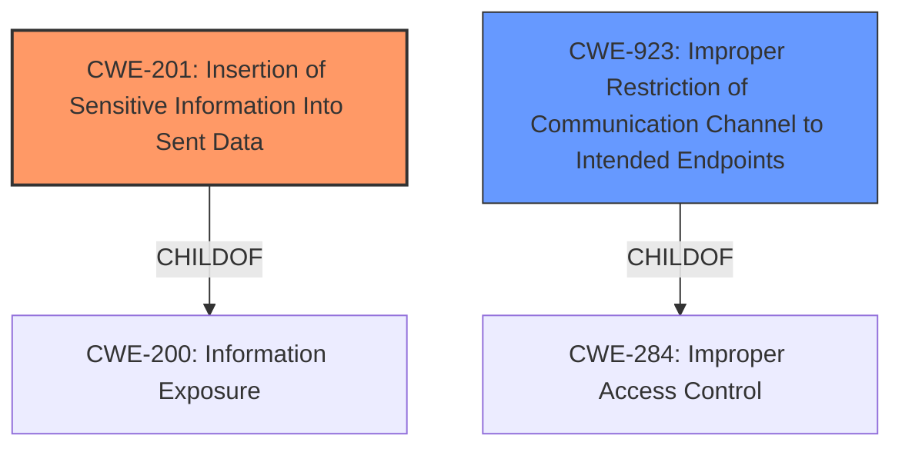

# Analysis Report for CVE-2021-32690

# Vulnerability Analysis Report: CVE-2021-32690

## Description


## Analysis (with Relationship Data)

# Summary
| CWE ID | CWE Name | Confidence | CWE Abstraction Level | CWE Vulnerability Mapping Label | CWE-Vulnerability Mapping Notes |
|---|---|---|---|---|---|
| CWE-201 | Insertion of Sensitive Information Into Sent Data | 0.9 | Base | Primary | Allowed |
| CWE-923 | Improper Restriction of Communication Channel to Intended Endpoints | 0.7 | Class | Secondary | Allowed-with-Review |

## Evidence and Confidence

*   **Confidence Score:** 0.8
*   **Evidence Strength:** HIGH

## Relationship Analysis
The primary CWE is CWE-201 which is at the Base level and has a ChildOf relationship to CWE-200 (Information Exposure). It has CanAlsoBe relationships with CWE-209 (Information Exposure Through an Error Message) and CWE-202 (Exposure of Sensitive Information Through Data Queries). The secondary CWE is CWE-923 which is a Class level with a ChildOf relationship to CWE-284 (Improper Access Control). The relationship between these two CWEs isn't direct, but both relate to the sensitive information being sent to an unintended recipient.



## Vulnerability Chain
The vulnerability chain begins with the **over-sharing of credentials** by the Helm application. This leads to the **insertion of sensitive information (username and password) into data sent** to unintended domains. The final impact is **credential leakage**, potentially allowing an attacker to impersonate the user or gain access to other resources.

## Summary of Analysis
The analysis is based on the provided evidence from the vulnerability description and the CVE Reference Links Content Summary.

The vulnerability description states: "In versions of helm prior to 3.6.1, a vulnerability exists where the username and password credentials associated with a Helm repository could be passed on to another domain referenced by that Helm repository." This directly supports the identification of **insertion of sensitive information into sent data**.

The CVE Reference Links Content Summary provides further evidence: "The core weakness was that authentication credentials for a Helm repository were not scoped to that repository's domain. Instead, these credentials were being sent along with requests for chart archives hosted on other domains."

CWE-201 (Insertion of Sensitive Information Into Sent Data) accurately describes this vulnerability as it involves the **transmission of username and password credentials (sensitive information) to another domain (unintended actor)**. The security implication is credential leakage, which could lead to unauthorized access and other security breaches.

CWE-923 (Improper Restriction of Communication Channel to Intended Endpoints) is a secondary concern. While the primary issue is the leakage of credentials, the fact that the communication channel is not properly restricted to the intended endpoint (the Helm repository's domain) contributes to the vulnerability.

The selected CWEs are at the optimal level of specificity, as CWE-201 is a Base level weakness and directly describes the root cause. While CWE-923 is a Class level, it provides additional context about the communication channel.

Other CWEs considered but not used:

*   CWE-639 (Authorization Bypass Through User-Controlled Key): This CWE was considered but deemed less relevant as the vulnerability does not involve bypassing authorization through a user-controlled key. The issue is the **unintentional sending of credentials**, not the manipulation of keys to gain unauthorized access.
*   CWE-427 (Uncontrolled Search Path Element): This CWE was considered but not selected because the vulnerability does not involve an uncontrolled search path. The problem is the **transmission of credentials to unintended domains**, not the use of an insecure search path.
*   CWE-789 (Memory Allocation with Excessive Size Value) and CWE-1325 (Improperly Controlled Sequential Memory Allocation) were not considered since there was no evidence of memory allocation issues.


## CWE Relationship Analysis

Current CWEs represent these abstraction levels: .


### Vulnerability Chain Analysis

**Chain starting from CWE-284:**
- 284 (Improper Access Control) - ROOT


**Chain starting from CWE-201:**
- 201 (Insertion of Sensitive Information Into Sent Data) - ROOT


### CWE Relationship Diagram

```mermaid
graph TD
    classDef primary fill:#f96,stroke:#333,stroke-width:2px
    classDef secondary fill:#69f,stroke:#333
    classDef tertiary fill:#9e9,stroke:#333
```


*Report generated on 2025-04-02 05:32:19*
