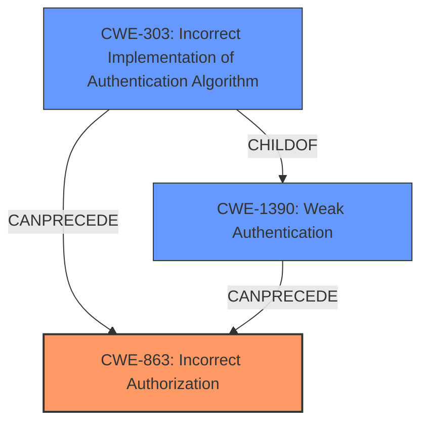

# Analysis for CVE-2021-32693

# Summary
| CWE ID  | CWE Name                                                                                                           | Confidence | CWE Abstraction Level | CWE Vulnerability Mapping Label | CWE-Vulnerability Mapping Notes |
| :-------- | :----------------------------------------------------------------------------------------------------------------- | :---------- | :---------------------- | :------------------------------ | :------------------------------ |
| CWE-863   | Incorrect Authorization                                                                                            | 0.9         | Class                   | Primary CWE                     | Allowed-with-Review             |
| CWE-303   | Incorrect Implementation of Authentication Algorithm                                                              | 0.7         | Base                    | Secondary Candidate             | Allowed                         |
| CWE-1390  | Weak Authentication                                                                                                | 0.6         | Class                   | Secondary Candidate             | Allowed-with-Review             |

## Evidence and Confidence

*   **Confidence Score:** 0.8
*   **Evidence Strength:** HIGH

## Relationship Analysis
The primary CWE is CWE-863, Incorrect Authorization. This CWE is a Class-level weakness and has multiple children that represent more specific authorization issues. The vulnerability involves an **improper firewall authentication** leading to a user authenticated on one part of the application being incorrectly considered authenticated on another.

CWE-303, Incorrect Implementation of Authentication Algorithm, and CWE-1390, Weak Authentication, were considered as potential related weaknesses. CWE-303 is a child of CWE-1390, and both relate to authentication issues. The final decision was to select CWE-863 as the primary weakness due to the incorrect authorization occurring after authentication.

## Vulnerability Chain
The vulnerability chain involves the following:
1.  **Root Cause:** **Improper firewall authentication** (Implied CWE, but related to authN/authZ).
2.  **Weakness:** Incorrectly handles authenticated token from one firewall to all other firewalls (CWE-863).
3.  **Impact:** User authenticated on one part of application is considered authenticated on the rest (Unauthorized Access).

## Summary of Analysis
The initial analysis focused on the **improper firewall authentication** as the root cause. The CVE description and the CVE Reference Links Content Summary helped to refine the selection. The key phrase "An authenticated token from one firewall is made available to all other firewalls, even if they should have different providers" from the "CVE Reference Links Content Summary" indicated an authorization issue. The vulnerability description states "When an application defines multiple firewalls, the token authenticated by one of the firewalls was available for all other firewalls." This suggests that authentication was occurring, but authorization was not properly enforced across the different firewalls.

Based on this analysis, CWE-863, Incorrect Authorization, was selected as the primary CWE. While the vulnerability involves authentication, the core issue is that the system **fails to properly authorize access** based on the firewall context. The other CWEs, CWE-303 and CWE-1390, were considered but deemed less relevant because the **incorrect authorization** follows a successful (albeit potentially flawed) authentication process.

The selection of CWE-863 is at the Class level. While more specific Base-level CWEs exist under CWE-863, the available information does not provide enough detail to pinpoint the precise authorization flaw. Therefore, the Class level is deemed the most appropriate level of abstraction.

Relevant CWE Information:
* CWE-863: Incorrect Authorization: The product performs an authorization check when an actor attempts to access a resource or perform an action, but it does not correctly perform the check.
* CWE-303: Incorrect Implementation of Authentication Algorithm: The requirements for the product dictate the use of an established authentication algorithm, but the implementation of the algorithm is incorrect.
* CWE-1390: Weak Authentication: The product uses an authentication mechanism to restrict access to specific users or identities, but the mechanism does not sufficiently prove that the claimed identity is correct.