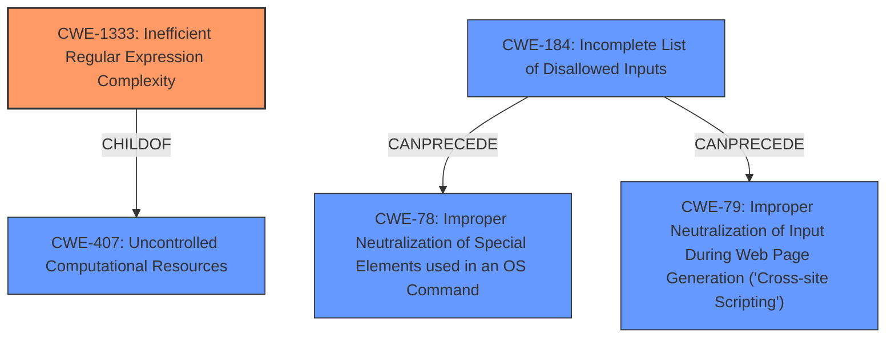

# Analysis Report for CVE-2021-32706

# Vulnerability Analysis Report: CVE-2021-32706

## Description


## Analysis (with Relationship Data)

# Summary
| CWE ID    | CWE Name                                                                    | Confidence | CWE Abstraction Level | CWE Vulnerability Mapping Label | CWE-Vulnerability Mapping Notes |
| :---------- | :-------------------------------------------------------------------------- | :--------- | :-------------------- | :------------------------------ | :------------------------------ |
| CWE-1333 | Inefficient Regular Expression Complexity    | 0.95       | Base                  | Primary                       | Allowed                       |
| CWE-78     | Improper Neutralization of Special Elements used in an OS Command ('OS Command Injection') | 0.70      | Base                  | Secondary                       | Allowed                       |
| CWE-184     | Incomplete List of Disallowed Inputs                  | 0.65       | Base                  | Secondary                       | Allowed                       |

## Evidence and Confidence

*   **Confidence Score:** 0.85
*   **Evidence Strength:** HIGH

## Relationship Analysis
The primary relationship impacting the CWE selection is the hierarchical link between CWE-407 (Uncontrolled Computational Resources) and its child CWE-1333 (Inefficient Regular Expression Complexity). Additionally, the "CanPrecede" relationship from CWE-184 (Incomplete List of Disallowed Inputs) to CWE-78 (OS Command Injection) and CWE-79 (Cross-site Scripting) suggests a potential chain where insufficient input validation can lead to command or script injection vulnerabilities. The choice of CWE-1333 is further supported by its explicit mention of "ReDoS" as an alternative term and the focus on inefficient regex processing, aligning well with the vulnerability description. The choice to include CWE-78 is due to the fact that the malicious input is used in a command executed by the pihole_execute function which directly leads to OS Command injection.



## Vulnerability Chain
The vulnerability chain starts with **CWE-1333 (Inefficient Regular Expression Complexity)**, where a flawed regular expression allows malicious characters to pass through. This leads to **CWE-78 (Improper Neutralization of Special Elements used in an OS Command)** and subsequent command injection, enabling attackers to execute arbitrary commands. The chain may also involve **CWE-184 (Incomplete List of Disallowed Inputs)** if the input validation mechanism relies on an incomplete list of disallowed characters, leading to the injection.

## Summary of Analysis
The initial assessment strongly points towards CWE-1333 as the primary weakness due to the **weakness** stemming from a **regular expression denial of service**. The vulnerability description explicitly mentions the flawed `validDomainWildcard` preg_match filter, which aligns perfectly with CWE-1333's focus on inefficient regular expression complexity and potential for denial-of-service attacks.

The inclusion of CWE-78 is warranted because the injected input is later used in a command executed by `pihole_execute`, enabling arbitrary command execution.

CWE-184 is also relevant as the insufficient input validation implies an incomplete list of disallowed inputs, which allowed the malicious characters to bypass the filter.

The evidence supporting these mappings is found in the "CVE Reference Links Content Summary" section, which details the root cause and impact of the vulnerability. The confidence in this assessment is high (0.85) due to the explicit mention of the regular expression issue and the subsequent command injection vulnerability. The selected CWEs are at the optimal level of specificity, with CWE-1333 being a Base-level weakness that directly addresses the root cause, and CWE-78 and CWE-184 capturing the subsequent vulnerabilities.

Relevant CWE Information:
- **CWE-1333: Inefficient Regular Expression Complexity** - The vulnerability stems from an inefficient regular expression in the `validDomainWildcard` preg_match filter.
- **CWE-78: Improper Neutralization of Special Elements used in an OS Command ('OS Command Injection')** - The injected malicious input is later used in a command executed by the `pihole_execute` function.
- **CWE-184: Incomplete List of Disallowed Inputs** - The flawed regular expression implies an incomplete list of disallowed characters.

Other CWEs considered but not used:
- CWE-79 (Improper Neutralization of Input During Web Page Generation ('Cross-site Scripting')): While the vulnerability involves a web interface, the primary issue is command injection rather than script injection, making CWE-78 a better fit.
- CWE-22 (Improper Limitation of a Pathname to a Restricted Directory ('Path Traversal')): This CWE was not selected as the vulnerability does not directly involve path traversal.


## CWE Relationship Analysis

Current CWEs represent these abstraction levels: .


### Vulnerability Chain Analysis

**Chain starting from CWE-79:**
- 79 (Improper Neutralization of Input During Web Page Generation ('Cross-site Scripting')) - ROOT


**Chain starting from CWE-1333:**
- 1333 (Inefficient Regular Expression Complexity) - ROOT


### CWE Relationship Diagram

```mermaid
graph TD
    classDef primary fill:#f96,stroke:#333,stroke-width:2px
    classDef secondary fill:#69f,stroke:#333
    classDef tertiary fill:#9e9,stroke:#333
```


*Report generated on 2025-04-02 11:34:03*
