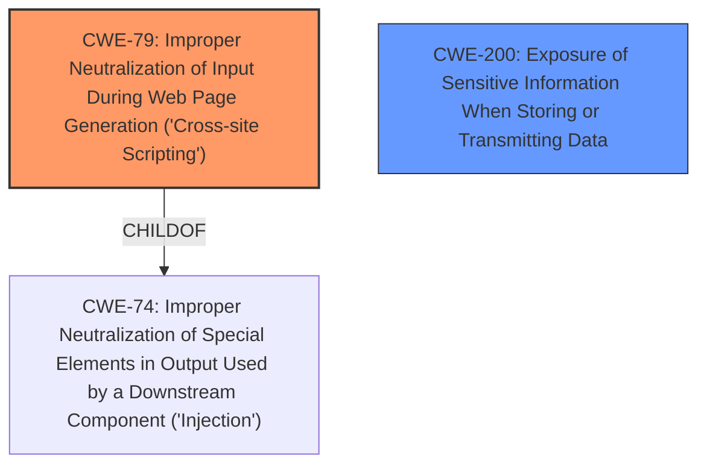

# Enhanced Analysis for CVE-2021-32707

# Summary
| CWE ID | CWE Name | Confidence | CWE Abstraction Level | CWE Vulnerability Mapping Label | CWE-Vulnerability Mapping Notes |
|---|---|---|---|---|---|
| CWE-79 | Improper Neutralization of Input During Web Page Generation ('Cross-site Scripting') | 0.9 | Base | Allowed | Primary CWE. The application **failed to filter images with a `background-image` CSS attribute**, resulting in the bypass of a privacy filter. |
| CWE-200 | Exposure of Sensitive Information When Storing or Transmitting Data | 0.7 | Class | Allowed-with-Review | Secondary CWE. The **leak of the read state** is a form of sensitive information exposure. |

## Evidence and Confidence

*   **Confidence Score:** 0.8
*   **Evidence Strength:** HIGH

## Relationship Analysis
The primary relationship influencing the decision is the parent-child relationship between CWE-74 (Improper Neutralization of Special Elements in Output Used by a Downstream Component ('Injection')) and CWE-79 (Improper Neutralization of Input During Web Page Generation ('Cross-site Scripting')). CWE-79 is a specific type of injection that occurs in web page generation. While CWE-74 is broader, CWE-79 is more precise in describing the vulnerability. CWE-200 is classified as a Class-level CWE.



## Vulnerability Chain
The vulnerability chain starts with **insufficient input sanitization** of the CSS style sheets, leading to a **failure to filter images with a `background-image` CSS attribute**, resulting in a **bypass of the privacy filter**, ultimately causing a **leak of the read state** (information exposure).
  - Root Cause: **Improper Input Sanitization**
  - Weakness: Privacy filter bypass
  - Impact: Information exposure

## Summary of Analysis
The initial assessment focused on the **failure to filter images with a `background-image` CSS attribute** and the resulting bypass of the privacy filter. The Retriever Results pointed to CWE-79 (Improper Neutralization of Input During Web Page Generation ('Cross-site Scripting')) as the top candidate, which aligns with the description of the vulnerability where the application **does not neutralize or incorrectly neutralizes user-controllable input before it is placed in output that is used as a web page**. The description clearly states that the **privacy filter failed to filter images with a `background-image` CSS attribute**.

The final decision is based on the evidence from the "Vulnerability Description Key Phrases" and "CVE Reference Links Content Summary" sections. The vulnerability is best represented by CWE-79 because the application failed to properly sanitize CSS style sheets, allowing the injection of malicious CSS and the bypass of the privacy filter. The relationship graph influenced the selection by highlighting the parent-child relationship between CWE-74 and CWE-79, where CWE-79 is a more specific case of injection in web page generation. The selection of CWE-79 is at the optimal level of specificity because it directly addresses the root cause of the vulnerability, which is the **improper neutralization of input during web page generation**.

The other CWEs from **Complete CWE Specifications** were considered but not used because they did not directly address the root cause or the specific type of vulnerability. For example, CWE-923 (Improper Restriction of Communication Channel to Intended Endpoints) is related to communication channels and endpoints, which is not the primary issue in this case. CWE-639 (Authorization Bypass Through User-Controlled Key) is related to authorization bypass through user-controlled keys, which is also not the primary issue.

Relevant CWE Information:
- CWE-79: The application **failed to filter images with a `background-image` CSS attribute**, allowing the injection of malicious CSS.
- CWE-200: The **leak of the read state** constitutes the exposure of sensitive information.


## CWE Relationship Analysis

Current CWEs represent these abstraction levels: .


### Vulnerability Chain Analysis

**Chain starting from CWE-79:**
- 79 (Improper Neutralization of Input During Web Page Generation ('Cross-site Scripting')) - ROOT


**Chain starting from CWE-923:**
- 923 (Improper Restriction of Communication Channel to Intended Endpoints) - ROOT


### CWE Relationship Diagram

```mermaid
graph TD
    classDef primary fill:#f96,stroke:#333,stroke-width:2px
    classDef secondary fill:#69f,stroke:#333
    classDef tertiary fill:#9e9,stroke:#333
```