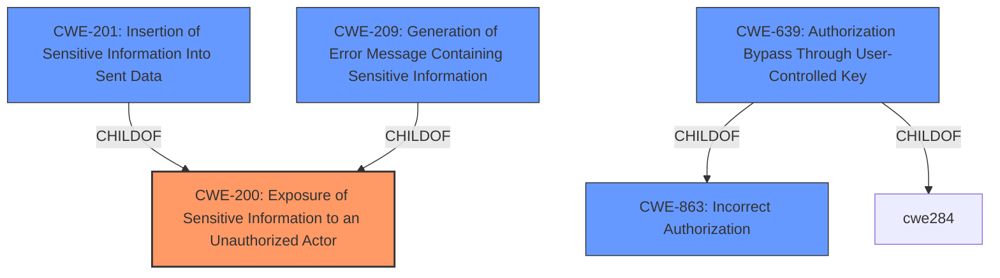

# Raw Analyzer Response for CVE-2021-32711

# Summary
| CWE ID | CWE Name | Confidence | CWE Abstraction Level | CWE Vulnerability Mapping Label | CWE-Vulnerability Mapping Notes |
|---|---|---|---|---|---|
| CWE-200 | Exposure of Sensitive Information to an Unauthorized Actor | 0.8 | Class | Allowed-with-Review | Primary CWE |
| CWE-201 | Insertion of Sensitive Information Into Sent Data | 0.7 | Base | Allowed | Secondary Candidate |
| CWE-209 | Generation of Error Message Containing Sensitive Information | 0.6 | Base | Allowed | Secondary Candidate |
| CWE-639 | Authorization Bypass Through User-Controlled Key | 0.5 | Base | Allowed | Secondary Candidate |

## Evidence and Confidence

*   **Confidence Score:** 0.8
*   **Evidence Strength:** MEDIUM

## Relationship Analysis
The primary CWE selected is CWE-200 (Exposure of Sensitive Information to an Unauthorized Actor), which is a Class-level CWE. Several Base-level CWEs are children or related to CWE-200, including CWE-201 (Insertion of Sensitive Information Into Sent Data) and CWE-209 (Generation of Error Message Containing Sensitive Information). These relationships influenced the decision to consider these CWEs as secondary candidates, providing more specific potential root causes of the information exposure. The relationships between authorization-related CWEs, like CWE-639 (Authorization Bypass Through User-Controlled Key) and CWE-863 (Incorrect Authorization), were also considered but deemed less relevant as the primary issue is the exposure itself, rather than an authorization failure.

## Vulnerability Chain
The chain of events starts with a **flaw in the API system** of Shopware's Store-API, which leads to an **information leak**. This leak results in the **exposure of potentially sensitive information** to unauthorized actors.
- API Design Flaw (Implicit) -> Information Leak (CWE-200)

## Summary of Analysis
The initial assessment pointed towards CWE-200 (Exposure of Sensitive Information to an Unauthorized Actor) as the primary weakness, given the vulnerability description and CVE Reference Links Content Summary highlighting the **"information leak"** via the Store-API. The fix requiring a non-backward compatible change suggests a deeper architectural **flaw in the API system**.

The evidence from the CVE Reference Links Content Summary supports this: "The root cause is a flaw in the API system that allows for information leakage via the Store-API" and "The core vulnerability is the unintended exposure of potentially sensitive information through the Store-API."

The retriever results also ranked CWE-200 as the top candidate. While CWE-200 is a Class-level CWE and typically discouraged, in this case, the lack of specific details about the exact mechanism of the leak makes it difficult to pinpoint a more specific Base or Variant CWE. Therefore, CWE-200 is the most appropriate choice.

CWE-201 (Insertion of Sensitive Information Into Sent Data) and CWE-209 (Generation of Error Message Containing Sensitive Information) were considered as more specific alternatives, but there isn't enough information to confirm that the sensitive information was explicitly inserted into sent data or error messages. CWE-639 (Authorization Bypass Through User-Controlled Key) and CWE-863 (Incorrect Authorization) were also considered, but the primary issue is the information exposure, not necessarily an authorization failure, though authorization could be a contributing factor.

The final decision is based on the available evidence, which points to an **information leak** due to a **flaw in the API system**. CWE-200 captures this general weakness effectively, and the other considered CWEs lack sufficient evidence to be definitively assigned.
The selected CWEs are at an adequate level of specificity given the available details. More information would be needed to pinpoint a more precise root cause.

Relevant CWE Information:

# Enhanced Context (25 CWEs)
The following CWEs were identified as potentially relevant to this vulnerability:

## CWE-226: Sensitive Information in Resource Not Removed Before Reuse
**Abstraction Level**: Base
**Similarity Score**: 0.79
**Source**: dense

**Description**:
The product releases a resource such as memory or a file so that it can be made available for reuse, but it does not clear or "zeroize" the information contained in the resource before the product performs a critical state transition or makes the resource available for reuse by other entities.

**Mapping Guidance**:
- Usage: Allowed
- Rationale: This CWE entry is at the Base level of abstraction, which is a preferred level of abstraction for mapping to the root causes of vulnerabilities.

## CWE-404: Improper Resource Shutdown or Release
**Abstraction Level**: Class
**Similarity Score**: 0.77
**Source**: dense

**Description**:
The product does not release or incorrectly releases a resource before it is made available for re-use.

**Mapping Guidance**:
- Usage: Allowed-with-Review
- Rationale: This CWE entry is a Class and might have Base-level children that would be more appropriate

## CWE-668: Exposure of Resource to Wrong Sphere
**Abstraction Level**: Class
**Similarity Score**: 0.77
**Source**: dense

**Description**:
The product exposes a resource to the wrong control sphere, providing unintended actors with inappropriate access to the resource.

**Mapping Guidance**:
- Usage: Discouraged
- Rationale: CWE-668 is high-level and is often misused as a catch-all when lower-level CWE IDs might be applicable. It is sometimes used for low-information vulnerability reports [REF-1287]. It is a level-1 Class (i.e., a child of a Pillar). It is not useful for trend analysis.

## CWE-212: Improper Removal of Sensitive Information Before Storage or Transfer
**Abstraction Level**: Base
**Similarity Score**: 0.76
**Source**: dense

**Description**:
The product stores, transfers, or shares a resource that contains sensitive information, but it does not properly remove that information before the product makes the resource available to unauthorized actors.

**Mapping Guidance**:
- Usage: Allowed
- Rationale: This CWE entry is at the Base level of abstraction, which is a preferred level of abstraction for mapping to the root causes of vulnerabilities.

## CWE-1289: Improper Validation of Unsafe Equivalence in Input
**Abstraction Level**: Base
**Similarity Score**: 0.76
**Source**: dense

**Description**:
The product receives an input value that is used as a resource identifier or other type of reference, but it does not validate or incorrectly validates that the input is equivalent to a potentially-unsafe value.

**Mapping Guidance**:
- Usage: Allowed
- Rationale: This CWE entry is at the Base level of abstraction, which is a preferred level of abstraction for mapping to the root causes of vulnerabilities.

## CWE-274: Improper Handling of Insufficient Privileges
**Abstraction Level**: Base
**Similarity Score**: 0.75
**Source**: dense

**Description**:
The product does not handle or incorrectly handles when it has insufficient privileges to perform an operation, leading to resultant weaknesses.

**Mapping Guidance**:
- Usage: Discouraged
- Rationale: This CWE entry could be deprecated in a future version of CWE.

## CWE-280: Improper Handling of Insufficient Permissions or Privileges
**Abstraction Level**: Base
**Similarity Score**: 0.75
**Source**: dense

**Description**:
The product does not handle or incorrectly handles when it has insufficient privileges to access resources or functionality as specified by their permissions. This may cause it to follow unexpected code paths that may leave the product in an invalid state.

**Mapping Guidance**:
- Usage: Allowed
- Rationale: This CWE entry is at the Base level of abstraction, which is a preferred level of abstraction for mapping to the root causes of vulnerabilities.

## CWE-639: Authorization Bypass Through User-Controlled Key
**Abstraction Level**: Base
**Similarity Score**: 0.75
**Source**: dense

**Description**:
The system's authorization functionality does not prevent one user from gaining access to another user's data or record by modifying the key value identifying the