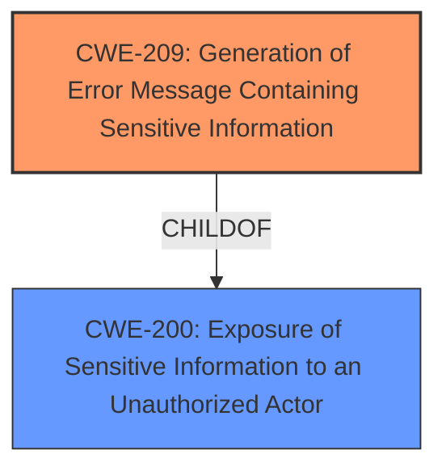

# Raw Analyzer Response for CVE-2021-32712

# Summary
| CWE ID | CWE Name | Confidence | CWE Abstraction Level | CWE Vulnerability Mapping Label | CWE-Vulnerability Mapping Notes |
|---|---|---|---|---|---|
| **CWE-209** | Generation of Error Message Containing Sensitive Information | 0.8 | Base | Primary | Allowed |
| CWE-200 | Exposure of Sensitive Information to an Unauthorized Actor | 0.5 | Class | Secondary | Discouraged |

## Evidence and Confidence

*   **Confidence Score:** 0.8
*   **Evidence Strength:** MEDIUM

## Relationship Analysis
The primary CWE, CWE-209, is a child of CWE-200, indicating a hierarchical relationship where CWE-209 is a specific type of information exposure. The retriever results also suggested CWE-200, but the description leans towards the generation of error messages containing sensitive information, making CWE-209 a more precise fit. The graph relationships highlight the association of CWE-209 with other information exposure CWEs.

## Vulnerability Chain
The vulnerability chain starts with a **failure to properly handle errors**, leading to the **generation of error messages** that inadvertently **disclose sensitive system information.** This information leakage could then be exploited by an attacker to gain further insights into the system, aiding in subsequent attacks.
  - The root cause is the **improper error handling**, and the impact is **information leakage.**

## Summary of Analysis
The analysis indicates that **Shopware versions prior to 5.6.10 are vulnerable to system information leakage in error handling**. The **Vulnerability Description Key Phrases** indicates that the **impact** is system information leakage. Based on the **CVE Reference Links Content Summary**, SW-26001 is the Information Leakage vulnerability. The vulnerability allows for unauthorized disclosure of information due to the **product generating an error message that includes sensitive information about its environment**.

The retriever results pointed towards several CWEs related to information exposure and authorization issues. The most relevant CWE is CWE-209 (Generation of Error Message Containing Sensitive Information), which is at the Base level of abstraction and has a direct correlation with the vulnerability description.

CWE-200 (Exposure of Sensitive Information to an Unauthorized Actor) was also considered, given its broader scope encompassing various information exposure scenarios. However, since the vulnerability description specifically mentions information leakage in error handling, CWE-209 is a more precise and specific mapping.

The final decision to select CWE-209 is based on its direct alignment with the vulnerability description, its Base level of abstraction, and the mapping guidance that suggests it as an appropriate fit when error messages contain sensitive information. I am overriding the general mapping guidance for CWE-200, which suggests it is discouraged.

Relevant CWE Information:

# Enhanced Context (25 CWEs)
The following CWEs were identified as potentially relevant to this vulnerability:

## CWE-209: Generation of Error Message Containing Sensitive Information
**Abstraction Level**: Base
**Similarity Score**: 0.77
**Source**: dense

**Description**:
The product generates an error message that includes sensitive information about its environment, users, or associated data.

**Mapping Guidance**:
- Usage: Allowed
- Rationale: This CWE entry is at the Base level of abstraction, which is a preferred level of abstraction for mapping to the root causes of vulnerabilities.