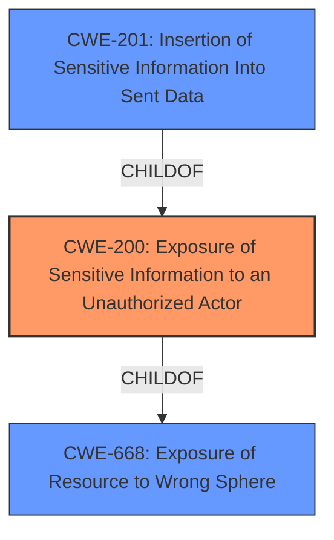

# Analysis Report for CVE-2021-32716

# Vulnerability Analysis Report: CVE-2021-32716

## Description


## Analysis (with Relationship Data)

# Summary
| CWE ID | CWE Name | Confidence | CWE Abstraction Level | CWE Vulnerability Mapping Label | CWE-Vulnerability Mapping Notes |
|---|---|---|---|---|---|
| CWE-200 | Exposure of Sensitive Information to an Unauthorized Actor | 0.9 | Class | Primary | Discouraged |
| CWE-201 | Insertion of Sensitive Information Into Sent Data | 0.7 | Base | Secondary | Allowed |
| CWE-668 | Exposure of Resource to Wrong Sphere | 0.6 | Class | Secondary | Discouraged |

## Evidence and Confidence

*   **Confidence Score:** 0.7
*   **Evidence Strength:** MEDIUM

## Relationship Analysis
The primary relationship influencing the selection is that CWE-201 is a child of CWE-200. The vulnerability involves exposing internal fields through an API, which aligns with the general concept of exposing sensitive information. Since the sensitive information is being **inserted** into the sent data, CWE-201 is a more specific, and therefore better, description of the weakness. However, CWE-200 is a Class level CWE and is discouraged from being used. CWE-668, although related, is a higher-level classification and less precise than CWE-200 and CWE-201.



## Vulnerability Chain
The vulnerability chain starts with the **lack of proper authorization checks** in the admin API, leading to the **exposure of internal hidden fields** when an association is loaded with a "to many" reference. This results in **sensitive information being disclosed** to unauthorized actors.

## Summary of Analysis
The initial analysis focused on identifying the most specific CWE that accurately reflects the vulnerability. The description clearly indicates that the **exposure of internal hidden fields** is the core issue, which directly aligns with CWE-200. However, since the information is **inserted** into sent data, CWE-201 becomes a more precise classification as it's a child of CWE-200.

The retriever results also suggest CWE-200, CWE-201, and CWE-668 as potential candidates. However, CWE-200 is discouraged. The decision to include CWE-200 and CWE-201 is based on the "Vulnerability Description Key Phrases" **impact: exposed internal hidden fields**.

The decision to include CWE-668 as a secondary candidate is based on it being the parent of CWE-200 and therefore broadly applicable to the exposure of a resource to the wrong sphere.

Relevant CWE Information:

# Enhanced Context (25 CWEs)

## CWE-668: Exposure of Resource to Wrong Sphere
**Abstraction Level**: Class
**Similarity Score**: 0.77
**Source**: dense

**Description**:
The product exposes a resource to the wrong control sphere, providing unintended actors with inappropriate access to the resource.

**Mapping Guidance**:
- Usage: Discouraged
- Rationale: CWE-668 is high-level and is often misused as a catch-all when lower-level CWE IDs might be applicable. It is sometimes used for low-information vulnerability reports [REF-1287]. It is a level-1 Class (i.e., a child of a Pillar). It is not useful for trend analysis.

## CWE-200: Exposure of Sensitive Information to an Unauthorized Actor
**Abstraction Level**: Class
**Similarity Score**: 0.76
**Source**: dense

**Description**:
The product exposes sensitive information to an actor that is not explicitly authorized to have access to that information.

**Mapping Guidance**:
- Usage: Discouraged
- Rationale: CWE-200 is commonly misused to represent the loss of confidentiality in a vulnerability, but confidentiality loss is a technical impact - not a root cause error. As of CWE 4.9, over 400 CWE entries can lead to a loss of confidentiality. Other options are often available. [REF-1287].

## CWE-201: Insertion of Sensitive Information Into Sent Data
**Abstraction Level**: Base
**Similarity Score**: 5.03
**Source**: graph

**Description**:
CWE-201: Insertion of Sensitive Information Into Sent Data

**Mapping Guidance**:
- Usage: Allowed
- Rationale: This CWE entry is at the Base level of abstraction, which is a preferred level of abstraction for mapping to the root causes of vulnerabilities.

### Technical Explanation for CWE-200
The Shopware admin API **exposes internal hidden fields** when an association has been loaded with a "to many" reference. This means that sensitive information, which should not be accessible to unauthorized actors, is being revealed through the API. This aligns directly with the characteristics of CWE-200, which describes the exposure of sensitive information to an unauthorized actor. The security implication is that attackers can potentially gain access to sensitive data not intended for public exposure. CWE-200 is a class-level weakness, and while it's often misused, in this context, it serves as a broad categorization of the issue. The MITRE mapping guidance discourages its use when more specific weaknesses are available, but given the lack of a more precise root cause in the provided information, it remains a relevant, albeit high-level, classification.

### Technical Explanation for CWE-201
CWE-201 is more specific than CWE-200. The sensitive information (internal hidden fields) is being **inserted** into the data that is sent via the API. This aligns perfectly with CWE-201, which focuses on the **insertion of sensitive information into sent data**. The security implications are the same as with CWE-200, but this classification provides a more accurate depiction of how the information is being exposed.

### Technical Explanation for CWE-668
CWE-668 describes the exposure of a resource to the wrong control sphere. In this case, the internal hidden fields are the resource being exposed. While applicable, it's a broader classification compared to CWE-200 and CWE-201, which directly address the exposure of sensitive information. Therefore, CWE-668 is considered a secondary classification.


## CWE Relationship Analysis

Current CWEs represent these abstraction levels: .


### Vulnerability Chain Analysis

**Chain starting from CWE-200:**
- 200 (Exposure of Sensitive Information to an Unauthorized Actor) - ROOT


**Chain starting from CWE-668:**
- 668 (Exposure of Resource to Wrong Sphere) - ROOT


### CWE Relationship Diagram

```mermaid
graph TD
    classDef primary fill:#f96,stroke:#333,stroke-width:2px
    classDef secondary fill:#69f,stroke:#333
    classDef tertiary fill:#9e9,stroke:#333
```


*Report generated on 2025-04-01 17:14:27*
