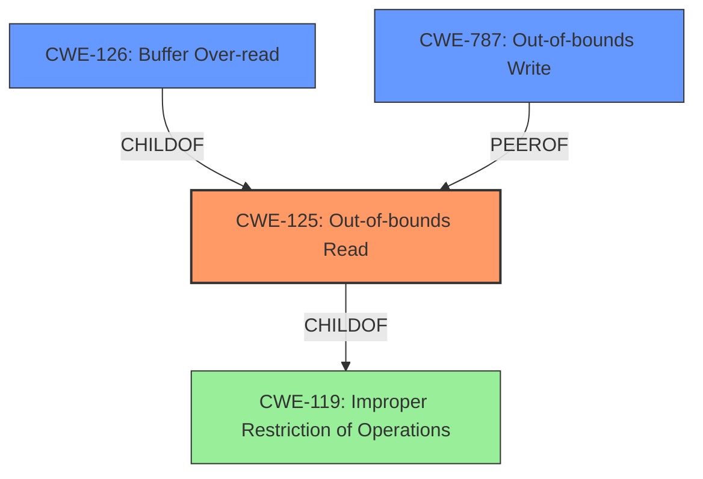

# Enhanced Analysis for CVE-2021-3272

# Summary
| CWE ID | CWE Name | Confidence | CWE Abstraction Level | CWE Vulnerability Mapping Label | CWE-Vulnerability Mapping Notes |
|---|---|---|---|---|---|
| CWE-125 | Out-of-bounds Read | 1.0 | Base | Allowed | Primary CWE |
| CWE-126 | Buffer Over-read | 0.8 | Variant | Allowed | Secondary Candidate |
| CWE-787 | Out-of-bounds Write | 0.6 | Base | Allowed | Secondary Candidate |

## Evidence and Confidence

*   **Confidence Score:** 0.9
*   **Evidence Strength:** HIGH

## Relationship Analysis
The primary CWE selected is CWE-125 (Out-of-bounds Read), which has a direct relationship to CWE-119 (Improper Restriction of Operations within the Bounds of a Memory Buffer). CWE-126 (Buffer Over-read) is a child of CWE-125, representing a more specific case. CWE-787 (Out-of-bounds Write) is considered as a secondary candidate because the vulnerability description explicitly mentions an "over-read" condition. The analysis prioritizes the base CWE due to the precise description of the vulnerability, although the variant helps refine the classification.



## Vulnerability Chain
The vulnerability chain starts with the **improper** handling of the relationship between the number of channels and image components, leading to a **heap-based buffer over-read**.

## Summary of Analysis
The initial assessment strongly points to CWE-125 (Out-of-bounds Read) due to the explicit mention of a "**heap-based buffer over-read**" in the vulnerability description. The CVE Reference Links Content Summary further confirms this by stating, "Heap-based buffer over-read (CWE-125) in `jp2_decode` function." This direct evidence makes CWE-125 the most appropriate primary classification.

The relationship graph highlights the connection between CWE-125 and its parent, CWE-119 (Improper Restriction of Operations within the Bounds of a Memory Buffer), as well as its child, CWE-126 (Buffer Over-read). While CWE-126 is a more specific variant, the description primarily focuses on the "over-read" condition, making CWE-125 a more accurate fit.

CWE-787 (Out-of-bounds Write) was considered but deemed less accurate because the primary issue is reading beyond the buffer's boundaries, not writing.

The selection of CWE-125 at the base level is optimal because it directly reflects the vulnerability's core weakness: reading data beyond the allocated buffer. The evidence from the vulnerability description and the CVE summary strongly support this classification.

Relevant CWE Information:

# Enhanced Context (25 CWEs)

## CWE-197: Numeric Truncation Error
**Abstraction Level**: Base
**Similarity Score**: 0.82
**Source**: dense

**Description**:
Truncation errors occur when a primitive is cast to a primitive of a smaller size and data is lost in the conversion.
**Why it was not selected**: Numeric Truncation Error is not relevant since there is no evidence of data being lost in conversion.

## CWE-191: Integer Underflow (Wrap or Wraparound)
**Abstraction Level**: Base
**Similarity Score**: 0.81
**Source**: dense

**Description**:
The product subtracts one value from another, such that the result is less than the minimum allowable integer value, which produces a value that is not equal to the correct result.
**Why it was not selected**: Integer Underflow is not relevant since the primary issue is an out-of-bounds read, not an arithmetic error.

## CWE-681: Incorrect Conversion between Numeric Types
**Abstraction Level**: Base
**Similarity Score**: 0.78
**Source**: dense

**Description**:
When converting from one data type to another, such as long to integer, data can be omitted or translated in a way that produces unexpected values.
**Why it was not selected**: The vulnerability doesn't seem to stem from incorrect numeric type conversions but rather from improper handling of buffer boundaries.

## CWE-131: Incorrect Calculation of Buffer Size
**Abstraction Level**: Base
**Similarity Score**: 0.77
**Source**: dense

**Description**:
The product does not correctly calculate the size to be used when allocating a buffer, which could lead to a buffer overflow.
**Why it was not selected**: Incorrect Calculation of Buffer Size is not the root cause; the issue is reading past the buffer.

## CWE-190: Integer Overflow or Wraparound
**Abstraction Level**: Base
**Similarity Score**: 0.76
**Source**: dense

**Description**:
The product performs a calculation that can
produce an integer overflow or wraparound when the logic
assumes that the resulting value will always be larger than
the original value.
**Why it was not selected**: Integer Overflow or Wraparound is not relevant.

## CWE-125: Out-of-bounds Read
**Abstraction Level**: Base
**Similarity Score**: 0.76
**Source**: dense

**Description**:
The product reads data past the end, or before the beginning, of the intended buffer.
**Why it was selected**: The vulnerability description explicitly mentions a "heap-based buffer over-read," which directly aligns with CWE-125.

## CWE-193: Off-by-one Error
**Abstraction Level**: Base
**Similarity Score**: 0.75
**Source**: dense

**Description**:
A product calculates or uses an incorrect maximum or minimum value that is 1 more, or 1 less, than the correct value.
**Why it was not selected**: Off-by-one Error is not explicitly indicated in the vulnerability description.

## CWE-124: Buffer Underwrite ('Buffer Underflow')
**Abstraction Level**: Base
**Similarity Score**: 0.75
**Source**: dense

**Description**:
The product writes to a buffer using an index or pointer that references a memory location prior to the beginning of the buffer.
**Why it was not selected**: Buffer Underwrite ('Buffer Underflow') is not relevant since the vulnerability is about reading beyond the buffer, not writing before it.

## CWE-680: Integer Overflow to Buffer Overflow
**Abstraction Level**: Compound
**Similarity Score**: 0.75
**Source**: dense

**Description**:
The product performs a calculation to determine how much memory to allocate, but an integer overflow can occur that causes less memory to be allocated than expected, leading to a buffer overflow.
**Why it was not selected**: Integer Overflow to Buffer Overflow is not relevant since the described issue is an over-read, not an overflow due to integer issues.

## CWE-129: Improper Validation of Array Index
**Abstraction Level**: Variant
**Similarity Score**: 0.75
**Source**: dense

**Description**:
The product uses untrusted input when calculating or using an array index, but the product does not validate or incorrectly validates the index to ensure the index references a valid position within the array.
**Why it was not selected**: Improper Validation of Array Index is not explicitly mentioned. The primary issue is the inconsistent relationship between channels and components.

## CWE-190: Integer Overflow or Wraparound
**Abstraction Level**: Base
**Similarity Score**: 6416.47
**Source**: sparse

**Description**:
The product performs a calculation that can
produce an integer overflow or wraparound when the logic
assumes that the resulting value will always be larger than
the original value.
**Why it was not selected**: Integer Overflow or Wraparound is not relevant.

## CWE-197: Numeric Truncation Error
**Abstraction Level**: Base
**Similarity Score**: 6234.46
**Source**: sparse

**Description**:
Truncation errors occur when a primitive is cast to a primitive of a smaller size and data is lost in the conversion.
**Why it was not selected**: Numeric Truncation Error is not relevant.

## CWE-191: Integer Underflow (Wrap or Wraparound)
**Abstraction Level**: Base
**Similarity Score**: 6119.56
**Source**: sparse

**Description**:
The product subtracts one value from another, such that the result is less


## CWE Relationship Analysis

Current CWEs represent these abstraction levels: .


### Vulnerability Chain Analysis

**Chain starting from CWE-787:**
- 787 (Out-of-bounds Write) - ROOT


**Chain starting from CWE-680:**
- 680 (Integer Overflow to Buffer Overflow) - ROOT


### CWE Relationship Diagram

```mermaid
graph TD
    classDef primary fill:#f96,stroke:#333,stroke-width:2px
    classDef secondary fill:#69f,stroke:#333
    classDef tertiary fill:#9e9,stroke:#333
```