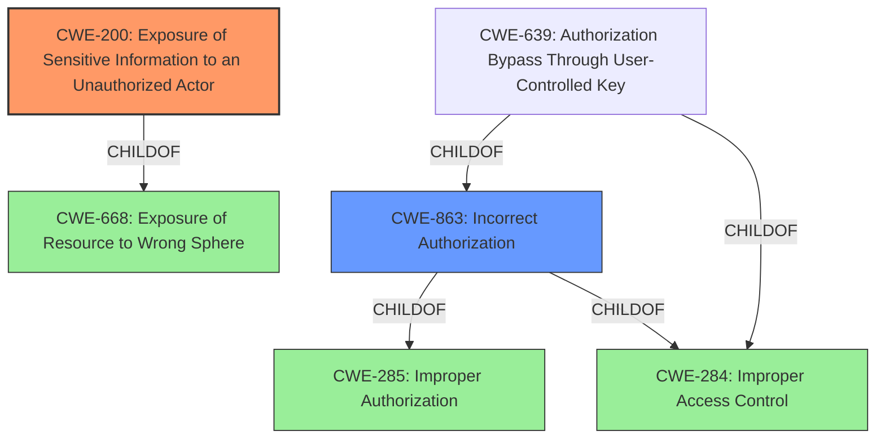

# Analysis for CVE-2021-32720

# Summary
| CWE ID | CWE Name | Confidence | CWE Abstraction Level | CWE Vulnerability Mapping Label | CWE-Vulnerability Mapping Notes |
|---|---|---|---|---|---|
| CWE-200 | Exposure of Sensitive Information to an Unauthorized Actor | 0.9 | Class | Primary | The API endpoint exposes order details to unauthorized users. |
| CWE-863 | Incorrect Authorization | 0.7 | Class | Secondary | The system performs an authorization check, but it is not correctly performed, allowing access to unauthorized data. |

## Evidence and Confidence

*   **Confidence Score:** 0.8
*   **Evidence Strength:** HIGH

## Relationship Analysis
The primary CWE is CWE-200 **Exposure of Sensitive Information to an Unauthorized Actor**, which aligns with the vulnerability description of exposing order details to unauthorized users.

CWE-863 **Incorrect Authorization** is a child of CWE-285 **Improper Authorization** and CWE-284 **Improper Access Control**. Although **Authorization Bypass Through User-Controlled Key CWE-639** is a more specific child of **Incorrect Authorization CWE-863**, there isn't enough information to determine if the key value is user controlled.

## Vulnerability Chain
The vulnerability chain starts with **Inadequate Access Control**, leading to **Information Disclosure**, which can be further exploited for **Sociotechnical Attacks** and **Exposure of Shop Condition**.

## Summary of Analysis
The initial assessment identified CWE-200 as the primary weakness due to the vulnerability's description of exposing order details to unauthorized users. This aligns with the CWE's description: "The product exposes sensitive information to an actor that is not explicitly authorized to have access to that information."

The retriever results suggested considering CWE-863 **Incorrect Authorization** as it describes a scenario where "the product performs an authorization check when an actor attempts to access a resource or perform an action, but it does not correctly perform the check." The "CVE Reference Links Content Summary" section supports this, stating: "The vulnerability stems from a new API endpoint that exposes order details (order ID, order number, items total, and token value) without proper authorization checks."

CWE-200 is chosen as the primary weakness because the core issue is the exposure of sensitive information. The lack of proper authorization (CWE-863) is a contributing factor but not the direct cause of the information exposure. CWE-863 is assigned as a secondary CWE because it provides additional context about the nature of the authorization failure. Both CWEs are at appropriate levels of abstraction (Class) given the available information.