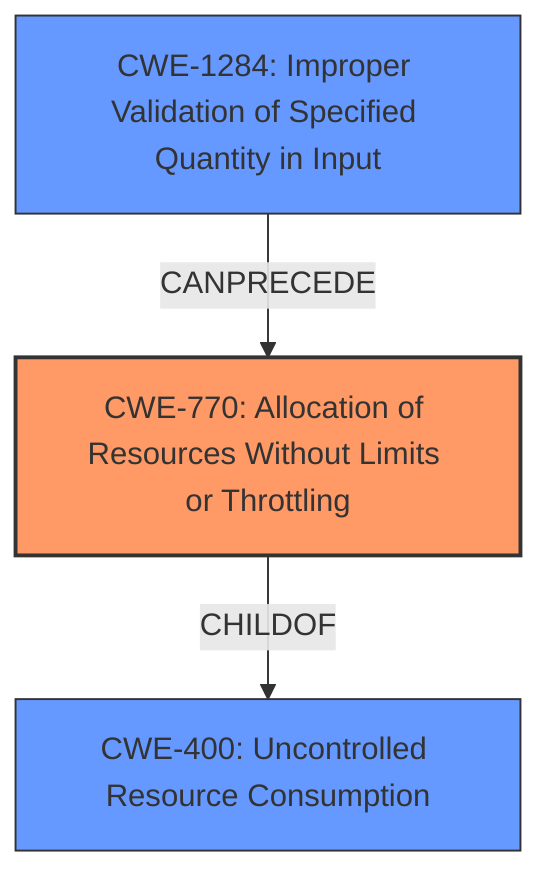

# Analysis Report for CVE-2021-32722

# Vulnerability Analysis Report: CVE-2021-32722

## Description


## Analysis (with Relationship Data)

# Summary
| CWE ID    | CWE Name                                                              | Confidence | CWE Abstraction Level | CWE Vulnerability Mapping Label | CWE-Vulnerability Mapping Notes |
| :-------- | :-------------------------------------------------------------------- | :--------- | :---------------------- | :------------------------------ | :------------------------------ |
| CWE-770   | Allocation of Resources Without Limits or Throttling                | 0.9        | Base                    | Primary                         | Allowed                       |
| CWE-400   | Uncontrolled Resource Consumption                                     | 0.7        | Class                   | Secondary                       | Discouraged                    |
| CWE-1284  | Improper Validation of Specified Quantity in Input                   | 0.6        | Base                    | Secondary                       | Allowed                       |

## Evidence and Confidence

*   **Confidence Score:** 0.8
*   **Evidence Strength:** HIGH

## Relationship Analysis
The primary CWE is CWE-770, which is a child of CWE-400. This indicates a hierarchical relationship where CWE-770 is a more specific case of uncontrolled resource consumption. CWE-1284 can precede CWE-770 in a vulnerability chain, where improper input validation leads to excessive resource allocation. Selecting CWE-770 provides the most specific and accurate description of the vulnerability, while CWE-400 provides a broader categorization.



## Vulnerability Chain
The vulnerability chain starts with **improper handling of load balancing**, leading to **uncontrolled resource consumption**, which then overwhelms the database servers.
  - **Root Cause:** **Improper handling of load balancing** (implicitly leads to CWE-770)
  - **Weakness:** **Uncontrolled resource consumption** (CWE-770)
  - **Impact:** Overwhelm Database servers

## Summary of Analysis
The initial assessment identified **uncontrolled resource consumption** and **improper handling of load balancing** as key aspects of the vulnerability.

The evidence provided in the "Vulnerability Description Key Phrases" and "CVE Reference Links Content Summary" sections strongly supports the selection of CWE-770. Specifically, the description mentions "**uncontrolled resource consumption**" and "**improper handling of load balancing**," which directly relate to the characteristics of CWE-770, namely allocating resources without limits or throttling.

The Retriever Results also indicate that CWE-770 is a strong candidate.

The graph relationships confirm that CWE-770 is a more specific type of CWE-400, and CWE-1284 can be a preceding factor. This reinforces the decision to choose CWE-770 as the primary CWE.

The selected CWEs are at the optimal level of specificity. CWE-770 provides a detailed description of the resource allocation issue, while CWE-400 offers a broader categorization. CWE-1284 addresses the potential lack of input validation which can trigger the excessive allocation of resources.

Relevant CWE Information:

# Enhanced Context (25 CWEs)

## CWE-1289: Improper Validation of Unsafe Equivalence in Input
**Abstraction Level**: Base
**Similarity Score**: 0.75
**Source**: dense

**Description**:
The product receives an input value that is used as a resource identifier or other type of reference, but it does not validate or incorrectly validates that the input is equivalent to a potentially-unsafe value.

**Mapping Guidance**:
- Usage: Allowed
- Rationale: This CWE entry is at the Base level of abstraction, which is a preferred level of abstraction for mapping to the root causes of vulnerabilities.

**Why Not Used:** This CWE is about validating input values as resource identifiers, which is not the primary issue described in the vulnerability.

## CWE-405: Asymmetric Resource Consumption (Amplification)
**Abstraction Level**: Class
**Similarity Score**: 0.75
**Source**: dense

**Description**:
The product does not properly control situations in which an adversary can cause the product to consume or produce excessive resources without requiring the adversary to invest equivalent work or otherwise prove authorization, i.e., the adversary's influence is "asymmetric."

**Mapping Guidance**:
- Usage: Allowed-with-Review
- Rationale: This CWE entry is a Class and might have Base-level children that would be more appropriate

**Why Not Used:** While there is resource consumption, the vulnerability description does not explicitly mention an asymmetric relationship between the attacker's effort and the resource consumption.

## CWE-639: Authorization Bypass Through User-Controlled Key
**Abstraction Level**: Base
**Similarity Score**: 0.74
**Source**: dense

**Description**:
The system's authorization functionality does not prevent one user from gaining access to another user's data or record by modifying the key value identifying the data.

**Mapping Guidance**:
- Usage: Allowed
- Rationale: This CWE entry is at the Base level of abstraction, which is a preferred level of abstraction for mapping to the root causes of vulnerabilities.

**Why Not Used:** The vulnerability description does not involve authorization bypass.

## CWE-404: Improper Resource Shutdown or Release
**Abstraction Level**: Class
**Similarity Score**: 0.74
**Source**: dense

**Description**:
The product does not release or incorrectly releases a resource before it is made available for re-use.

**Mapping Guidance**:
- Usage: Allowed-with-Review
- Rationale: This CWE entry is a Class and might have Base-level children that would be more appropriate

**Why Not Used:** The vulnerability is about allocating resources without limits, not about failing to release resources.

## CWE-226: Sensitive Information in Resource Not Removed Before Reuse
**Abstraction Level**: Base
**Similarity Score**: 0.74
**Source**: dense

**Description**:
The product releases a resource such as memory or a file so that it can be made available for reuse, but it does not clear or "zeroize" the information contained in the resource before the product performs a critical state transition or makes the resource available for reuse by other entities.

**Mapping Guidance**:
- Usage: Allowed
- Rationale: This CWE entry is at the Base level of abstraction, which is a preferred level of abstraction for mapping to the root causes of vulnerabilities.

**Why Not Used:** This vulnerability is not about sensitive information being left in resources after reuse.

## CWE-807: Reliance on Untrusted Inputs in a Security Decision
**Abstraction Level**: Base
**Similarity Score**: 0.74
**Source**: dense

**Description**:
The product uses a protection mechanism that relies on the existence or values of an input, but the input can be modified by an untrusted actor in a way that bypasses the protection mechanism.

**Mapping Guidance**:
- Usage: Allowed
- Rationale: This CWE entry is at the Base level of abstraction, which is a preferred level of abstraction for mapping to the root causes of vulnerabilities.

**Why Not Used:** This vulnerability is not about relying on untrusted inputs for security decisions.

## CWE-668: Exposure of Resource to Wrong Sphere
**Abstraction Level**: Class
**Similarity Score**: 0.74
**Source**: dense

**Description**:
The product exposes a resource to the wrong control sphere, providing unintended actors with inappropriate access to the resource.

**Mapping Guidance**:
- Usage: Discouraged
- Rationale: CWE-668 is high-level and is often misused as a catch-all when lower-level CWE IDs might be applicable. It is sometimes used for low-information vulnerability reports [REF-1287]. It is a level-1 Class (i.e., a child of a Pillar). It is not useful for trend analysis.

**Why Not Used:** This CWE is too broad and doesn't accurately describe the specific weakness.

## CWE-184: Incomplete List of Disallowed Inputs
**Abstraction Level**: Base
**Similarity Score**: 0.74
**Source**: dense

**Description**:
The product implements a protection mechanism that relies on a list of inputs (or properties of inputs) that are not allowed by policy or otherwise require other action to neutralize before additional processing takes place, but the list is incomplete.

**Mapping Guidance**:
- Usage: Allowed
- Rationale: This CWE entry is at the Base level of abstraction, which is a preferred level of abstraction for mapping to the root causes of vulnerabilities.

**Why Not Used:** This vulnerability is not about an incomplete list of disallowed inputs.

## CWE-799: Improper Control of Interaction Frequency
**Abstraction Level**: Class
**Similarity Score**: 0.74
**Source**: dense

**


## CWE Relationship Analysis

Current CWEs represent these abstraction levels: .


### Vulnerability Chain Analysis

**Chain starting from CWE-404:**
- 404 (Improper Resource Shutdown or Release) - ROOT


**Chain starting from CWE-807:**
- 807 (Reliance on Untrusted Inputs in a Security Decision) - ROOT


### CWE Relationship Diagram

```mermaid
graph TD
    classDef primary fill:#f96,stroke:#333,stroke-width:2px
    classDef secondary fill:#69f,stroke:#333
    classDef tertiary fill:#9e9,stroke:#333
```


*Report generated on 2025-04-02 04:10:05*
