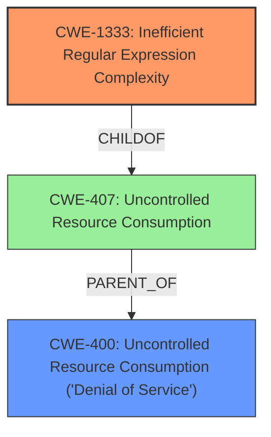

# Analysis for CVE-2021-32723

# Summary
| CWE ID  | CWE Name                                                                                               | Confidence | CWE Abstraction Level | CWE Vulnerability Mapping Label | CWE-Vulnerability Mapping Notes |
| :-------- | :------------------------------------------------------------------------------------------------------- | :--------- | :---------------------- | :------------------------------ | :------------------------------ |
| CWE-1333  | Inefficient Regular Expression Complexity                                                              | 1.0        | Base                    | Primary                         | Allowed                         |
| CWE-400 | Uncontrolled Resource Consumption ('Denial of Service') | 0.7 | Class | Secondary  | Allowed-with-Review |

## Evidence and Confidence

*   **Confidence Score:** 0.85
*   **Evidence Strength:** HIGH

## Relationship Analysis
The primary relationship that influenced my decision was the direct match of the vulnerability description to CWE-1333, which is a base-level CWE. CWE-1333 is also a child of CWE-407 (Uncontrolled Resource Consumption), which is related to the Denial of Service impact of the vulnerability. I considered CWE-400, which is a broader class encompassing various resource consumption issues leading to DoS, but ultimately chose CWE-1333 because it specifically identifies the **inefficient regular expression** as the root cause.

## Vulnerability Chain
The vulnerability chain starts with the use of an **inefficient regular expression** (CWE-1333). This leads to excessive CPU consumption when processing specially crafted inputs, ultimately resulting in a denial-of-service condition (CWE-400).

## Summary of Analysis
My analysis is primarily based on the explicit vulnerability description, which mentions "**regular expression denial of service**" as the **weakness**. The description directly aligns with CWE-1333 (Inefficient Regular Expression Complexity).

The retriever results also strongly support CWE-1333 as the top candidate, with a score of 1.0 based on alternate terms. While other CWEs like CWE-789 (Memory Allocation with Excessive Size Value) and CWE-1321 (Improperly Controlled Modification of Object Prototype Attributes ('Prototype Pollution')) were considered, they do not accurately represent the root cause of this specific vulnerability.

CWE-1333 is at the optimal level of specificity because it directly identifies the root cause of the denial of service as being due to an **inefficient regular expression**.

Relevant CWE Information:

# Enhanced Context (25 CWEs)

## CWE-1333: Inefficient Regular Expression Complexity
**Abstraction:** Base
**Similarity Score**: 1.000 (Retriever Results)
**Source**: alternate_terms (Retriever Results)

**Description**:
The product uses a regular expression with an inefficient, possibly exponential worst-case computational complexity that consumes excessive CPU cycles.

**Mapping Guidance**:
- Usage: Allowed
- Rationale: This CWE entry is at the Base level of abstraction, which is a preferred level of abstraction for mapping to the root causes of vulnerabilities.

## CWE-400: Uncontrolled Resource Consumption ('Denial of Service')
**Abstraction:** Class

**Description**: The software does not properly control the consumption of resources, leading to a denial of service.

**Mapping Guidance**:
- Usage: Allowed-with-Review
- Rationale: While DoS is the impact, look for the rootcause to see what is causing the DoS.

## CWE-1333: Inefficient Regular Expression Complexity

**CWE-1333 (Inefficient Regular Expression Complexity)**: This CWE is selected as the primary weakness because the vulnerability description explicitly mentions "**regular expression denial of service**" and that some languages before 1.24.0 are vulnerable to Regular Expression Denial of Service (ReDoS). The description of CWE-1333 states: "The product uses a regular expression with an **inefficient**, possibly exponential worst-case computational complexity that consumes excessive CPU cycles." This aligns perfectly with the vulnerability. The security implication is that an attacker can craft a specific input that causes the regular expression engine to consume excessive CPU resources, leading to a denial of service. It is a Base level CWE, which is the preferred level of abstraction. Confidence: 1.0

**CWE-400 (Uncontrolled Resource Consumption ('Denial of Service'))**: This CWE is selected as a secondary weakness because the impact of the inefficient regular expression is a denial of service. While CWE-1333 identifies the root cause, CWE-400 describes the resulting impact.