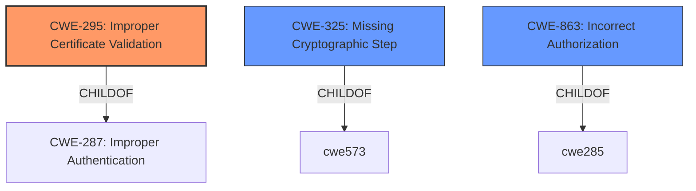

# Analysis for CVE-2021-32727

# Summary
| CWE ID | CWE Name | Confidence | CWE Abstraction Level | CWE Vulnerability Mapping Label | CWE-Vulnerability Mapping Notes |
|---|---|---|---|---|---|
| CWE-295 | Improper Certificate Validation | 1.0 | Base | Allowed | Primary CWE |
| CWE-325 | Missing Cryptographic Step | 0.7 | Base | Allowed | Secondary Candidate |
| CWE-863 | Incorrect Authorization | 0.5 | Class | Allowed-with-Review | Secondary Candidate |

## Evidence and Confidence

*   **Confidence Score:** 0.9
*   **Evidence Strength:** HIGH

## Relationship Analysis
The primary CWE, CWE-295 **(Improper Certificate Validation)**, is a base-level CWE that directly addresses the **missing** validation of certificates, which is the root cause of the vulnerability. It is a child of CWE-287 (Improper Authentication). CWE-322 (Key Exchange without Entity Authentication) is a peer. CWE-325 **(Missing Cryptographic Step)**, is also a base level CWE and is considered as a secondary mapping because a specific step in the cryptographic process, the certificate validation, was skipped. CWE-863 **(Incorrect Authorization)** is a class-level CWE that could broadly apply, as the **missing** validation leads to incorrect authorization. However, it is less specific than CWE-295 or CWE-325.

## Vulnerability Chain
The vulnerability chain starts with the **missing** certificate validation (CWE-295), which leads to the acceptance of a malicious public key. This results in data being encrypted with the malicious key, ultimately granting unauthorized access to the attacker.

## Summary of Analysis
The initial analysis focused on the **skipped step to check if private key belonged to previously downloaded public certificate**, as highlighted in the "Vulnerability Description Key Phrases". The "CVE Reference Links Content Summary" further confirmed this, stating "The primary vulnerability is the **lack of validation** of the downloaded private key against the corresponding public certificate."

CWE-295 **(Improper Certificate Validation)** was chosen as the primary CWE because it directly addresses the root cause: the **failure** to validate the certificate. This is supported by the CVE description and the retriever results, which gave CWE-295 the highest similarity score. The MITRE mapping guidance allows for its usage, as it's a base-level CWE.

CWE-325 **(Missing Cryptographic Step)** was considered because the certificate validation is a step in the cryptographic process. However, it is not as direct a fit as CWE-295.

CWE-863 **(Incorrect Authorization)** was also considered, but it is a more general Class-level CWE. While the **lack of validation** leads to incorrect authorization, CWE-295 provides a more precise description of the vulnerability.

The final decision is based on the evidence that the **root cause** is the **missing** validation of the certificate, making CWE-295 the most appropriate and specific CWE.

Relevant CWE Information:

# Enhanced Context (25 CWEs)
The following CWEs were identified as potentially relevant to this vulnerability:

## CWE-226: Sensitive Information in Resource Not Removed Before Reuse
**Abstraction Level**: Base
**Similarity Score**: 0.77
**Source**: dense

**Description**:
The product releases a resource such as memory or a file so that it can be made available for reuse, but it does not clear or "zeroize" the information contained in the resource before the product performs a critical state transition or makes the resource available for reuse by other entities.
**NOT USED:** This vulnerability is not about releasing resources.

## CWE-345: Insufficient Verification of Data Authenticity
**Abstraction Level**: Class
**Similarity Score**: 0.77
**Source**: dense

**Description**:
The product does not sufficiently verify the origin or authenticity of data, in a way that causes it to accept invalid data.
**NOT USED:** This is a more general case of **insufficient verification**, whereas CWE-295 is more specific to **certificate validation**.

## CWE-203: Observable Discrepancy
**Abstraction Level**: Base
**Similarity Score**: 0.76
**Source**: dense

**Description**:
The product behaves differently or sends different responses under different circumstances in a way that is observable to an unauthorized actor, which exposes security-relevant information about the state of the product, such as whether a particular operation was successful or not.
**NOT USED:** This vulnerability is not about observable discrepancies in behavior.

## CWE-404: Improper Resource Shutdown or Release
**Abstraction Level**: Class
**Similarity Score**: 0.76
**Source**: dense

**Description**:
The product does not release or incorrectly releases a resource before it is made available for re-use.
**NOT USED:** This vulnerability is not about improper resource shutdown or release.

## CWE-459: Incomplete Cleanup
**Abstraction Level**: Base
**Similarity Score**: 0.76
**Source**: dense

**Description**:
The product does not properly "clean up" and remove temporary or supporting resources after they have been used.
**NOT USED:** This vulnerability is not about incomplete cleanup of resources.

## CWE-668: Exposure of Resource to Wrong Sphere
**Abstraction Level**: Class
**Similarity Score**: 0.76
**Source**: dense

**Description**:
The product exposes a resource to the wrong control sphere, providing unintended actors with inappropriate access to the resource.
**NOT USED:** This is a higher-level concept; CWE-295 is more specific.

## CWE-1390: Weak Authentication
**Abstraction Level**: Class
**Similarity Score**: 0.75
**Source**: dense

**Description**:
The product uses an authentication mechanism to restrict access to specific users or identities, but the mechanism does not sufficiently prove that the claimed identity is correct.
**NOT USED:** The authentication itself isn't necessarily weak, but the **certificate validation** is **missing**.

## CWE-754: Improper Check for Unusual or Exceptional Conditions
**Abstraction Level**: Class
**Similarity Score**: 0.75
**Source**: dense

**Description**:
The product does not check or incorrectly checks for unusual or exceptional conditions that are not expected to occur frequently during day to day operation of the product.
**NOT USED:** The vulnerability is not about unusual or exceptional conditions, but about a **missing validation step**.

## CWE-212: Improper Removal of Sensitive Information Before Storage or Transfer
**Abstraction Level**: Base
**Similarity Score**: 0.75
**Source**: dense

**Description**:
The product stores, transfers, or shares a resource that contains sensitive information, but it does not properly remove that information before the product makes the resource available to unauthorized actors.
**NOT USED:** This vulnerability is not about sensitive information removal.

## CWE-639: Authorization Bypass Through User-Controlled Key
**Abstraction Level**: Base
**Similarity Score**: 6625.09
**Source**: sparse

**Description**:
The system's authorization functionality does not prevent one user from gaining access to another user's data or record by modifying the key value identifying the data.
**NOT USED:** The vulnerability is more about the **certificate validation** and less about direct user control over authorization keys.

## CWE-201: Insertion of Sensitive Information Into Sent Data
**Abstraction Level**: base
**Similarity Score**: 5.03
**Source**: graph

**Description**:
CWE-201: Insertion of Sensitive Information Into Sent Data
**NOT USED:** This vulnerability is not about inserting sensitive information into sent data.

## CWE-178: Improper Handling of Case Sensitivity
**Abstraction Level**: base
**Similarity Score**: 3.76
**Source**: graph

**Description**:
CWE-178: Improper Handling of Case Sensitivity
**NOT USED:** This vulnerability is not about case sensitivity.

## CWE-322: Key Exchange without Entity Authentication
**Abstraction Level**: base
**Similarity Score**: 3.64
**Source**: graph

**Description**:
CWE-322: Key Exchange without Entity Authentication
**NOT USED:** While related to key exchange, the core issue is the **missing validation** rather than the absence of entity authentication.

## CWE-358: Improperly Implemented Security Check for Standard
**