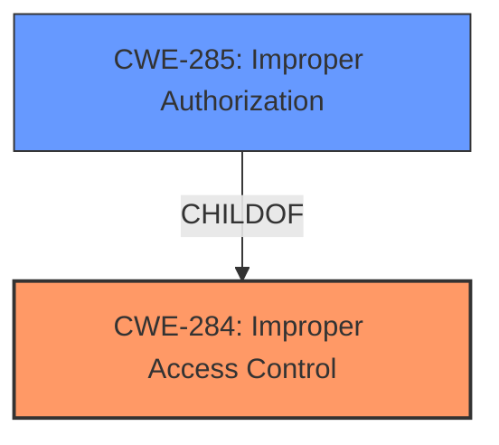

# Analysis Report for CVE-2021-32729

# Vulnerability Analysis Report: CVE-2021-32729

## Description


## Analysis (with Relationship Data)

# Summary
| CWE ID | CWE Name | Confidence | CWE Abstraction Level | CWE Vulnerability Mapping Label | CWE-Vulnerability Mapping Notes |
|---|---|---|---|---|---|
| CWE-284 | Improper Access Control | 0.9 | Class | Primary | Allowed-with-Review |
| CWE-285 | Improper Authorization | 0.7 | Class | Secondary | Allowed-with-Review |

## Evidence and Confidence

*   **Confidence Score:** 0.9
*   **Evidence Strength:** HIGH

## Relationship Analysis
The primary relationship that impacted my decision was the parent-child relationship between CWE-285 and CWE-284. CWE-284 is a parent of CWE-285, indicating a hierarchical structure where access control is a broader category encompassing authorization. Since the vulnerability specifically concerns the **improper** nature of the access control, rather than a complete absence of access control, CWE-284 is selected as the primary CWE and CWE-285 is selected as secondary CWE.



## Vulnerability Chain
The chain of root cause and weaknesses for this vulnerability is:

1.  **Root Cause:** The **script service method does not require Programming rights**, leading to **improper access control** (CWE-284).
2.  **Weakness:** An attacker with script rights can reset the authentication failure record due to the **incorrect access control** (CWE-284).
3.  **Impact:** The attacker can then perform a brute-force attack because they can virtually deactivate the mechanism introduced to mitigate such attacks.

## Summary of Analysis
My assessment is based on the provided evidence, which includes the vulnerability description and the CVE reference links content summary. The key phrase "script service method does not require Programming rights" directly points to an access control issue. The CVE reference links content summary confirms this, stating: "The core vulnerability is the lack of proper access control on the script service method. The method was intended to be protected but was not."

The hierarchical relationship between CWE-285 and CWE-284 influenced the final selection. While the CVE summary uses the term "authorization", the root cause is the broader issue of access control; therefore, a broader CWE such as CWE-284 is more appropriate.

The selected CWEs are at the optimal level of specificity. CWE-284 (Improper Access Control) accurately represents the core issue, which is that the script service method was not properly protected. This allows attackers with script rights to bypass intended security mechanisms.

Relevant CWE Information:

# Enhanced Context (25 CWEs)
The following CWEs were identified as potentially relevant to this vulnerability:

## CWE-284: Improper Access Control
**CWE-284** (Improper Access Control) is selected as the primary CWE. The vulnerability involves a script service method that can be executed by any user with script rights, even though it should require Programming rights. This directly relates to an access control issue, where the system **fails to properly restrict access** to a sensitive function. The impact of this **improper access control** is that an attacker with script rights can reset the authentication failure record and perform a brute-force attack.

*How the vulnerability's details match the CWE's characteristics:* The vulnerability clearly demonstrates a scenario where the system's access control mechanisms are insufficient, allowing unauthorized users to execute a function they should not have access to.
*The security implications and potential impact:* The security implication is that an attacker can bypass brute-force protection mechanisms and potentially gain unauthorized access to user accounts.
*Any parent-child relationships or chain patterns that influenced your mapping:* CWE-285 (Improper Authorization) is a child of CWE-284.
*Whether the weakness is primary or secondary in the vulnerability:* Primary.
*How the official MITRE mapping guidance influenced your decision:* The retriever results did not have CWE-284 or 285 so this was a manual selection.

## CWE-285: Improper Authorization
**CWE-285** (Improper Authorization) is considered as a related CWE. The script service method, which should only be accessible to users with Programming rights, can be executed by any user with Script rights. This indicates that the authorization checks are not correctly implemented, allowing users without the necessary privileges to perform a sensitive action. While authorization is related, access control is the broader issue.

*How the vulnerability's details match the CWE's characteristics:* The vulnerability involves an authorization check that is not correctly performed, allowing users without the necessary privileges to reset the authentication failure record.
*The security implications and potential impact:* The security implication is that an attacker can bypass brute-force protection mechanisms and potentially gain unauthorized access to user accounts.
*Any parent-child relationships or chain patterns that influenced your mapping:* CWE-285 is a child of CWE-284.
*Whether the weakness is primary or secondary in the vulnerability:* Secondary.
*How the official MITRE mapping guidance influenced your decision:* The retriever results did not have CWE-284 or 285 so this was a manual selection.

## Other CWEs Considered:

*   **CWE-116 (Improper Encoding or Escaping of Output):** This CWE is not directly applicable because the vulnerability is not related to encoding or escaping of output.
*   **CWE-732 (Incorrect Permission Assignment for Critical Resource):** While this CWE is related to permissions, it is not as specific as CWE-284 or CWE-285, which directly address access control and authorization.
*   **CWE-328 (Use of Weak Hash):** This CWE is not relevant because the vulnerability is not related to hashing algorithms.
*   **CWE-22 (Improper Limitation of a Pathname to a Restricted Directory ('Path Traversal')):** This CWE is not applicable because the vulnerability is not related to path traversal.
*   **CWE-202 (Exposure of Sensitive Information Through Data Queries):** This CWE is not directly related because the vulnerability does not involve exposure of sensitive information through data queries.
*   **CWE-184 (Incomplete List of Disallowed Inputs):** This CWE is not relevant because the vulnerability does not involve an incomplete list of disallowed inputs.
*   **CWE-552 (Files or Directories Accessible to External Parties):** This CWE is not directly related because the vulnerability does not involve making files or directories accessible to external parties.
*   **CWE-1390 (Weak Authentication):** This CWE is not directly related because the vulnerability does not involve weak authentication mechanisms.
*   **CWE-306 (Missing Authentication for Critical Function):** This CWE is not applicable because the vulnerability does not involve missing authentication for a critical function.


## CWE Relationship Analysis

Current CWEs represent these abstraction levels: .


### Vulnerability Chain Analysis

**Chain starting from CWE-732:**
- 732 (Incorrect Permission Assignment for Critical Resource) - ROOT


**Chain starting from CWE-306:**
- 306 (Missing Authentication for Critical Function) - ROOT


### CWE Relationship Diagram

```mermaid
graph TD
    classDef primary fill:#f96,stroke:#333,stroke-width:2px
    classDef secondary fill:#69f,stroke:#333
    classDef tertiary fill:#9e9,stroke:#333
```


*Report generated on 2025-04-01 17:05:02*
