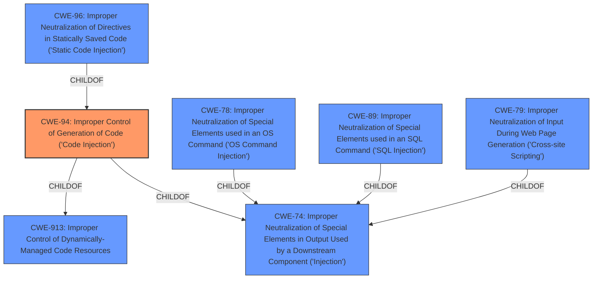

# Raw Analyzer Response for CVE-2021-3273

# Summary
| CWE ID  | CWE Name                                                                                                      | Confidence | CWE Abstraction Level | CWE Vulnerability Mapping Label | CWE-Vulnerability Mapping Notes |
| :-------- | :------------------------------------------------------------------------------------------------------------- | :---------- | :---------------------- | :------------------------------ | :------------------------------ |
| CWE-94 | Improper Control of Generation of Code ('Code Injection')                                                      | 0.9        | Base                    | Primary                         | Allowed-with-Review             |

## Evidence and Confidence

*   **Confidence Score:** 0.9
*   **Evidence Strength:** HIGH

## Relationship Analysis
The primary relationship influencing the selection is the direct match of the vulnerability description to CWE-94.
- The description explicitly mentions "**code injection**" in the `graphtemplates.php` component.
- CWE-94 directly addresses scenarios where a product constructs code segments using externally-influenced input without proper neutralization.
- The other relationships show how other CWEs can relate to code injection but aren't a direct match.

## Vulnerability Chain
The chain of root cause and weaknesses is:
  - **Root Cause:** Improper input validation and neutralization in the `graphtemplates.php` component.
  - **Weakness:** **Code injection** due to the construction of code segments using untrusted input.
  - **Impact:** Arbitrary code execution on the Nagios XI system.

## Summary of Analysis
The initial assessment focused on identifying the core weakness, which is **code injection**. The vulnerability description explicitly states that the Nagios XI component `/nagiosxi/admin/graphtemplates.php` is affected by **code injection**. The provided evidence strongly supports classifying this vulnerability as CWE-94.

The selection of CWE-94 is based on the following:
  - The vulnerability description mentions "**code injection**".
  - The "Vulnerability Description Key Phrases" section identifies "**code injection**" as the **weakness**.
  - The CVE Reference Links Content Summary shows multiple instances of **code injection** in Nagios products due to improper input validation.

CWE-94 is at the Base level of abstraction, which is preferred. The alternative CWEs considered, like CWE-78, CWE-79, and CWE-89, relate to OS command injection, XSS, and SQL injection, respectively. However, the primary weakness is the **improper control of code generation**, which aligns directly with CWE-94.

The final decision is to classify this vulnerability as CWE-94 due to the explicit mention of **code injection** in the vulnerability description and its direct relevance to the CWE description.

Relevant CWE Information:

# Enhanced Context (25 CWEs)
The following CWEs were identified as potentially relevant to this vulnerability:

## CWE-94: Improper Control of Generation of Code ('Code Injection')
**Abstraction:** Base

**Description**:
The product constructs all or part of a code segment using externally-influenced input from an upstream component, but it does not neutralize or incorrectly neutralizes special elements that could modify the syntax or behavior of the intended code segment.

**Mapping Guidance**
- Usage: Allowed-with-Review
- Rationale: This entry is frequently misused for vulnerabilities with a technical impact of "code execution," which does not by itself indicate a root cause weakness, since dozens of weaknesses can enable code execution.