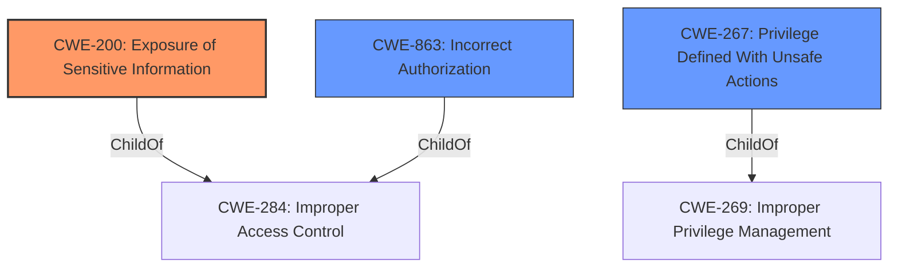

# Raw Analyzer Response for CVE-2021-32739

# Summary

| CWE ID | CWE Name | Confidence | CWE Abstraction Level | CWE Vulnerability Mapping Label | CWE-Vulnerability Mapping Notes |
|---|---|---|---|---|---|
| CWE-200 | Exposure of Sensitive Information | 0.9 | Class | Primary | Allowed-with-Review |
| CWE-267 | Privilege Defined With Unsafe Actions | 0.7 | Base | Secondary | Allowed |
| CWE-863 | Incorrect Authorization | 0.6 | Class | Secondary | Allowed-with-Review |

## Evidence and Confidence

*   **Confidence Score:** 0.7
*   **Evidence Strength:** HIGH

## Relationship Analysis
The primary CWE is CWE-200 [Exposure of Sensitive Information] because the vulnerability allows a read-only user to view the `ticket_salt` of the `ApiListener` object, which is sensitive information. CWE-200 is a Class-level CWE, and while there are more specific child CWEs, none of them fit the specific vulnerability as well as CWE-200. CWE-267 [Privilege Defined With Unsafe Actions] is included because the read-only privilege allows access to the sensitive `ticket_salt`, which leads to privilege escalation. CWE-863 [Incorrect Authorization] is included because the system **incorrectly authorizes** read-only users to view sensitive configuration data.

## Vulnerability Chain
The vulnerability chain starts with the **incorrect authorization** (CWE-863) of read-only users, which leads to the **exposure of sensitive information** (CWE-200) like the `ticket_salt`. This then allows an attacker to compute tickets and request certificates, ultimately leading to privilege escalation and identity theft. The **privilege defined with unsafe actions** (CWE-267) also contributes since the read-only privilege grants access to sensitive information which can then be used for malicious purposes.

## Summary of Analysis
The initial analysis identified CWE-200 [Exposure of Sensitive Information] as the primary weakness, due to the direct **impact** of the vulnerability: the ability for read-only users to view sensitive configuration data. The retriever results also highlight CWE-267 [Privilege Defined With Unsafe Actions] and CWE-863 [Incorrect Authorization] as potentially relevant. The final decision includes all three CWEs to provide a more comprehensive understanding of the vulnerability. CWE-200 captures the immediate **impact** of information disclosure, while CWE-267 and CWE-863 capture the underlying **root causes** of the vulnerability.

The selection of CWEs is based on the evidence provided in the vulnerability description and CVE reference links. Specifically, the vulnerability description states that "With a read-ony users credentials, an attacker can view most attributes of all config objects including `ticket_salt` of `ApiListener`." This directly supports the selection of CWE-200, as it describes the exposure of sensitive information. The CVE reference links content summary further supports this by stating that "The API exposes the `ticket_salt` which is meant to be a secret, to unauthorized (read-only) users."

The selected CWEs are at the optimal level of specificity because they accurately represent the weaknesses described in the vulnerability description and CVE reference links. While more specific child CWEs may exist for each of these CWEs, they do not provide a better fit for the specific details of this vulnerability.

Relevant CWE Information:

# Enhanced Context (25 CWEs)
The following CWEs were identified as potentially relevant to this vulnerability:

## CWE-639: Authorization Bypass Through User-Controlled Key
**Abstraction Level**: Base
**Similarity Score**: 0.77
**Source**: dense

**Description**:
The system's authorization functionality does not prevent one user from gaining access to another user's data or record by modifying the key value identifying the data.

**Mapping Guidance**:
- Usage: Allowed
- Rationale: This CWE entry is at the Base level of abstraction, which is a preferred level of abstraction for mapping to the root causes of vulnerabilities.

*This CWE was considered but not selected because the vulnerability doesn't involve modifying a key to access another user's data. The issue is about exposing sensitive information to read-only users.*

## CWE-212: Improper Removal of Sensitive Information Before Storage or Transfer
**Abstraction Level**: Base
**Similarity Score**: 0.77
**Source**: dense

**Description**:
The product stores, transfers, or shares a resource that contains sensitive information, but it does not properly remove that information before the product makes the resource available to unauthorized actors.

**Mapping Guidance**:
- Usage: Allowed
- Rationale: This CWE entry is at the Base level of abstraction, which is a preferred level of abstraction for mapping to the root causes of vulnerabilities.

*This CWE was considered but not selected because it focuses on the improper removal of sensitive information, which is not the primary issue here. The primary issue is the exposure of sensitive information through the API.*

## CWE-538: Insertion of Sensitive Information into Externally-Accessible File or Directory
**Abstraction Level**: Base
**Similarity Score**: 0.77
**Source**: dense

**Description**:
The product places sensitive information into files or directories that are accessible to actors who are allowed to have access to the files, but not to the sensitive information.

**Mapping Guidance**:
- Usage: Allowed
- Rationale: This CWE entry is at the Base level of abstraction, which is a preferred level of abstraction for mapping to the root causes of vulnerabilities.

*This CWE was considered but not selected because it focuses on placing sensitive information into files or directories, which is not the primary issue here. The primary issue is the exposure of sensitive information through the API.*

## CWE-668: Exposure of Resource to Wrong Sphere
**Abstraction Level**: Class
**Similarity Score**: 0.76
**Source**: dense

**Description**:
The product exposes a resource to the wrong control sphere, providing unintended actors with inappropriate access to the resource.

**Mapping Guidance**:
- Usage: Discouraged
- Rationale: CWE-668 is high-level and is often misused as a catch-all when lower-level CWE IDs might be applicable. It is sometimes used for low-information vulnerability reports [REF-1287]. It is a level-1 Class (i.e., a child of a Pillar). It is not useful for trend analysis.

*This CWE was considered but not selected because it's too high-level and more specific CWEs like CWE-200 are more appropriate.*

## CWE-267: Privilege Defined With Unsafe Actions
**Abstraction Level**: Base
**Similarity Score**: 0.76
**Source**: dense

**Description**:
A particular privilege, role, capability, or right can be used to perform unsafe actions that were not intended, even when it is assigned to the correct entity.

**Mapping Guidance**:
- Usage: Allowed
- Rationale: This CWE entry is at the Base level of abstraction, which is a preferred level of abstraction for mapping to the root causes of vulnerabilities.

*This CWE was selected as a secondary CWE because the read-only privilege allows access to the sensitive `ticket_salt`, which leads to privilege escalation.*

## CWE-807: Reliance on Untrusted Inputs in a Security Decision
**Abstraction Level**: Base
**Similarity Score**: 0.75
**Source**: dense

**Description**:
The product uses a protection mechanism that relies on the existence or values of an input, but the input can be modified by an untrusted actor in a way that bypasses the protection mechanism.

**Mapping Guidance**:
- Usage: Allowed
- Rationale: This CWE entry is at the Base level of abstraction, which is a preferred level of abstraction for mapping to the root causes of vulnerabilities.

*This CWE was considered but not selected because it focuses on relying on untrusted inputs, which is not the primary issue here. The primary issue is the exposure of sensitive information through the API.*

## CWE-1390: Weak Authentication
**Abstraction Level**: Class
**Similarity Score**: 0.75
**Source**: dense

**Description**:
The product uses an authentication mechanism to restrict access to specific users or identities, but the mechanism does not sufficiently prove that the claimed identity is correct.

**Mapping Guidance**:
- Usage: Allowed-with-Review
- Rationale: This CWE entry is a Class and might have Base-level children that would be more appropriate

*