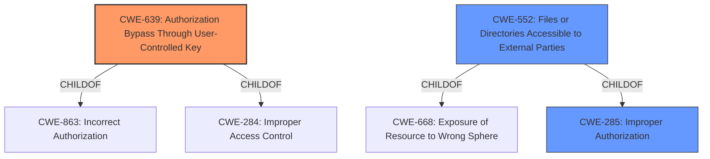

# Analysis for CVE-2021-32744

# Summary
| CWE ID | CWE Name | Confidence | CWE Abstraction Level | CWE Vulnerability Mapping Label | CWE-Vulnerability Mapping Notes |
|---|---|---|---|---|---|
| CWE-639 | Authorization Bypass Through User-Controlled Key | 1.0 | Base | Allowed | Primary CWE |
| CWE-552 | Files or Directories Accessible to External Parties | 0.7 | Base | Allowed | Secondary Candidate |
| CWE-285 | Improper Authorization | 0.5 | Class | Discouraged | Secondary Candidate |

## Evidence and Confidence

*   **Confidence Score:** 0.8
*   **Evidence Strength:** HIGH

## Relationship Analysis
The primary CWE, CWE-639, is a base-level weakness that focuses on authorization bypass through user-controlled keys, aligning directly with the IDOR aspect of the vulnerability. It is a child of CWE-863 (Incorrect Authorization) and CWE-284 (Improper Access Control), indicating a more specific type of authorization issue. CWE-552 (Files or Directories Accessible to External Parties) is also a base-level CWE, which is a child of CWE-668 (Exposure of Resource to Wrong Sphere) and CWE-285 (Improper Authorization). CWE-285, a class-level CWE, represents a broader category of authorization flaws. The choice of CWE-639 is more precise than CWE-285, given the specific IDOR context.

## Vulnerability Chain
The vulnerability chain starts with the **insecure direct object reference** due to predictable file identifiers. This allows unauthenticated attackers to bypass authorization and gain access to files opened by other users. The chain can be summarized as: Predictable File Identifiers (IDOR) -> Missing Authentication/Authorization -> Unauthorized Access to Files.

## Summary of Analysis
The initial assessment focused on the **insecure direct object reference (IDOR)** aspect of the vulnerability, supported by the description and CVE reference. The Retriever results pointed to CWE-639 (Authorization Bypass Through User-Controlled Key) as a top candidate, aligning with the IDOR mechanism.

The vulnerability description states: "unauthenticated attackers are able to gain access to files which are currently opened by other users in the Collabora Online editor. For successful exploitation the attacker is required to guess the file identifier - the predictability of this file identifier is dependent on external file-storage implementations (this is a potential IDOR - Insecure Direct Object Reference - vulnerability)."

The CVE Reference Links Content Summary states: "**Root cause of vulnerability:** Predictable file identifiers (potential "IDOR" - Insecure Direct Object Reference) in the Collabora Online editor, combined with a **lack of authentication** required to access open files."

CWE-639 aligns with this description because it explicitly addresses authorization bypass via user-controlled keys, which is precisely how the attacker gains unauthorized access by guessing file identifiers. The relationship analysis confirmed that CWE-639 is a specific base-level CWE suitable for this IDOR vulnerability. CWE-552 (Files or Directories Accessible to External Parties) was considered since the impact involves unauthorized file access. However, CWE-639 better captures the root cause related to authorization bypass, whereas CWE-552 focuses more on the outcome.

CWE-285 (Improper Authorization) was also considered, but it is a more general class-level CWE, and CWE-639 provides a more precise description of the vulnerability mechanism.

Therefore, CWE-639 is the optimal choice due to its specificity and alignment with the root cause of the vulnerability.

Relevant CWE Information:

# Enhanced Context (25 CWEs)
The following CWEs were identified as potentially relevant to this vulnerability:

## CWE-639: Authorization Bypass Through User-Controlled Key
**Abstraction Level**: Base
**Similarity Score**: 0.78
**Source**: dense

**Description**:
The system's authorization functionality does not prevent one user from gaining access to another user's data or record by modifying the key value identifying the data.

**Mapping Guidance**:
- Usage: Allowed
- Rationale: This CWE entry is at the Base level of abstraction, which is a preferred level of abstraction for mapping to the root causes of vulnerabilities.

## CWE-552: Files or Directories Accessible to External Parties
**Abstraction Level**: Base
**Similarity Score**: 0.77
**Source**: dense

**Description**:
The product makes files or directories accessible to unauthorized actors, even though they should not be.

**Mapping Guidance**:
- Usage: Allowed
- Rationale: This CWE entry is at the Base level of abstraction, which is a preferred level of abstraction for mapping to the root causes of vulnerabilities.

## CWE-668: Exposure of Resource to Wrong Sphere
**Abstraction Level**: Class
**Similarity Score**: 0.76
**Source**: dense

**Description**:
The product exposes a resource to the wrong control sphere, providing unintended actors with inappropriate access to the resource.

**Mapping Guidance**:
- Usage: Discouraged
- Rationale: CWE-668 is high-level and is often misused as a catch-all when lower-level CWE IDs might be applicable. It is sometimes used for low-information vulnerability reports [REF-1287]. It is a level-1 Class (i.e., a child of a Pillar). It is not useful for trend analysis.

## CWE-807: Reliance on Untrusted Inputs in a Security Decision
**Abstraction Level**: Base
**Similarity Score**: 0.76
**Source**: dense

**Description**:
The product uses a protection mechanism that relies on the existence or values of an input, but the input can be modified by an untrusted actor in a way that bypasses the protection mechanism.

**Mapping Guidance**:
- Usage: Allowed
- Rationale: This CWE entry is at the Base level of abstraction, which is a preferred level of abstraction for mapping to the root causes of vulnerabilities.

## CWE-274: Improper Handling of Insufficient Privileges
**Abstraction Level**: Base
**Similarity Score**: 0.76
**Source**: dense

**Description**:
The product does not handle or incorrectly handles when it has insufficient privileges to perform an operation, leading to resultant weaknesses.

**Mapping Guidance**:
- Usage: Discouraged
- Rationale: This CWE entry could be deprecated in a future version of CWE.

## CWE-280: Improper Handling of Insufficient Permissions or Privileges
**Abstraction Level**: Base
**Similarity Score**: 0.76
**Source**: dense

**Description**:
The product does not handle or incorrectly handles when it has insufficient privileges to access resources or functionality as specified by their permissions. This may cause it to follow unexpected code paths that may leave the product in an invalid state.

**Mapping Guidance**:
- Usage: Allowed
- Rationale: This CWE entry is at the Base level of abstraction, which is a preferred level of abstraction for mapping to the root causes of vulnerabilities.

## CWE-183: Permissive List of Allowed Inputs
**Abstraction Level**: Base
**Similarity Score**: 0.76
**Source**: dense

**Description**:
The product implements a protection mechanism that relies on a list of inputs (or properties of inputs) that are explicitly allowed by policy because the inputs are assumed to be safe, but the list is too permissive - that is, it allows an input that is unsafe, leading to resultant weaknesses.

**Mapping Guidance**:
- Usage: Allowed
- Rationale: This CWE entry is at the Base level of abstraction, which is a preferred level of abstraction for mapping to the root causes of vulnerabilities.

## CWE-404: Improper Resource Shutdown or Release
**Abstraction Level**: Class
**Similarity Score**: 0.75
**Source**: dense

**Description**:
The product does not release or incorrectly releases a resource before it is made available for re-use.

**Mapping Guidance**:
- Usage: Allowed-with-Review
- Rationale: This CWE entry is a Class and might have Base-level children that would be more appropriate

## CWE-653: Improper Isolation or Compartmentalization
**Abstraction Level**: Class
**Similarity Score**: