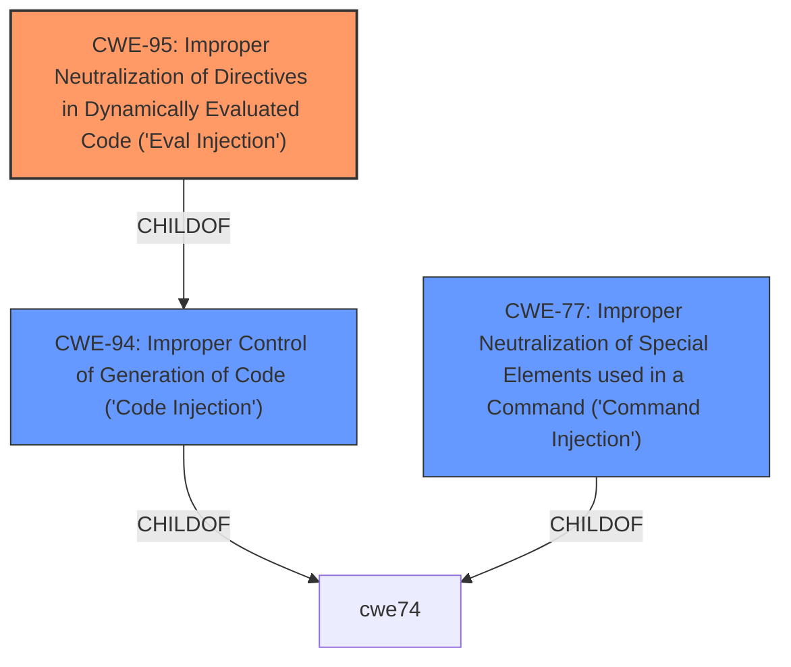

# Raw Analyzer Response for CVE-2021-32756

# Summary
| CWE ID | CWE Name | Confidence | CWE Abstraction Level | CWE Vulnerability Mapping Label | CWE-Vulnerability Mapping Notes |
|---|---|---|---|---|---|
| CWE-95 | Improper Neutralization of Directives in Dynamically Evaluated Code ('Eval Injection') | 1.0 | Variant | Allowed | Primary CWE |
| CWE-94 | Improper Control of Generation of Code ('Code Injection') | 0.7 | Base | Allowed-with-Review | Secondary Candidate |
| CWE-77 | Improper Neutralization of Special Elements used in a Command ('Command Injection') | 0.6 | Class | Allowed-with-Review | Secondary Candidate |

## Evidence and Confidence

*   **Confidence Score:** 0.9
*   **Evidence Strength:** HIGH

## Relationship Analysis
The primary CWE is CWE-95, which is a Variant of CWE-94. CWE-94 is a more general case of code injection, while CWE-95 specifically deals with dynamic evaluation (like `eval()` in Ruby, as is the case here). CWE-77 is a Class-level CWE for command injection, which is related but less specific than CWE-95. The hierarchical relationships influenced the selection by highlighting the specific nature of the vulnerability, leading to the selection of the Variant, CWE-95, over the more general Base, CWE-94 or Class, CWE-77.

## Vulnerability Chain
The vulnerability chain is:
1.  **Root Cause:** The application allows a low-privilege user to inject a crafted Ruby string into the `MiqExpression` module.
2.  **Weakness:** The injected string is dynamically evaluated. This step represents the core weakness of **CWE-95 (Improper Neutralization of Directives in Dynamically Evaluated Code ('Eval Injection'))**.
3.  **Impact:** The dynamic evaluation leads to arbitrary code execution with root privileges.

## Summary of Analysis
The initial analysis identified several potential CWEs, including CWE-77, CWE-78, CWE-95, and CWE-94. The final decision focused on **CWE-95 (Improper Neutralization of Directives in Dynamically Evaluated Code ('Eval Injection'))** as the primary CWE because the vulnerability description specifically mentions a crafted Ruby string being evaluated, which aligns directly with the definition of CWE-95.

The vulnerability description key phrases include "**weakness: command injection**", "**impact: execute arbitrary code**", and "**vector: crafted Ruby string**". The CVE Reference Links Content Summary also mentions "**Arbitrary code execution due to the evaluation of user-controlled input within the `MiqExpression` module**" and "**This is a classic case of 'eval injection' or insecure deserialization where user-supplied data is treated as code.**"

The selection of CWE-95 is based on the explicit evidence of dynamic code evaluation. While "**command injection**" is mentioned, the specific mechanism of injecting Ruby code for evaluation points directly to CWE-95. The other CWEs were considered but ultimately deemed less specific. For example, CWE-77, while related to command injection, is a broader category and doesn't capture the dynamic evaluation aspect.

The chosen CWEs are at the optimal level of specificity, with CWE-95 being a Variant that accurately describes the vulnerability.

Relevant CWE Information:

# Enhanced Context (25 CWEs)

## CWE-95: Improper Neutralization of Directives in Dynamically Evaluated Code ('Eval Injection')
**Abstraction Level**: Variant
**Similarity Score**: 8463.64
**Source**: sparse

**Description**:
The product receives input from an upstream component, but it does not neutralize or incorrectly neutralizes code syntax before using the input in a dynamic evaluation call (e.g. "eval").

**Mapping Guidance**:
- Usage: Allowed
- Rationale: This CWE entry is at the Variant level of abstraction, which is a preferred level of abstraction for mapping to the root causes of vulnerabilities.

## CWE-94: Improper Control of Generation of Code ('Code Injection')
**Abstraction Level**: Base
**Similarity Score**: 8075.60
**Source**: sparse

**Description**:
The product constructs all or part of a code segment using externally-influenced input from an upstream component, but it does not neutralize or incorrectly neutralizes special elements that could modify the syntax or behavior of the intended code segment.

**Mapping Guidance**:
- Usage: Allowed-with-Review
- Rationale: This entry is frequently misused for vulnerabilities with a technical impact of "code execution," which does not by itself indicate a root cause weakness, since dozens of weaknesses can enable code execution.

## CWE-77: Improper Neutralization of Special Elements used in a Command ('Command Injection')
**Abstraction Level:** Class
**Similarity Score**: 1.00
**Source**: alternate_terms

### Description
The product constructs all or part of a command using externally-influenced input from an upstream component, but it does not neutralize or incorrectly neutralizes special elements that could modify the intended command when it is sent to a downstream component.

### Extended Description
Many protocols and products have their own custom command language. While OS or shell command strings are frequently discovered and targeted, developers may not realize that these other command languages might also be vulnerable to attacks.

### Mapping Guidance
**Usage:** Allowed-with-Review
**Rationale:** CWE-77 is often misused when OS command injection (CWE-78) was intended instead [REF-1287].
**Comments:** Ensure that the analysis focuses on the root-cause error that allows the execution of commands, as there are many weaknesses that can lead to this consequence. See Terminology Notes. If the weakness involves a command language besides OS shell invocation, then CWE-77 could be used.
**Reasons:**
- Frequent Misuse
**Suggested Alternatives:**
- CWE-78: OS Command Injection

### Summary of Other CWE Considerations:

*   **CWE-78 (Improper Neutralization of Special Elements used in an OS Command ('OS Command Injection'))**: This was considered due to the "**weakness: command injection**" key phrase. However, the vulnerability involves Ruby code evaluation, not direct OS command execution, making CWE-95 a better fit.
*   **CWE-94 (Improper Control of Generation of Code ('Code Injection'))**: This was considered as a more general form of code injection. While applicable, CWE-95 is more specific because it highlights the dynamic evaluation aspect.
*   **CWE-77 (Improper Neutralization of Special Elements used in a Command ('Command Injection'))**: This was considered, but the vulnerability involves the evaluation of injected code, not merely the execution of a command.
*   **CWE-269 (Improper Privilege Management)**: While the impact is arbitrary code execution with root privileges, this CWE is discouraged because it's often misused. The root cause is the **eval injection**, not a privilege management issue.
*   **CWE-20 (Improper Input Validation)**: This is too general. The issue is not just that input validation is missing, but that the lack of neutralization leads to code evaluation.