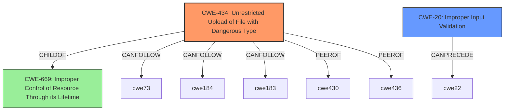

# Enhanced Analysis for CVE-2021-32759

# Summary
| CWE ID    | CWE Name                                                                          | Confidence | CWE Abstraction Level | CWE Vulnerability Mapping Label | CWE-Vulnerability Mapping Notes |
| :-------- | :-------------------------------------------------------------------------------- | :--------- | :---------------------- | :------------------------------ | :------------------------------ |
| CWE-434   | Unrestricted Upload of File with Dangerous Type                                 | 0.9        | Base                    | Primary CWE                     | Allowed                       |
| CWE-20    | Improper Input Validation                                                          | 0.7        | Class                   | Secondary Candidate             | Discouraged                    |

## Evidence and Confidence

*   **Confidence Score:** 0.8
*   **Evidence Strength:** HIGH

## Relationship Analysis
The primary CWE is CWE-434, which directly addresses the unrestricted upload of dangerous file types. CWE-20 is a broader category, indicating a **missing** or improper validation, but CWE-434 pinpoints the specific type of input validation failure related to file uploads. CWE-434's relationships include peers like CWE-430 (Deployment of Wrong Handler) and CWE-436 (Insufficient Granularity of Access Control). The parent of CWE-434 is CWE-669 which is Improper Control of Resource Through its Lifetime.



## Vulnerability Chain
The vulnerability chain starts with the **missing sanitation** (input validation) which leads to the ability to upload arbitrary executable files. The chain is: **Missing Input Validation** -> Unrestricted File Upload -> Potential Remote Code Execution.

## Summary of Analysis
The initial analysis identified **missing sanitation** as the root cause, leading to arbitrary executable file uploads. The vulnerability description states: "Due to **missing sanitation** in data flow in versions prior to 19.4.15 and 20.0.13, it was possible for admin users to upload arbitrary executable files to the server."

The retriever results and CVE reference link content summary confirm this. The "CVE Reference Links Content Summary" section explicitly states: "Missing sanitization in data flow during file upload." and "Improper Input Validation (CWE-20)".

CWE-434 (Unrestricted Upload of File with Dangerous Type) is the most specific and appropriate CWE because it directly addresses the vulnerability of uploading dangerous file types without proper restrictions. While CWE-20 (Improper Input Validation) is also relevant, it is a broader category. Therefore, CWE-434 is the primary CWE, and CWE-20 is a secondary CWE.

The selection of CWE-434 is at the optimal level of specificity because it directly describes the vulnerability. CWE-20 is more general and could apply to various input validation issues, whereas CWE-434 focuses on the specific issue of unrestricted file uploads of dangerous types.


## CWE Relationship Analysis

Current CWEs represent these abstraction levels: .


### Vulnerability Chain Analysis

**Chain starting from CWE-430:**
- 430 (Deployment of Wrong Handler) - ROOT


**Chain starting from CWE-434:**
- 434 (Unrestricted Upload of File with Dangerous Type) - ROOT


### CWE Relationship Diagram

```mermaid
graph TD
    classDef primary fill:#f96,stroke:#333,stroke-width:2px
    classDef secondary fill:#69f,stroke:#333
    classDef tertiary fill:#9e9,stroke:#333
```