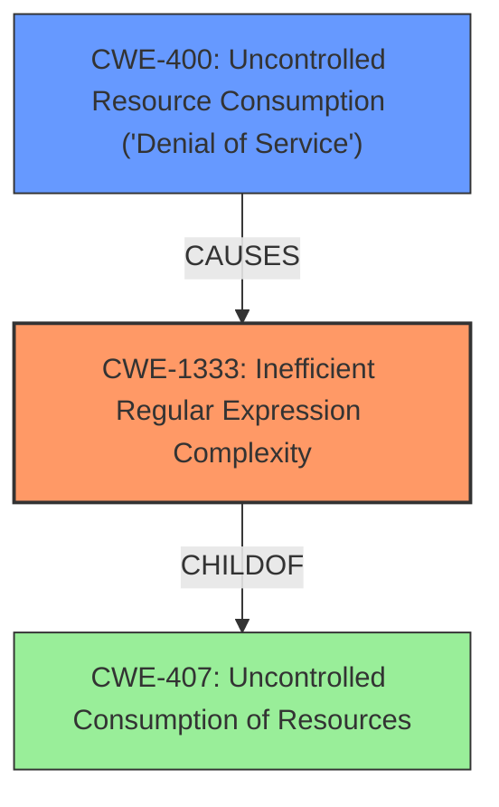

# Enhanced Analysis for CVE-2021-32763

# Summary
| CWE ID    | CWE Name                                                     | Confidence | CWE Abstraction Level | CWE Vulnerability Mapping Label | CWE-Vulnerability Mapping Notes |
| --------- | ------------------------------------------------------------ | ---------- | --------------------- | ------------------------------- | ------------------------------- |
| CWE-1333  | Inefficient Regular Expression Complexity                    | 1          | Base                  | Primary                         | Allowed                         |
| CWE-400  | Uncontrolled Resource Consumption ('Denial of Service')                                                   | 0.7         | Class                  | Secondary                         | Allowed-with-Review |

## Evidence and Confidence

*   **Confidence Score:** 0.9
*   **Evidence Strength:** HIGH

## Relationship Analysis
The primary CWE, CWE-1333, is a base-level weakness that directly addresses the **inefficient regular expression** complexity leading to excessive CPU consumption. It is a child of CWE-407, which deals with uncontrolled resource consumption, but CWE-1333 is more specific. CWE-400, Uncontrolled Resource Consumption, is considered as a secondary weakness because it represents the high-level impact of the vulnerability. The relationship between CWE-1333 and CWE-400 is that the inefficient regular expression (CWE-1333) leads to uncontrolled resource consumption and potentially a denial-of-service condition (CWE-400).



## Vulnerability Chain
The vulnerability chain starts with the use of an **inefficient regular expression** (CWE-1333) in the `MessagesController` class of OpenProject. This inefficiency leads to excessive backtracking when processing an unterminated `<pre>` tag with many spaces. The excessive backtracking consumes excessive CPU cycles, ultimately resulting in uncontrolled resource consumption (CWE-400) and potentially a denial-of-service condition.

## Summary of Analysis
The initial analysis identified CWE-1333 as the primary weakness due to the **inefficient regular expression**, which is the root cause of the vulnerability. The CVE Reference Links Content Summary clearly states that the vulnerability stems from the regex ` %r{<pre>((.|\s)*?)</pre>}m` leading to excessive backtracking. This aligns directly with CWE-1333's description of a regular expression with inefficient complexity that consumes excessive CPU cycles. "The `(.|\s)` part allows the regex engine to match a space character in two ways, leading to excessive backtracking when processing an unterminated `<pre>` tag with many spaces."

CWE-400 is a secondary candidate representing the impact of the vulnerability, where the **inefficient regular expression** causes uncontrolled resource consumption, possibly leading to a denial of service.

The selected CWEs are at the optimal level of specificity. CWE-1333 is a base-level weakness that directly describes the root cause, while CWE-400 captures the impact. Higher-level CWEs like CWE-664 (Improper Control of a Resource Through its Lifetime) are too abstract.

Relevant CWE Information:

# Enhanced Context (25 CWEs)
The following CWEs were identified as potentially relevant to this vulnerability:

## CWE-668: Exposure of Resource to Wrong Sphere
**Abstraction Level**: Class
**Similarity Score**: 0.76
**Source**: dense

**Description**:
The product exposes a resource to the wrong control sphere, providing unintended actors with inappropriate access to the resource.

**Mapping Guidance**:
- Usage: Discouraged
- Rationale: CWE-668 is high-level and is often misused as a catch-all when lower-level CWE IDs might be applicable. It is sometimes used for low-information vulnerability reports [REF-1287]. It is a level-1 Class (i.e., a child of a Pillar). It is not useful for trend analysis.

*Not Selected*: This CWE is too abstract and doesn't directly relate to the specific vulnerability.

## CWE-664: Improper Control of a Resource Through its Lifetime
**Abstraction Level**: Pillar
**Similarity Score**: 0.76
**Source**: dense

**Description**:
The product does not maintain or incorrectly maintains control over a resource throughout its lifetime of creation, use, and release.

**Mapping Guidance**:
- Usage: Discouraged
- Rationale: This CWE entry is high-level when lower-level children are available.

*Not Selected*: This CWE is too high-level and doesn't accurately reflect the specific weakness.

## CWE-41: Improper Resolution of Path Equivalence
**Abstraction Level**: Base
**Similarity Score**: 0.76
**Source**: dense

**Description**:
The product is vulnerable to file system contents disclosure through path equivalence. Path equivalence involves the use of special characters in file and directory names. The associated manipulations are intended to generate multiple names for the same object.

**Mapping Guidance**:
- Usage: Allowed
- Rationale: This CWE entry is at the Base level of abstraction, which is a preferred level of abstraction for mapping to the root causes of vulnerabilities.

*Not Selected*: This CWE is not relevant as the vulnerability does not involve path equivalence.

## CWE-404: Improper Resource Shutdown or Release
**Abstraction Level**: Class
**Similarity Score**: 0.75
**Source**: dense

**Description**:
The product does not release or incorrectly releases a resource before it is made available for re-use.

**Mapping Guidance**:
- Usage: Allowed-with-Review
- Rationale: This CWE entry is a Class and might have Base-level children that would be more appropriate

*Not Selected*: This CWE is not relevant as the vulnerability doesn't involve improper resource shutdown or release.

## CWE-799: Improper Control of Interaction Frequency
**Abstraction Level**: Class
**Similarity Score**: 0.75
**Source**: dense

**Description**:
The product does not properly limit the number or frequency of interactions that it has with an actor, such as the number of incoming requests.

**Mapping Guidance**:
- Usage: Allowed-with-Review
- Rationale: This CWE entry is a Class and might have Base-level children that would be more appropriate

*Not Selected*: This CWE is not directly applicable as the vulnerability is related to an inefficient regular expression rather than the frequency of interactions.

## CWE-674: Uncontrolled Recursion
**Abstraction Level**: Class
**Similarity Score**: 0.75
**Source**: dense

**Description**:
The product does not properly control the amount of recursion that takes place,  consuming excessive resources, such as allocated memory or the program stack.

**Mapping Guidance**:
- Usage: Allowed-with-Review
- Rationale: This CWE entry is a Class and might have Base-level children that would be more appropriate

*Not Selected*: While recursion is related to backtracking in regex, CWE-1333 is a better fit due to its specificity.

## CWE-617: Reachable Assertion
**Abstraction Level**: Base
**Similarity Score**: 0.75
**Source**: dense

**Description**:
The product contains an assert() or similar statement that can be triggered by an attacker, which leads to an application exit or other behavior that is more severe than necessary.

**Mapping Guidance**:
- Usage: Allowed
- Rationale: This CWE entry is at the Base level of abstraction, which is a preferred level of abstraction for mapping to the root causes of vulnerabilities.

*Not Selected*: This CWE is not relevant as the vulnerability does not involve assertions.

## CWE-226: Sensitive Information in Resource Not Removed Before Reuse
**Abstraction Level**: Base
**Similarity Score**: 0.75
**Source**: dense

**Description**:
The product releases a resource such as memory or a file so that it can be made available for reuse, but it does not clear or "zeroize" the information contained in the resource before the product performs a critical state transition or makes the resource available for reuse by other entities.

**Mapping Guidance**:
- Usage: Allowed
- Rationale: This CWE entry is at the Base level of abstraction, which is a preferred level of abstraction for mapping to the root causes of vulnerabilities.

*Not Selected*: Not applicable. The vulnerability does not involve sensitive information in resources.

## CWE-691: Insufficient Control Flow Management
**Abstraction Level**: Pillar
**Similarity Score**: 0.74
**Source**: dense

**Description**:
The code does not sufficiently manage its control flow during execution, creating conditions in which the control flow can be modified in unexpected ways.

**Mapping Guidance**:
- Usage: Discouraged


## CWE Relationship Analysis

Current CWEs represent these abstraction levels: .


### Vulnerability Chain Analysis

**Chain starting from CWE-691:**
- 691 (Insufficient Control Flow Management) - ROOT


**Chain starting from CWE-664:**
- 664 (Improper Control of a Resource Through its Lifetime) - ROOT


### CWE Relationship Diagram

```mermaid
graph TD
    classDef primary fill:#f96,stroke:#333,stroke-width:2px
    classDef secondary fill:#69f,stroke:#333
    classDef tertiary fill:#9e9,stroke:#333
```