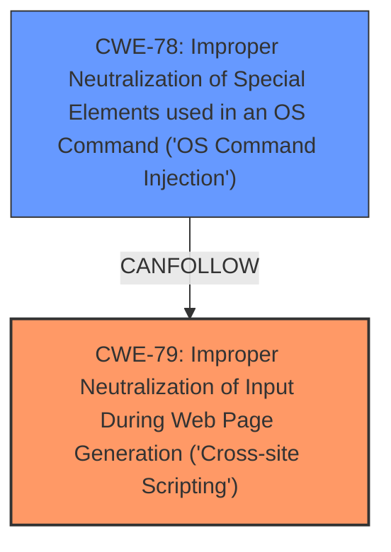

# Raw Analyzer Response for CVE-2021-32772

# Summary
| CWE ID | CWE Name | Confidence | CWE Abstraction Level | CWE Vulnerability Mapping Label | CWE-Vulnerability Mapping Notes |
|---|---|---|---|---|---|
| CWE-79 | Improper Neutralization of Input During Web Page Generation ('Cross-site Scripting') | 1.0 | Base | Allowed | Primary CWE |
| CWE-78 | Improper Neutralization of Special Elements used in an OS Command ('OS Command Injection') | 0.9 | Base | Allowed | Secondary CWE |

## Evidence and Confidence

*   **Confidence Score:** 0.95
*   **Evidence Strength:** HIGH

## Relationship Analysis
The primary weakness is CWE-79, which describes the **improper neutralization** of input during web page generation, leading to cross-site scripting. Due to the application being built in Electron, this XSS vulnerability can be escalated to Remote Code Execution. The application fails to sanitize HTML characters from podcast feed data, leading to a OS Command Injection vulnerability. This involves the injection of malicious HTML and JavaScript code into podcast titles. CWE-78 describes the **improper neutralization** of special elements used in OS commands, which is a direct consequence of the XSS vulnerability in the Electron application. The relationship between CWE-79 and CWE-78 is that the XSS vulnerability (CWE-79) enables the OS Command Injection (CWE-78) in the context of Electron.

## Vulnerability Chain
The vulnerability chain starts with the **improper input sanitization** (the root cause), which leads to Cross-Site Scripting (CWE-79). Because the application is built using Electron, the XSS vulnerability can be escalated to Remote Code Execution by injecting and executing OS commands (CWE-78).

## Summary of Analysis
The initial assessment and resulting conclusion are based on the provided evidence. The application fails to properly sanitize HTML characters from podcast feed data, leading to **improper neutralization** and Cross-Site Scripting (CWE-79).

The content from the provided information shows:
- "The application does not clean the HTML characters of the podcast information obtained from the Feed, which allows the injection of HTML and JS code (**cross-site scripting**)."
- "Being an application made in electron, **cross-site scripting** can be scaled to remote code execution, making it possible to execute commands on the machine where the application is running."
- "The application fails to properly sanitize HTML characters from podcast feed data, leading to an OS Command Injection vulnerability."
- "By injecting malicious HTML and JavaScript code into podcast titles or other fields, an attacker can potentially execute arbitrary commands on the user's machine."
- "Vulnerable code where `TitleElement.innerHTML = _Title` is used without sanitization."
- "Vulnerable code where `document.getElementsByClassName('settings-header')[0].innerHTML = ChannelName` is used without sanitization"

The graph relationships influenced the selection of both CWEs, showing how XSS can lead to OS Command Injection in this specific context. The selected CWEs are at the optimal level of specificity because they accurately represent the root cause (CWE-79) and the resulting vulnerability (CWE-78).

Relevant CWE Information:

# Enhanced Context (25 CWEs)
The following CWEs were identified as potentially relevant to this vulnerability:

## CWE-74: Improper Neutralization of Special Elements in Output Used by a Downstream Component ('Injection')
**Abstraction Level**: Class
**Similarity Score**: 0.77
**Source**: dense

**Description**:
The product constructs all or part of a command, data structure, or record using externally-influenced input from an upstream component, but it does not neutralize or incorrectly neutralizes special elements that could modify how it is parsed or interpreted when it is sent to a downstream component.

**Mapping Guidance**:
- Usage: Discouraged
- Rationale: CWE-74 is high-level and often misused when lower-level weaknesses are more appropriate.

*Not Selected:* This is a class-level CWE and too general for this case. CWE-79 and CWE-78 are more specific.

## CWE-80: Improper Neutralization of Script-Related HTML Tags in a Web Page (Basic XSS)
**Abstraction Level**: Variant
**Similarity Score**: 0.77
**Source**: dense

**Description**:
The product receives input from an upstream component, but it does not neutralize or incorrectly neutralizes special characters such as "<", ">", and "&" that could be interpreted as web-scripting elements when they are sent to a downstream component that processes web pages.

**Mapping Guidance**:
- Usage: Allowed
- Rationale: This CWE entry is at the Variant level of abstraction, which is a preferred level of abstraction for mapping to the root causes of vulnerabilities.

*Not Selected:* CWE-79 is a more general description of the XSS vulnerability, while CWE-80 focuses on specific HTML tags. CWE-79 is a better fit because it encompasses a broader range of potential XSS vectors.

## CWE-184: Incomplete List of Disallowed Inputs
**Abstraction Level**: Base
**Similarity Score**: 0.76
**Source**: dense

**Description**:
The product implements a protection mechanism that relies on a list of inputs (or properties of inputs) that are not allowed by policy or otherwise require other action to neutralize before additional processing takes place, but the list is incomplete.

**Mapping Guidance**:
- Usage: Allowed
- Rationale: This CWE entry is at the Base level of abstraction, which is a preferred level of abstraction for mapping to the root causes of vulnerabilities.

*Not Selected:* This CWE is about an incomplete list of disallowed inputs. This vulnerability isn't about a list; it's about a general failure to sanitize input.

## CWE-917: Improper Neutralization of Special Elements used in an Expression Language Statement ('Expression Language Injection')
**Abstraction Level**: Base
**Similarity Score**: 0.75
**Source**: dense

**Description**:
The product constructs all or part of an expression language (EL) statement in a framework such as a Java Server Page (JSP) using externally-influenced input from an upstream component, but it does not neutralize or incorrectly neutralizes special elements that could modify the intended EL statement before it is executed.

**Mapping Guidance**:
- Usage: Allowed
- Rationale: This CWE entry is at the Base level of abstraction, which is a preferred level of abstraction for mapping to the root causes of vulnerabilities.

*Not Selected:* The vulnerability is not related to expression language injection.

## CWE-138: Improper Neutralization of Special Elements
**Abstraction Level**: Class
**Similarity Score**: 0.74
**Source**: dense

**Description**:
The product receives input from an upstream component, but it does not neutralize or incorrectly neutralizes special elements that could be interpreted as control elements or syntactic markers when they are sent to a downstream component.

**Mapping Guidance**:
- Usage: Discouraged
- Rationale: This CWE entry is a level-1 Class (i.e., a child of a Pillar). It might have lower-level children that would be more appropriate

*Not Selected:* This is a class-level CWE and is too general.

## CWE-88: Improper Neutralization of Argument Delimiters in a Command ('Argument Injection')
**Abstraction Level**: Base
**Similarity Score**: 0.74
**Source**: dense

**Description**:
The product constructs a string for a command to be executed by a separate component
in another control sphere, but it does not properly delimit the
intended arguments, options, or switches within that command string.

**Mapping Guidance**:
- Usage: Allowed
- Rationale: This CWE entry is at the Base level of abstraction, which is a preferred level of abstraction for mapping to the root causes of vulnerabilities.

*Not Selected:* While argument injection could be related, the primary issue is the execution of arbitrary commands due to the **improper neutralization** of special elements. CWE-78 is a better fit.

## CWE-1289: Improper Validation of Unsafe Equivalence in Input
**Abstraction Level**: Base
**Similarity Score**: 0.74
**Source**: dense

**Description**:
The product receives an input value that is used as a resource identifier or other type of reference, but it does not validate or incorrectly validates that the input is equivalent to a potentially-unsafe value.

**Mapping Guidance**:
- Usage: Allowed
- Rationale: This CWE entry is at the Base level of abstraction, which is a preferred level of abstraction for mapping to the root causes of vulnerabilities.

*Not Selected:* This CWE is not relevant to the vulnerability.

## CWE-116: Improper Encoding or Escaping of Output
**Abstraction Level**: Class
**Similarity Score**: 0.74
**Source**: dense

**Description**:
The product prepares